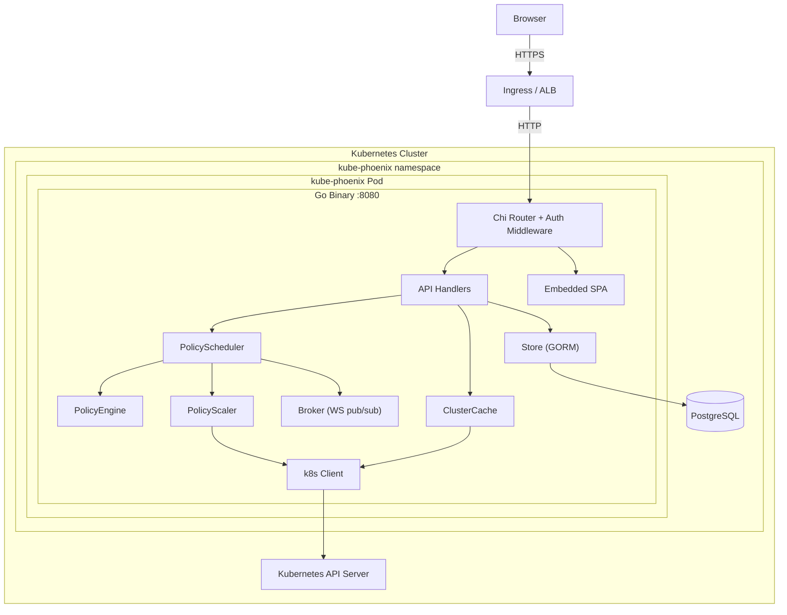
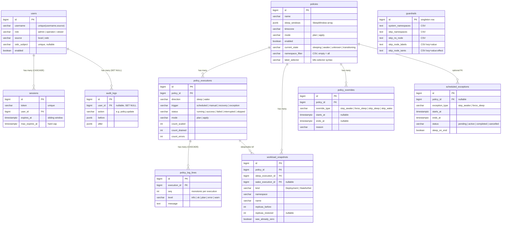

# Architecture

> For engineers who need to understand, extend, or debug kube-phoenix.

---

## Table of Contents

1. [Overview](#overview)
2. [Components](#components)
3. [Data Model](#data-model)
4. [Request Flows](#request-flows)
5. [Package Layout](#package-layout)
6. [Design Decisions](#design-decisions)

---

## Overview

kube-phoenix is a Kubernetes cluster sleep/wake policy engine that reduces cloud
spend by scaling workloads to zero and draining nodes during off-hours, then
restoring them on schedule. It ships as a single Go binary that embeds a
statically-exported Next.js SPA, talks to PostgreSQL for persistence, and calls
the Kubernetes API via a ServiceAccount with cluster-wide RBAC. A 30-second
evaluation ticker continuously reconciles intended state (derived from policy
sleep windows) against actual cluster state, triggering sleep or wake executions
when they diverge.



### Technology Stack

| Layer       | Choice                                   |
|:------------|:-----------------------------------------|
| Backend     | Go 1.26, Chi v5, GORM v1.31, gorilla/websocket, client-go |
| Frontend    | Next.js 16 (static export), MUI v7, TanStack Query v5 |
| Database    | PostgreSQL 17                            |
| Container   | Multi-stage Docker build, distroless base |
| Deployment  | Helm chart (OCI), GitHub Actions CI/CD   |

---

## Components

### API Server

**Purpose:** Serve the REST API, embedded SPA, WebSocket endpoints, and
Prometheus metrics from a single HTTP listener on port 8080.

**Key responsibilities:**
- Route requests through a middleware stack: request ID, structured logging,
  panic recovery, CORS, body size limit, session auth, CSRF protection, RBAC.
- Expose 25+ REST endpoints under `/api/*` for policies, executions, cluster
  state, guardrails, users, audit logs, and exceptions.
- Serve the embedded Next.js SPA for all non-API paths (SPA fallback to
  `index.html` for client-side routing).
- Expose `/healthz` (liveness probe) and `/metrics` (Prometheus) without
  authentication.

**Key interfaces:**
- `GET /api/overview` -- pre-aggregated dashboard summary (cache-backed, no DB I/O).
- `GET /api/cluster/stream` -- SSE stream pushing overview updates every ~10s.
- `GET /ws/policy-executions/{id}/logs` -- WebSocket for live execution log streaming.
- `POST /api/policies/{id}/sleep`, `/wake` -- manual execution triggers.

### PolicyScheduler

**Purpose:** Continuously evaluate all enabled policies and trigger sleep/wake
executions when intended state diverges from actual state.

**Key responsibilities:**
- Run a 30-second evaluation ticker that loads all enabled policies, computes
  `IntendedState(now)` for each, and fires executions on mismatch.
- Run a 60-second exception ticker that activates or deactivates scheduled
  exceptions whose time windows have started or ended.
- Recover on startup by reconciling every enabled policy against current cluster
  state (handles server restarts mid-sleep).
- Manage an in-memory policy cache for fast tick evaluation.
- Guard against concurrent runs via the `transitioning` state.

**Key interfaces:**
- `Start(ctx)` / `Stop()` -- lifecycle management.
- `RunSleepNow(ctx, policyID, trigger)` / `RunWakeNow(...)` -- manual triggers.
- `RecoverPolicies(ctx)` -- startup reconciliation.
- `TickExceptions(ctx)` -- exception lifecycle.

### PolicyEngine

**Purpose:** Pure evaluation logic that determines whether a policy should be
sleeping or awake at a given point in time.

**Key responsibilities:**
- Evaluate sleep windows against the current time in the policy's timezone.
- Apply override precedence: `force_sleep` > `stay_awake` > window evaluation.
- Compute the next state transition time for dashboard display.

**Key interfaces:**
- `IntendedState(policy, overrides, now) string` -- returns `"sleeping"` or `"awake"`.
- `Evaluate(windows, timezone, now) string` -- window-only evaluation.
- `NextTransition(windows, timezone, now) *time.Time` -- next sleep/wake edge.

### PolicyScaler

**Purpose:** Execute the actual Kubernetes mutations for sleep and wake
operations, persisting workload snapshots for reliable restoration.

**Key responsibilities:**
- **Sleep:** For each matched workload, save the current replica count as a
  `WorkloadSnapshot`, annotate the resource with `previous-replicas`, and scale
  to zero. Then cordon, drain, and delete unprotected nodes.
- **Wake:** Load snapshots from the most recent sleep execution, restore each
  workload to its saved replica count, and remove the annotation. Nodes are not
  managed -- Karpenter provisions new nodes in response to pending pods.
- Respect guardrails: skip protected namespaces, labeled nodes, tainted nodes,
  and nodes hosting critical-namespace pods.
- Emit structured log lines to a channel for real-time streaming via the Broker.
- Support plan mode (dry-run): log what would happen without mutating anything.

**Key interfaces:**
- `RunSleep(ctx, policy, execID, mode, logCh) (*Counts, error)`
- `RunWake(ctx, policy, execID, mode, logCh) (*Counts, error)`

### ClusterCache

**Purpose:** In-memory mirror of cluster state that eliminates repeated
Kubernetes API calls on every HTTP request.

**Key responsibilities:**
- Background goroutine fetches Nodes, Pods, Deployments, and StatefulSets in
  parallel every 10 seconds.
- Results stored in `CachedSnapshot` behind a `sync.RWMutex`.
- Partial failures do not evict previously-good data for unaffected resource types.
- Pub/sub notification to SSE subscribers on each refresh.

**Key interfaces:**
- `Snapshot() CachedSnapshot` -- current cluster state.
- `Subscribe() / Unsubscribe(ch)` -- notification channel for SSE stream.

### Broker

**Purpose:** In-process pub/sub for fan-out of execution log lines to zero or
more WebSocket clients.

**Key responsibilities:**
- Maintain per-execution subscriber lists (buffered channels, capacity 256).
- Non-blocking publish: slow clients are skipped rather than blocking the scaler.
- Close all subscribers when an execution completes.

**Key interfaces:**
- `Subscribe(execID) chan PolicyLogLine`
- `Publish(execID, line)`
- `Close(execID)`

### Frontend

**Purpose:** Single-page application providing the operator UI.

**Key responsibilities:**
- Dashboard with cluster status, next-run countdown, and activity feed.
- Cluster state explorer with workload, node, and pod detail drawers.
- Policy management with sleep window picker, weekly timeline visualization,
  plan/apply mode toggle, overrides, and scheduled exceptions.
- Live execution log viewer via WebSocket, with auto-scroll and level coloring.
- Live pod log viewer via chunked HTTP streaming from the Kubernetes API.
- User management (admin), audit log viewer, guardrails editor.
- Dark (default) and light theme with WCAG AA contrast compliance.
- Cookie-based session auth with CSRF double-submit protection; optional OIDC SSO.

**Key interfaces:**
- `api.ts` -- centralized fetch wrapper with cookie/CSRF handling.
- `auth.tsx` -- React context-based auth state management.
- TanStack Query with SSE-driven cache updates for the overview page.

---

## Data Model



---

## Request Flows

### 1. Sleep Execution

Triggered by the 30-second ticker (scheduled), a manual API call, or a
scheduled exception activation.

1. **PolicyScheduler** evaluates `IntendedState(now)` for each enabled policy.
   If intended state is `sleeping` but `current_state` is `awake`, a sleep
   execution is created.
2. `current_state` is set to `transitioning` (prevents concurrent runs).
3. **PolicyExecution** record is created with `status=running, direction=sleep`.
4. **PolicyScaler.RunSleep** begins:
   a. Load guardrails (skip namespaces, protected labels/taints).
   b. Match workloads by `namespace_filter` and `label_selector`.
   c. For each matched workload: save snapshot, annotate `previous-replicas`,
      scale to 0.
   d. For each unprotected node: cordon, drain (dynamic timeout: `podCount*15+60`s),
      delete.
5. Log lines are emitted to the log channel. **Broker** fans them out to
   WebSocket subscribers. Lines are also persisted to `policy_log_lines`.
6. On completion, `Broker.Close()` signals all WS clients. Execution record is
   updated with final counts and `status=success` (or `failed`).
   `current_state` is set to `sleeping`.

### 2. Wake Execution

Triggered by the ticker, a manual call, or a scheduled exception ending.

1. Same trigger logic as sleep, but intended state is `awake` and current state
   is `sleeping`.
2. **PolicyScaler.RunWake** loads `WorkloadSnapshot` records from the most
   recent sleep execution.
3. For each snapshot: restore the workload to `replicas_before`, remove the
   `previous-replicas` annotation, update the snapshot with `replicas_restored`.
4. Nodes are **not** managed. Karpenter detects pending pods and provisions new
   nodes automatically.
5. `current_state` is set to `awake`.

### 3. Policy Evaluation Loop

```
Every 30 seconds:
  for each enabled policy:
    if current_state == "transitioning": skip
    intended = PolicyEngine.IntendedState(policy, overrides, now)
    if intended != current_state:
      spawn goroutine -> run(policy, intended_direction, "scheduled")
```

Override precedence within `IntendedState`:
- Active `force_sleep` override: always return `sleeping`.
- Active `stay_awake` override: always return `awake`.
- No active override: evaluate sleep windows against current time in policy timezone.

### 4. Real-Time Log Streaming (WebSocket)

1. Client opens `ws://host/ws/policy-executions/{id}/logs`.
2. Handler upgrades to WebSocket, authenticates via session cookie.
3. **Replay:** All existing log lines are fetched from the database and sent.
4. **Subscribe:** Handler subscribes to `Broker` for the execution ID.
5. **Race check:** If the execution completed between steps 3 and 4, any gap
   lines are fetched from the DB and sent, then the connection is closed.
6. **Stream:** New lines arrive on the broker channel and are forwarded to the
   client. Ping frames are sent every 30s for keepalive.
7. **Close:** When the scaler finishes, `Broker.Close()` closes the channel.
   The handler sends a WebSocket close frame (code 1000).

---

## Package Layout

```
kube-phoenix/
├── backend/
│   ├── cmd/server/main.go           # Entry point: bootstrap, graceful shutdown
│   ├── internal/
│   │   ├── api/                     # HTTP handlers and Chi router construction
│   │   │   ├── router.go            # Route registration, middleware stack
│   │   │   ├── auth.go              # Login, logout, OIDC callbacks
│   │   │   ├── policies.go          # Policy CRUD, sleep/wake triggers
│   │   │   ├── policy_executions.go # Execution list, logs, snapshots, WebSocket
│   │   │   ├── cluster.go           # Workloads, nodes, pods, overview, SSE stream
│   │   │   ├── exceptions.go        # Scheduled exception CRUD
│   │   │   ├── overrides.go         # Policy override CRUD
│   │   │   ├── guardrails.go        # Guardrails get/update
│   │   │   ├── users.go             # User CRUD (admin only)
│   │   │   ├── audit.go             # Audit log listing
│   │   │   ├── admin.go             # DB reset (streaming NDJSON)
│   │   │   ├── ws.go                # WebSocket helpers
│   │   │   └── helpers.go           # JSON response utilities
│   │   ├── scheduler/
│   │   │   ├── policy_scheduler.go  # 30s ticker, recovery, exception tick
│   │   │   ├── policy_engine.go     # IntendedState evaluation, override precedence
│   │   │   ├── policy_scaler.go     # Sleep/wake execution with snapshot persistence
│   │   │   └── broker.go            # WebSocket log pub/sub
│   │   ├── policy/
│   │   │   └── windows.go           # SleepWindow type, validation, evaluator
│   │   ├── k8s/
│   │   │   ├── client.go            # Typed Kubernetes API wrapper
│   │   │   └── cache.go             # ClusterCache: 10s parallel background refresh
│   │   ├── store/
│   │   │   ├── models.go            # GORM model structs
│   │   │   ├── store.go             # DB connection, AutoMigrate, connection pool
│   │   │   └── queries.go           # All DB queries, SeedDefaults
│   │   ├── middleware/
│   │   │   ├── auth.go              # Session auth, CSRF double-submit
│   │   │   └── ratelimit.go         # Per-IP and per-username login throttling
│   │   ├── audit/
│   │   │   └── writer.go            # Async buffered audit writer, daily retention
│   │   ├── metrics/
│   │   │   └── metrics.go           # Prometheus metrics (promauto registration)
│   │   └── docs/
│   │       └── docs.go              # Embedded OpenAPI spec + Swagger UI handler
│   └── web/
│       ├── embed.go                 # //go:embed SPA + fallback handler
│       └── static/                  # Next.js build output (gitignored)
│
├── frontend/
│   ├── src/
│   │   ├── app/                     # Next.js pages (overview, cluster, policies, ...)
│   │   ├── components/              # React components by domain
│   │   ├── lib/                     # API client, auth, types, query client, utilities
│   │   └── theme/                   # MUI theme (dark + light mode)
│   ├── next.config.mjs              # Static export, trailing slash
│   └── package.json
│
├── helm/kube-phoenix/
│   ├── Chart.yaml
│   ├── values.yaml
│   └── templates/                   # Deployment, RBAC, Service, Ingress, PG, etc.
│
├── openapi.yaml                     # OpenAPI 3.1 spec (canonical source)
├── Dockerfile                       # 3-stage: node -> go -> distroless
├── Makefile                         # Developer workflow targets
└── .github/workflows/               # CI, security scanning, release automation
```

---

## Design Decisions

### Why GORM with AutoMigrate (no migration files)

AutoMigrate handles the common case of adding columns and tables without manual
migration files. For a small team with infrequent schema changes, the
operational overhead of migration tooling is not justified. Trade-off:
AutoMigrate cannot drop or rename columns. A one-time script would be needed
for destructive schema changes.

### Why Chi (not net/http ServeMux)

Chi provides URL parameter extraction, grouped routes with per-group middleware,
and composable middleware chaining. These are essential for the layered auth
model (public routes, session-required routes, role-gated routes) without
duplicating middleware wiring.

### Why SSE for cluster state + WebSocket for execution logs

Cluster state updates are server-to-client only and fit the SSE model. SSE
auto-reconnects natively in browsers and works over standard HTTP. Execution
logs use WebSocket because they require bidirectional communication (ping/pong
keepalive through load balancers) and benefit from gorilla/websocket's framing
and connection management.

### Why window-based scheduling (not cron)

Sleep windows (`daysOfWeek` + `startTime` + `endTime` + `timezone`) are
evaluated as time ranges. This model naturally handles overnight windows
(e.g., 19:00-07:00), multi-day spans, and timezone-aware evaluation. Cron
expressions describe points in time, not ranges, making them a poor fit for
"sleep during this window" semantics. The 30-second ticker evaluates windows
continuously, so the system self-corrects after restarts without missed
triggers.

### Why snapshot-based wake (not annotation-only)

Workload snapshots in the database record the exact replica count at the time
of sleep, including metadata about edge cases (was the workload already at zero,
was it externally scaled, was it deleted). This enables reliable wake even when
annotations have been manually removed, and provides an audit trail of what was
scaled and when.

### Why single binary with embedded SPA

Shipping the Next.js static export embedded in the Go binary via `//go:embed`
eliminates frontend/backend version skew, removes the need for a separate web
server or CDN, and simplifies the Kubernetes deployment to a single container.
Trade-off: the Docker build requires three stages, and frontend changes require
a full binary rebuild.

### Why PostgreSQL (not SQLite)

SQLite in Kubernetes is problematic: file locking conflicts with
ReadWriteOnce PVCs, and there is no connection pooling. PostgreSQL is the
standard for production Go applications and integrates with managed cloud
databases (RDS, Cloud SQL). The Helm chart includes an optional in-cluster
PostgreSQL for development use.

### Why in-process broker (no Redis)

kube-phoenix runs as a single replica. An in-process pub/sub broker with
mutex-guarded channels is simpler and faster than an external dependency.
If multi-replica support is ever needed, a Redis or NATS replacement would be
required.

### Why plan mode defaults

All policies default to `mode: "plan"`. Scaling production workloads to zero is
a serious operation. Plan mode shows exactly what would happen (which workloads,
which nodes) without any mutations. An operator must explicitly switch to
`mode: "apply"` after validating the dry-run output.

### Why Karpenter delegation for wake

Wake restores pod replicas, which creates pending pods. Karpenter detects
unschedulable pods and provisions optimally-sized nodes via its bin-packing
logic. Replicating node provisioning in kube-phoenix would duplicate Karpenter's
sophistication and conflict with its internal state machine.
