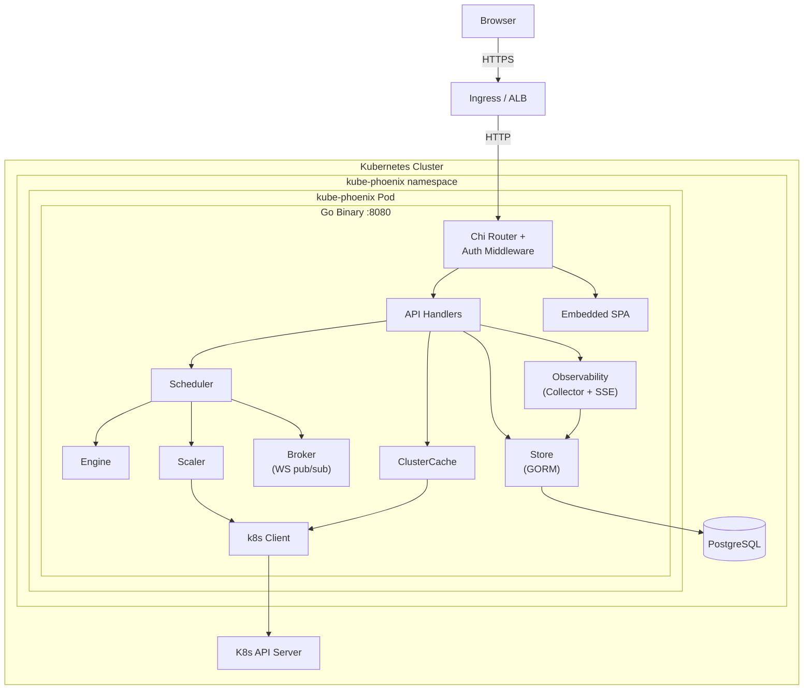
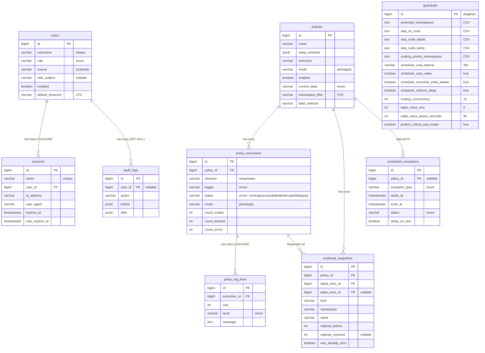

# Architecture

> For engineers who need to understand, extend, or debug kube-phoenix.

---

## Table of Contents

1. [Overview](#overview)
2. [Components](#components)
3. [Data Model](#data-model)
4. [Request Flows](#request-flows)
5. [Package Layout](#package-layout)
6. [Design Decisions](#design-decisions)

---

## Overview

kube-phoenix is a Kubernetes cluster sleep/wake policy engine that reduces cloud
spend by scaling workloads to zero and draining nodes during off-hours, then
restoring them on schedule. It ships as a single Go binary that embeds a
statically-exported Next.js SPA, talks to PostgreSQL for persistence, and calls
the Kubernetes API via a ServiceAccount with cluster-wide RBAC. A configurable evaluation ticker (default 30 seconds) continuously reconciles intended state (derived from policy
sleep windows) against actual cluster state, triggering sleep or wake executions
when they diverge.



### Technology Stack

| Layer       | Choice                                   |
|:------------|:-----------------------------------------|
| Backend     | Go 1.26, Chi v5, GORM v1.31, gorilla/websocket, client-go |
| Frontend    | Next.js 16 (static export), MUI v9, TanStack Query v5 |
| Database    | PostgreSQL 17                            |
| Container   | Multi-stage Docker build, digest-pinned base images, distroless runtime |
| Deployment  | Helm chart (OCI, with values schema), GitHub Actions CI/CD, cosign-signed images |

---

## Components

### API Server

**Purpose:** Serve the REST API, embedded SPA, WebSocket endpoints, and
Prometheus metrics from a single HTTP listener on port 8080.

**Key responsibilities:**
- Route requests through a middleware stack: request ID, structured logging,
  panic recovery, HTTP security headers, CORS, body size limit, session auth, CSRF protection, RBAC.
- Expose 45+ REST endpoints under `/api/*` for policies, executions, cluster
  state, guardrails, users, audit logs, exceptions, observability, and system info.
- Serve the embedded Next.js SPA for all non-API paths (SPA fallback to
  `index.html` for client-side routing).
- Expose `/healthz` (liveness probe) and `/metrics` (Prometheus) without
  authentication.

**Key interfaces:**
- `GET /api/overview` -- pre-aggregated dashboard summary (cache-backed, no DB I/O).
- `GET /api/cluster/stream` -- SSE stream pushing overview updates on cluster changes.
- `GET /ws/policy-executions/{id}/logs` -- WebSocket for live execution log streaming.
- `POST /api/policies/{id}/sleep`, `/wake` -- manual execution triggers.
- `POST /api/policies/{id}/cancel` -- cancel a running execution.
- `POST /api/danger/emergency-scale` -- danger-zone operation that disables all policies, cancels active exceptions, and scales sleeping workloads to 1 replica.

### Observability Center

**Purpose:** Real-time system observability with dual-view dashboard: Metrics Dashboard for quantitative monitoring and API Rivers for visual request flow topology.

**Key responsibilities:**
- Self-scrape the Prometheus registry every 2 seconds, computing counter deltas, histogram quantiles, and gauge values into structured metric snapshots. DB pool metrics (`open_connections`, `in_use`, `idle`) are collected from `sql.DBStats` on every tick. Cache hit rate is computed from real `cache_hits_total` and `cache_misses_total` counters.
- Store snapshots in PostgreSQL for historical queries (up to 3 days, auto-pruned).
- Cache the latest SSE payload in memory under a `sync.RWMutex`. The SSE handler reads from this buffer, never from the database, so multiple concurrent dashboard clients do not increase DB load.
- Serve component runtime configuration (DB pool sizes, rate limits, K8s QPS, scheduler interval) from actual runtime values.
- Provide configurable warn/crit thresholds per metric panel with default seeding.
- Record API calls via a Chi middleware into a 100-entry ring buffer (Call Recorder). Each call is mapped to a component and Go function name via a static lookup table of 49 route patterns. The latest 50 calls are included in each SSE payload for the Live API Call Feed.

**Key interfaces:**
- `GET /api/observability/stream` -- SSE stream reading from in-memory buffer, pushing every 2 seconds.
- `GET /api/observability/history?range=1h` -- Historical snapshots with SQL-level downsampling via `ROW_NUMBER` (1s for 1m, 15s for 1h, 5m for 3d).
- `GET /api/observability/config` -- Runtime component limits (reads from guardrails, env vars, and constants).
- `GET /api/observability/thresholds` / `PUT` -- CRUD for warn/crit threshold configuration.

### PolicyScheduler

**Purpose:** Continuously evaluate all enabled policies and trigger sleep/wake
executions when intended state diverges from actual state.

**Key responsibilities:**
- Run a configurable evaluation ticker (default 30 seconds) that loads all enabled policies, computes
  `IntendedState(now)` for each, and fires executions on mismatch.
- Run a 60-second exception ticker that activates or deactivates scheduled
  exceptions whose time windows have started or ended.
- Recover on startup by reconciling every enabled policy against current cluster
  state (handles server restarts mid-sleep).
- Manage an in-memory policy cache for fast tick evaluation.
- Guard against concurrent runs via an atomic conditional DB update that claims the `transitioning` state (only one caller wins the race). The claim also updates `state_since` atomically to support accurate stuck-transition detection. Per-policy in-flight tracking (`inflightPolicies`/`inflightCancels` maps) prevents duplicate goroutines and supports mid-execution cancellation.
- Skip automatic wake transitions when `AutoWake` is disabled — the scheduler will only put policies to sleep, not wake them.
- Enforce sleep: detect workloads that were externally scaled up during a sleeping policy and re-scale them to 0.
- Back off for 5 minutes after a failed scheduled transition to avoid tight retry loops when the K8s API is down.
- Execution goroutines derive their context from the scheduler's parent context, so `Stop()` can signal them to abort rather than hanging until the per-execution timeout expires.
- When `ReconcileWhileAwake` is enabled (default), detect drift from failed or partial wake executions by counting open snapshots that still need restoring. If drift is found, run a corrective wake (trigger `"reconcile"`) that bypasses the `AutoWake` gate. Retries back off at a minimum interval of 5 minutes per policy to avoid flooding history. When disabled, skip reconciliation entirely for policies already awake — reduces DB load between sleep windows.

**Key interfaces:**
- `NewPolicyScheduler(st, k8sClient, cfg SchedulerConfig)` -- construct scheduler with configurable settings.
- `Start(ctx)` / `Stop()` -- lifecycle management. `Stop()` waits for all in-flight execution goroutines to complete before returning.
- `RunSleepNow(ctx, policyID, trigger)` / `RunWakeNow(...)` -- manual triggers.
- `CancelExecution(policyID)` -- cancel an in-flight execution.
- `IsAlreadyRunning(err) bool` -- helper that checks for both `ErrPolicyTransitioning` and `ErrPolicyExecutionInflight`.
- `RecoverPolicies(ctx)` -- startup reconciliation (called automatically inside `Start()`).
- `TickExceptions(ctx)` -- exception lifecycle.
- `UpdateSettings(cfg SchedulerConfig) error` -- apply new eval interval, auto-wake, and reconcile-while-awake settings at runtime.

### PolicyEngine

**Purpose:** Pure evaluation logic that determines whether a policy should be
sleeping or awake at a given point in time.

**Key responsibilities:**
- Evaluate sleep windows against the current time in the policy's timezone.
- Apply exception precedence: `force_sleep` exception > `stay_awake` exception > window evaluation.
- Compute the next state transition time for dashboard display.

**Key interfaces:**
- `IntendedState(StateInput) PolicyState` -- accepts a `StateInput` struct containing windows, timezone (or a preloaded `Location`), exceptions, and time. Returns `"sleeping"`, `"awake"`, or `"unknown"`.
- `Evaluate(windows, timezone, now) string` -- window-only evaluation. `EvaluateInLocation(windows, loc, now)` is the same call with a preloaded `*time.Location` for hot paths.
- `NextTransition(windows, timezone, now) *time.Time` -- next sleep/wake edge. `NextTransitionInLocation(windows, loc, now)` accepts a preloaded `*time.Location`.

### PolicyScaler

**Purpose:** Execute the actual Kubernetes mutations for sleep and wake
operations, persisting workload snapshots for reliable restoration.

**Key responsibilities:**
- **Sleep:** For each matched workload, scale to zero, then persist a
  `WorkloadSnapshot` to the database. If the scale fails, no snapshot row is
  written, so a future wake is not confused by orphan rows. Then cordon, drain,
  and delete unprotected nodes.
- **Wake:** Load open snapshots for the policy and restore each workload to its
  saved replica count (`ReplicasBefore`), then close the snapshot by linking it
  to the wake execution. The `WorkloadSnapshot` table is the sole source of
  truth -- there is no on-cluster annotation fallback. Nodes are not managed;
  Karpenter provisions new nodes in response to pending pods.
- Respect guardrails: skip protected namespaces, labeled nodes, tainted nodes,
  nodes hosting non-DaemonSet pods in critical namespaces, and (when
  `ProtectCriticalPodNodes` is enabled — opt-in, default off) nodes running
  non-DaemonSet `system-node-critical` or `system-cluster-critical` pods.
- Deduplicate Deployment/StatefulSet dispatch via `workloadOps()` helper, which returns the appropriate get-replicas and scale functions for a given kind.
- Emit structured log lines to a channel for real-time streaming via the Broker.
  Summary lines include wall-clock duration, total K8s API calls, and req/s.
  Before scaling begins, an estimate line logs the predicted call count.
- Support plan mode (dry-run): log what would happen without mutating anything.
- Concurrency bounded by `guardrails.ScalingConcurrency` (default 10, max 50).

**Key interfaces:**
- `RunSleep(ctx, policy, execID, mode, logCh) (*Counts, error)`
- `RunWake(ctx, policy, execID, mode, logCh) (*Counts, error)`

### ClusterCache

**Purpose:** In-memory mirror of cluster state that eliminates repeated
Kubernetes API calls on every HTTP request.

**Key responsibilities:**
- SharedInformers maintain persistent WATCH connections to the API server for
  Nodes, Pods, Deployments, and StatefulSets. After an initial LIST, only
  deltas are received.
- Event-driven snapshot rebuilds with a 2-second trailing-edge debounce
  collapse rapid changes into a single rebuild.
- Results stored in `CachedSnapshot` behind a `sync.RWMutex` using deep copies
  to prevent mutation of the informer store.
- Partial failures do not evict previously-good data for unaffected resource types.
- Pub/sub notification to SSE subscribers on each rebuild, capped at 100
  concurrent subscribers.

**Key interfaces:**
- `Snapshot() CachedSnapshot` -- current cluster state.
- `Subscribe() / Unsubscribe(ch)` -- notification channel for SSE stream.
  `Subscribe()` returns nil when the subscriber limit is reached.

### Broker

**Purpose:** In-process pub/sub for fan-out of execution log lines to zero or
more WebSocket clients.

**Key responsibilities:**
- Maintain per-execution subscriber lists (buffered channels, capacity 256),
  capped at 50 subscribers per execution to prevent resource exhaustion.
- Non-blocking publish: slow clients are skipped rather than blocking the scaler.
- Close all subscribers when an execution completes.

**Key interfaces:**
- `Subscribe(execID) chan PolicyLogLine`
- `Publish(execID, line)`
- `Close(execID)`

### Frontend

**Purpose:** Single-page application providing the operator UI.

**Key responsibilities:**
- Dashboard with cluster status, next-run countdown, and activity feed.
- Cluster state explorer with workload, node, and pod detail drawers.
- Policy management with sleep window picker, weekly timeline visualization,
  plan/apply mode toggle, and scheduled exceptions. Policy cards
  use a wide timeline card layout (gradient header bar, LED status dot,
  70/30 split with sparkline timeline). The policy detail page uses full-width
  horizontal bands (hero, timeline, exceptions, execution history);
  clicking a row in the Recent Executions table opens the log viewer drawer inline.
- Live execution log viewer via WebSocket, with auto-scroll and level coloring.
- Live pod log viewer via chunked HTTP streaming from the Kubernetes API.
- User management (admin), audit log viewer with field-level diff highlighting (added/removed/changed/unchanged), guardrails editor.
- Dark (default) and light theme with WCAG AA contrast compliance.
- Cookie-based session auth with CSRF double-submit protection; optional OIDC SSO.

**Key interfaces:**
- `api.ts` -- centralized `apiFetch` wrapper with cookie/CSRF handling.
- `auth.tsx` -- React context-based auth state management.
- `useSnackbar.tsx` -- shared hook returning `{ notify, SnackbarAlert }` for standardized snackbar notifications across all pages.
- `useIsDark.ts` -- one-liner hook for dark/light mode detection, used by all components needing mode-aware colors.
- `usePolicyTriggers.ts` -- sleep/wake/cancel trigger hook with `onSuccessOverride` callback.
- `useTriStateSort.ts` -- generic tri-state column sort hook (asc/desc/none).
- `statusColors.ts` -- mode-aware style maps for states, execution statuses, and modes; includes `getModeStyle` and `getTypeLabel` helpers.
- `formatters.ts` -- shared formatting utilities (`formatError`, `fmtDt`, `fmtDuration`, `timeAgo`, etc.).
- TanStack Query with SSE-driven cache updates for the overview page.

---

## Data Model



---

## Request Flows

### 1. Sleep Execution

Triggered by the 30-second ticker (scheduled), a manual API call, or a
scheduled exception activation.

1. **PolicyScheduler** evaluates `IntendedState(StateInput)` for each enabled policy,
   considering active exceptions and sleep windows.
   If intended state is `sleeping` but `current_state` is `awake`, a sleep
   execution is created.
2. `current_state` is set to `transitioning` (prevents concurrent runs).
3. **PolicyExecution** record is created with `status=running, direction=sleep`.
4. **PolicyScaler.RunSleep** begins:
   a. Load guardrails (skip namespaces, protected labels/taints).
   b. Match workloads by `namespace_filter` and `label_selector`.
   c. Scale matched workloads concurrently: for each workload, scale to 0, then
      persist `WorkloadSnapshot` to DB. If the scale fails, no snapshot row is
      written, so a future wake is not confused. Each scale operation retries
      on 409 Conflict with exponential backoff.
   d. For each unprotected node: cordon, drain (dynamic timeout: `podCount*15+60`s),
      delete.
5. Log lines are emitted to the log channel. **Broker** fans them out to
   WebSocket subscribers. Lines are also persisted to `policy_log_lines`.
6. On completion, `Broker.Close()` signals all WS clients. Execution record is
   updated with final counts and `status=success` (or `failed`, or `interrupted`
   if cancelled via `CancelExecution`). `current_state` is set to `sleeping`.

### 2. Wake Execution

Triggered by the ticker, a manual call, or a scheduled exception ending.

1. Same trigger logic as sleep, but intended state is `awake` and current state
   is `sleeping`.
2. **PolicyScaler.RunWake** loads `WorkloadSnapshot` records from the most
   recent sleep execution.
3. Restore workloads concurrently (bounded by `scaling_concurrency` guardrail,
   default 10): for each snapshot, scale the workload back to `replicas_before`
   and update the snapshot with `replicas_restored`. Each scale operation
   retries on 409 Conflict with exponential backoff.
4. Nodes are **not** managed. Karpenter detects pending pods and provisions new
   nodes automatically.
5. `current_state` is set to `awake`.

### 3. Policy Evaluation Loop

```
Every configurable interval (default 30s):
  for each enabled policy:
    intended = PolicyEngine.IntendedState(StateInput{windows, tz, exceptions, now})
    if current_state == intended:
      if reconcileWhileAwake and intended == "awake":
        if backoff elapsed and open snapshots needing restore > 0:
          spawn goroutine -> run(policy, "wake", "reconcile")  // bypasses autoWake
      continue
    if current_state == "transitioning": check for stuck (>policy timeout + 5 min), reset to unknown
    if intended == "awake" and autoWake is false: skip
    spawn goroutine -> run(policy, intended_direction, "scheduled")
```

Precedence within `IntendedState` (highest to lowest):
1. Active `force_sleep` exception → `sleeping`
2. Active `stay_awake` exception → `awake`
3. Sleep window evaluation against current time in policy timezone

### 4. Real-Time Log Streaming (WebSocket)

1. Client opens `ws://host/ws/policy-executions/{id}/logs`.
2. Handler upgrades to WebSocket, authenticates via session cookie.
3. **Replay:** All existing log lines are fetched from the database and sent.
4. **Subscribe:** Handler subscribes to `Broker` for the execution ID.
5. **Race check:** If the execution completed between steps 3 and 4, any gap
   lines are fetched from the DB and sent, then the connection is closed.
6. **Stream:** New lines arrive on the broker channel and are forwarded to the
   client. Ping frames are sent every 30s for keepalive.
7. **Close:** When the scaler finishes, `Broker.Close()` closes the channel.
   The handler sends a WebSocket close frame (code 1000).

---

## Package Layout

```
kube-phoenix/
├── backend/
│   ├── cmd/server/main.go           # Entry point: bootstrap, crash recovery, graceful shutdown
│   ├── internal/
│   │   ├── config/                  # AppConfig: env vars parsed once at startup
│   │   │   └── config.go            # AppConfig struct + Load() + int/duration env helpers
│   │   ├── api/                     # HTTP handlers and Chi router construction
│   │   │   ├── router.go            # NewRouter + registerAuthRoutes/registerPolicyRoutes/registerClusterRoutes/registerAdminRoutes, middleware stack
│   │   │   ├── auth.go              # Login, logout, OIDC callbacks
│   │   │   ├── oidc.go              # OIDC discovery and SSO endpoints
│   │   │   ├── policies.go          # Policy CRUD, sleep/wake triggers (handlers + policyAuditSnapshot)
│   │   │   ├── policies_validation.go # Cross-cutting policy input validators and overlap check
│   │   │   ├── policy_executions.go # Execution list, logs, snapshots, WebSocket
│   │   │   ├── cluster.go           # Workload list handlers
│   │   │   ├── cluster_nodes.go     # Node list and detail handlers
│   │   │   ├── cluster_pods.go      # Pod list, detail, and log streaming handlers
│   │   │   ├── overview.go          # Pre-aggregated dashboard overview endpoint
│   │   │   ├── exceptions.go        # Scheduled exception CRUD
│   │   │   ├── guardrails.go        # Guardrails get/update
│   │   │   ├── export.go            # Sanitised JSON envelope export for guardrails, policies, exceptions
│   │   │   ├── import.go            # Import preview + apply for all three resources (skip removed, overlap-checked)
│   │   │   ├── import_validation.go # Envelope schema/kind checks and per-resource validators shared by preview and apply
│   │   │   ├── users.go             # User CRUD (admin only)
│   │   │   ├── audit.go             # AuditWriter, audit() enqueue, auditDeniedMiddleware, statusCapture response wrapper
│   │   │   ├── cluster_info.go       # Cluster metadata (API server, K8s version, auth mode, name)
│   │   │   ├── version.go           # Build version, Go version, server uptime (no auth)
│   │   │   ├── admin.go             # DB reset (streaming NDJSON)
│   │   │   ├── observability.go      # SSE stream, history queries, threshold CRUD
│   │   │   ├── errmsg.go            # Error constants, field length limits, valid enum sets
│   │   │   ├── ws.go                # WebSocket helpers
│   │   │   └── helpers.go           # JSON response utilities, handleStoreError, requirePolicy
│   │   ├── scheduler/
│   │   │   ├── policy_scheduler.go  # 30s ticker, recovery, exception tick, drift detection, inflightPolicies/inflightCancels, executeAndFinalize
│   │   │   ├── policy_scheduler_test.go # Scheduler unit tests (mock store + runner)
│   │   │   ├── policy_engine.go     # IntendedState evaluation, exception precedence
│   │   │   ├── policy_engine_test.go # Engine unit tests
│   │   │   └── broker.go            # WebSocket log pub/sub
│   │   ├── scaler/
│   │   │   ├── scaler.go            # Low-level Kubernetes scale helpers, workload entry abstraction, collectFilteredEntries
│   │   │   ├── policy_scaler.go     # DB-backed sleep/wake with WorkloadSnapshot logic, workloadOps dispatch
│   │   │   └── nodes.go             # Concurrent node drain/delete (classifyNodes, drainNodes, drainConcurrent)
│   │   ├── policy/
│   │   │   ├── evaluator.go         # Pure sleep window evaluation (Evaluate, NextTransition)
│   │   │   └── windows.go           # SleepWindow type definition and validation
│   │   ├── k8s/
│   │   │   ├── client.go            # Typed Kubernetes API wrapper (PodLogOptions, scale/list/get helpers)
│   │   │   └── cache.go             # ClusterCache: SharedInformer-driven event cache
│   │   ├── store/
│   │   │   ├── models.go            # GORM model structs
│   │   │   ├── store.go             # DB connection, AutoMigrate, connection pool
│   │   │   ├── policies.go          # Policy CRUD, executions, log lines, snapshots, exceptions
│   │   │   ├── queries.go           # Guardrails queries, SeedDefaults, DropAllTables
│   │   │   ├── store_helpers.go     # Shared GORM helpers (selectiveUpdate)
│   │   │   ├── sessions.go          # Session CRUD, sliding window, cleanup
│   │   │   ├── users.go             # User CRUD, OIDC provisioning (OIDCUserInfo struct), password hashing, timezone updates
│   │   │   ├── audit.go             # Audit log CRUD, retention cleanup
│   │   │   ├── observability.go     # Metric snapshot persistence, downsampling, threshold CRUD, pruning
│   │   │   └── status.go            # String constants for policy/execution/exception states (includes `interrupted`)
│   │   ├── auth/
│   │   │   ├── oidc.go              # OIDC provider discovery, token exchange, claim mapping
│   │   │   ├── permissions.go       # RBAC permission checks by role (includes admin.emergency_scale for the emergency scale endpoint)
│   │   │   └── ratelimit.go         # Per-IP and per-username login throttling
│   │   ├── middleware/
│   │   │   └── auth.go              # Session auth, CSRF double-submit
│   │   ├── metrics/
│   │   │   └── metrics.go           # Prometheus metrics (promauto registration)
│   │   ├── observability/
│   │   │   ├── collector.go         # SSE metric streaming, ring buffer history, threshold evaluation
│   │   │   └── call_recorder.go     # Route-level API call latency tracking (100-entry ring buffer)
│   │   ├── nodeutil/
│   │   │   └── protection.go        # Shared node protection helpers (label/taint matching, critical pod detection)
│   │   ├── stringutil/
│   │   │   └── stringutil.go        # Generic string helpers (CSV parsing, etc.)
│   │   └── docs/
│   │       └── docs.go              # Embedded OpenAPI spec + Swagger UI handler
│   └── web/
│       ├── embed.go                 # //go:embed SPA + fallback handler
│       └── static/                  # Next.js build output (gitignored)
│
├── frontend/
│   ├── mock-api/                    # Zero-dependency mock API server for frontend-only development (make dev-mock)
│   ├── src/
│   │   ├── app/                     # Next.js pages (overview, cluster, policies, ...)
│   │   ├── components/              # React components by domain
│   │   │   ├── audit/               # AuditRow, DiffLineRow, JsonDiffView, auditDiff helpers, auditFormatters
│   │   │   ├── auth/                # Auth-related components
│   │   │   ├── cluster/             # Tables, drawers, DetailDrawer, extracted subcomponents (MiniBar, LabelChip, etc.), statusColors
│   │   │   ├── common/              # ChipInput, LabeledSwitch, ConfirmDialog, CenteredSpinner
│   │   │   ├── exceptions/           # ExceptionsCalendarStrip, ExceptionDetailPanel, ExceptionChips, ExceptionActions
│   │   │   ├── guardrails/          # GuardrailsForm (useReducer + CategoryCard), CategoryCard, ProtectedChipInput
│   │   │   ├── history/             # ExecutionTable, LogViewer, ExecutionSummary, parseSummary, useExecutionLogs
│   │   │   ├── layout/              # Layout shell and navigation components
│   │   │   ├── observability/       # Metrics Dashboard and API Rivers components
│   │   │   ├── overview/            # Overview/dashboard page components
│   │   │   ├── policies/            # PolicyCard, timelines, WindowPicker, PolicyHeroBand, TimelineLegend, timelineSegments
│   │   │   ├── settings/            # AccountSettings, AppearanceSettings, DatabaseSettings, OIDCStatusCard, ActiveSessionsCard (live data), ClusterConnectionCard, AboutBar
│   │   │   └── shared/              # StatusChip, TriggerChip, PageHeader, EmptyState
│   │   ├── lib/                     # API client (apiFetch), auth, types, query client, formatters, statusColors, SortHeader, tableStyles, shared hooks (useSnackbar, useIsDark, useTriStateSort, usePolicyTriggers, useUnsavedChanges, useObservabilityStream, useClusterStream, useDebouncedValue, layoutConstants), rbac, colors, constants, motion/, observability-types
│   │   └── theme/                   # MUI theme (dark + light mode)
│   ├── next.config.mjs              # Static export, trailing slash
│   └── package.json
│
├── helm/kube-phoenix/
│   ├── Chart.yaml
│   ├── values.yaml
│   ├── values.schema.json           # JSON Schema for install-time validation
│   └── templates/                   # Deployment, RBAC, Service, Ingress, PG, etc.
│
├── openapi.yaml                     # OpenAPI 3.1 spec (canonical source)
├── Dockerfile                       # 3-stage: node -> go -> distroless (all digest-pinned)
├── Makefile                         # Developer workflow targets
└── .github/workflows/               # CI, security scanning, release automation
```

---

## Design Decisions

### Why GORM with AutoMigrate (no migration files)

AutoMigrate handles the common case of adding columns and tables without manual
migration files. For a small team with infrequent schema changes, the
operational overhead of migration tooling is not justified. Trade-off:
AutoMigrate cannot drop or rename columns. A one-time script would be needed
for destructive schema changes.

### Why Chi (not net/http ServeMux)

Chi provides URL parameter extraction, grouped routes with per-group middleware,
and composable middleware chaining. These are essential for the layered auth
model (public routes, session-required routes, role-gated routes) without
duplicating middleware wiring.

### Why SSE for cluster state + WebSocket for execution logs

Cluster state updates are server-to-client only and fit the SSE model. SSE
auto-reconnects natively in browsers and works over standard HTTP. Execution
logs use WebSocket because they require bidirectional communication (ping/pong
keepalive through load balancers) and benefit from gorilla/websocket's framing
and connection management.

### Why window-based scheduling (not cron)

Sleep windows (`name` + `daysOfWeek` + `startTime` + `endTime` + `timezone`) are
evaluated as time ranges. This model naturally handles overnight windows
(e.g., 19:00-07:00), multi-day spans, and timezone-aware evaluation. Cron
expressions describe points in time, not ranges, making them a poor fit for
"sleep during this window" semantics. The 30-second ticker evaluates windows
continuously, so the system self-corrects after restarts without missed
triggers.

### Why snapshot-based wake (not annotation-only)

Workload snapshots in the database record the exact replica count at the time
of sleep, including metadata about edge cases (was the workload already at zero,
was it externally scaled, was it deleted). This enables reliable wake even when
annotations have been manually removed, and provides an audit trail of what was
scaled and when.

### Why single binary with embedded SPA

Shipping the Next.js static export embedded in the Go binary via `//go:embed`
eliminates frontend/backend version skew, removes the need for a separate web
server or CDN, and simplifies the Kubernetes deployment to a single container.
Trade-off: the Docker build requires three stages, and frontend changes require
a full binary rebuild.

### Why PostgreSQL (not SQLite)

SQLite in Kubernetes is problematic: file locking conflicts with
ReadWriteOnce PVCs, and there is no connection pooling. PostgreSQL is the
standard for production Go applications and integrates with managed cloud
databases (RDS, Cloud SQL). The Helm chart includes an optional in-cluster
PostgreSQL for development use.

### Why in-process broker (no Redis)

kube-phoenix runs as a single replica. An in-process pub/sub broker with
mutex-guarded channels is simpler and faster than an external dependency.
If multi-replica support is ever needed, a Redis or NATS replacement would be
required.

### Why plan mode defaults

All policies default to `mode: "plan"`. Scaling production workloads to zero is
a serious operation. Plan mode shows exactly what would happen (which workloads,
which nodes) without any mutations. An operator must explicitly switch to
`mode: "apply"` after validating the dry-run output.

### Why Karpenter delegation for wake

Wake restores pod replicas, which creates pending pods. Karpenter detects
unschedulable pods and provisions optimally-sized nodes via its bin-packing
logic. Replicating node provisioning in kube-phoenix would duplicate Karpenter's
sophistication and conflict with its internal state machine.

---

## Further Reading

For implementation-level detail, see the [Backend Developer Guide](docs/backend-dev-guide.md) and [Frontend Developer Guide](docs/frontend-dev-guide.md).
