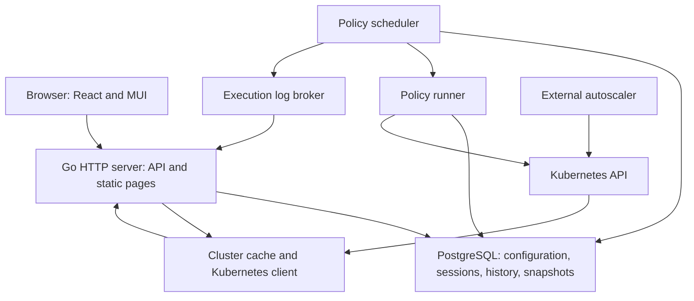
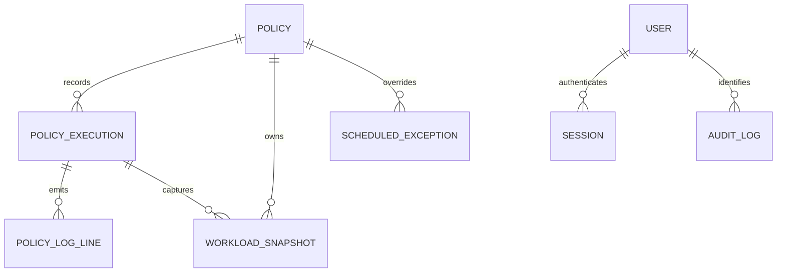

# Architecture

kube-phoenix is a Kubernetes sleep/wake policy engine with a browser interface. It scales selected Deployments and StatefulSets to zero during configured sleep windows and restores recorded replica counts on wake. Sleep can also drain and delete unprotected nodes across the cluster. Wake relies on an external autoscaler for missing capacity.

For setup, use [local development](docs/local-development.md) or [deployment](docs/deployment.md). Contributors can start with the [backend](docs/backend-dev-guide.md) and [frontend](docs/frontend-dev-guide.md) guides.

## Overview

One Go process serves the API and embedded Next.js static export, coordinates executions, and publishes live updates. PostgreSQL stores policies, guardrails, users, sessions, execution history, and workload snapshots. Kubernetes is the source of live resource state.

```mermaid
flowchart TB
    B["Browser: React and MUI"] --> H["Go HTTP server: API and static pages"]
    H --> D["PostgreSQL: configuration, sessions, history, snapshots"]
    H --> C["Cluster cache and Kubernetes client"]
    K["Kubernetes API"] --> C
    S["Policy scheduler"] --> D
    S --> R["Policy runner"]
    R --> D
    R --> K
    C --> H
    S --> L["Execution log broker"]
    L --> H
    A["External autoscaler"] --> K
```

The deployment supports one application replica (zero during maintenance) and uses Recreate upgrades. A dedicated PostgreSQL session advisory lock covers startup recovery and the process lifetime; Kubernetes mutations check that session. Cached state and the live broker remain process-local, so this is not a supported multi-replica scheduler. See [reliability review and upgrade notes](docs/reliability-review.md).

### Technology Stack

| Layer | Technology | Version source |
| :---- | :--------- | :------------- |
| Backend | Go, Chi, GORM, client-go, gorilla/websocket, Prometheus client | [go.mod](backend/go.mod) |
| Frontend | Next.js static export, React, MUI, TanStack Query, TypeScript | [package.json](frontend/package.json) |
| Persistence | PostgreSQL | [Helm values](helm/kube-phoenix/values.yaml), [Compose](docker-compose.yml) |
| Packaging | Embedded frontend, container build, Helm chart | [Dockerfile](Dockerfile), [chart](helm/kube-phoenix) |

Use manifests for exact dependency versions; architecture describes responsibilities and behavior.

## Components

| Component | Owns | Detailed reference |
| :-------- | :--- | :----------------- |
| API server | Authentication, authorization, validation, REST and stream boundaries | [Backend data flow](docs/development/backend-data-flow.md) |
| Policy engine | Pure intended-state calculation: exceptions then windows | [Policy engine](docs/development/backend-policy-engine.md#intended-state-and-evaluation) |
| Policy scheduler | Evaluation, claims, cancellation, recovery, log persistence, finalization | [Execution lifecycle](docs/development/backend-policy-engine.md#claims-and-execution-lifecycle) |
| Policy runner | Workload scaling, snapshots, node operations and wake waves | [Sleep/wake](docs/development/backend-policy-engine.md#sleep-and-snapshots) |
| Cluster cache | Informer-backed inventories and rebuild notifications | [Cluster pipeline](docs/development/backend-data-flow.md#cluster-cache-and-live-reads) |
| Log broker | Bounded process-local replay and live subscriber delivery | [Execution logs](docs/development/backend-data-flow.md#execution-logs) |
| Frontend | Navigation, forms, query cache, auth state and transport lifecycle | [Frontend data flow](docs/development/frontend-data-flow.md) |
| Monitoring | Prometheus metrics, audit records, alpha observability collection | [Observability](docs/observability.md) |

API Rivers is a cosmetic visualization with mock scenarios. Neither its particles nor the alpha metrics dashboard should be treated as proof that a scaling operation completed.

## Data Model

```mermaid
erDiagram
    POLICY ||--o{ POLICY_EXECUTION : records
    POLICY ||--o{ WORKLOAD_SNAPSHOT : owns
    POLICY ||--o{ SCHEDULED_EXCEPTION : overrides
    POLICY_EXECUTION ||--o{ POLICY_LOG_LINE : emits
    POLICY_EXECUTION ||--o{ WORKLOAD_SNAPSHOT : captures
    USER ||--o{ SESSION : authenticates
    USER ||--o{ AUDIT_LOG : identifies
```

A policy combines workload targeting, timezone, sleep windows, mode, enabled status, and recorded state. Executions hold direction, trigger, result, and counters; log records carry an ordered per-execution sequence. Open workload snapshots retain the pre-sleep replica baseline until restoration or a terminal skip.

Guardrails are global database-backed settings. Sessions and audit identity support authentication and accountability. Observability snapshots/thresholds form a separate monitoring store.

See [model definitions](backend/internal/store/models.go) for fields, [OpenAPI](openapi.yaml) for public schemas, and [configuration](docs/configuration.md) for operator settings.

## Request Flows

### 1. Sleep Execution

1. A manual trigger, scheduler transition, exception, or recovery path requests sleep.
2. The scheduler claims the policy transition and creates a running execution.
3. The runner selects workloads, checks namespace protection, and scales in bounded parallel groups.
4. Apply mode persists a prepared snapshot containing replicas and Kubernetes UID, scales the workload by kind/namespace/name to zero with conflict retries, then records application. Plan mode logs proposed changes.
5. Only complete workload operations permit the node phase. Scoped exception runs and preserved exception targets defer node actions; ordinary node selection remains cluster-wide. Global node protections apply.
6. Logs and counts are recorded, execution status is finalized, and the policy claim is released.

Kubernetes and PostgreSQL do not share a transaction. Prepared snapshots survive failures and process termination on either side of scaling; retries compare live state without replacing the original baseline. Partial failures produce failed executions and retryable policy state. Database loss still destroys the recovery source.

### 2. Wake Execution

Wake reads open policy snapshots and restores their replica counts. Originally-zero workloads are skipped, deleted workloads are marked, and external scaling is handled explicitly. Optional wake waves wait for readiness between groups with a bounded timeout.

Wake does not recreate nodes. Failed drain/deletion and startup recovery undo only marked execution-owned cordons. An external autoscaler can respond to pending pods by providing capacity. A completed execution and a recorded `awake` state still require separate pod-readiness verification.

### 3. Policy Evaluation Loop

The scheduler evaluates enabled policies on a configurable interval, defaulting to 30 seconds. Active `force_sleep` takes precedence over `stay_awake`, then the window evaluator supplies intent. The scheduler compares this with recorded state and uses transition claims to prevent duplicate work on a policy.

Recovery runs at startup after acquiring exclusive database ownership. Optional reconciliation retries incomplete wakes; sleep enforcement detects external scale-ups during sleeping periods. These paths have distinct gates and backoff. Manual triggers remain available when scheduling is disabled.

Read [window semantics](docs/window-native-scheduling.md) and [policy execution](docs/development/backend-policy-engine.md) for boundary cases and exception completion.

### 4. Real-Time Log Streaming (WebSocket)

The server authenticates and upgrades the request, subscribes to the broker before reading persisted logs, sends database history and the replay tail, then streams live lines. Sequence numbers allow overlap deduplication. The database is durable history; the broker is bounded live delivery.

Cluster visibility uses a separate SSE path: an initial overview followed by event-driven cache updates. See [transport flow](docs/development/backend-data-flow.md).

## Package Layout

| Location | Boundary |
| :------- | :------- |
| [backend/cmd/server](backend/cmd/server) | Process wiring and shutdown |
| [backend/internal/api](backend/internal/api), [middleware](backend/internal/middleware), [auth](backend/internal/auth) | HTTP, identity and permissions |
| [backend/internal/policy](backend/internal/policy), [scheduler](backend/internal/scheduler) | Pure time rules and execution coordination |
| [backend/internal/scaler](backend/internal/scaler), [k8s](backend/internal/k8s), [nodeutil](backend/internal/nodeutil) | Kubernetes mutations, reads/cache, node protection |
| [backend/internal/store](backend/internal/store), [config](backend/internal/config) | Persistent and startup configuration |
| [backend/web](backend/web), [internal/docs](backend/internal/docs) | Embedded frontend and API reference |
| [frontend/src/app](frontend/src/app), [components](frontend/src/components), [lib](frontend/src/lib) | Pages, domain UI and shared state/transports |
| [helm/kube-phoenix](helm/kube-phoenix), [hack](hack) | Deployment and local fixtures |

The source tree owns file/function inventories. These boundaries explain where behavior belongs.

## Design Decisions

### Why GORM with AutoMigrate (no migration files)

GORM supplies models and queries; startup AutoMigrate handles routine additions. Legacy repair/conversion SQL also exists in the store. Schema upgrades need review against existing data, especially destructive changes. `AUTO_MIGRATE=false` skips AutoMigrate, not every legacy startup SQL statement.

### Why Chi (not net/http ServeMux)

Route groups make public, session-protected, and permission-gated boundaries explicit. A new mutation must be registered with the appropriate permission check; a readable resource does not imply permission to edit it.

### Why SSE and WebSocket

Cluster overview updates are one-way notifications and fit SSE. Execution logs use WebSocket framing and ping/pong keepalives with explicit replay and completion handling. Proxies and clients must support long-lived connections. This transport choice does not provide exactly-once delivery.

### Why window-based scheduling (not cron)

Windows express periods of sleep directly, including overnight and all-day ranges in a timezone. Evaluating current intent supports recovery after downtime without replaying individual cron fires. Cron conversion remains migration history, not the current API.

### Why snapshot-based wake (not annotation-only)

PostgreSQL snapshots preserve the original replica baseline and its execution identity. They record already-zero, deleted, and externally-scaled cases. Annotations are not a fallback in the current engine; retaining the database matters for restoration.

### Why single binary with embedded SPA

Embedding the static frontend keeps one deployable application artifact and a same-origin browser/API connection. Frontend changes require rebuilding the embedded assets. Static export also constrains routing and rules out features requiring a Next.js runtime server.

### Why PostgreSQL (not SQLite)

PostgreSQL supplies the shared persistent store and managed-database deployment option. The chart can deploy a bundled instance for local use or connect to an external database. Application persistence does not by itself distribute process-local scheduler ownership.

### Why in-process broker (no Redis)

A process-local broker keeps the current single-replica design simple. Replay and subscriber buffers are bounded. Multi-replica operation would require a broader coordination and delivery design, not just another application pod.

### Why plan mode defaults

Plan mode previews workload and node actions without Kubernetes mutation or workload snapshot creation. It still records an execution and can update policy state. Operators must explicitly choose apply mode and verify targeting and guardrails.

### Why Karpenter delegation for wake

The application restores workload demand. Capacity provisioning belongs to an external autoscaler such as Karpenter. This avoids a second node-provisioning controller and makes autoscaler availability part of the deployment assumptions.

## Further Reading

Start at the [documentation home](docs/README.md). It distinguishes operator tasks, developer references, regression scenarios, and historical design records.
