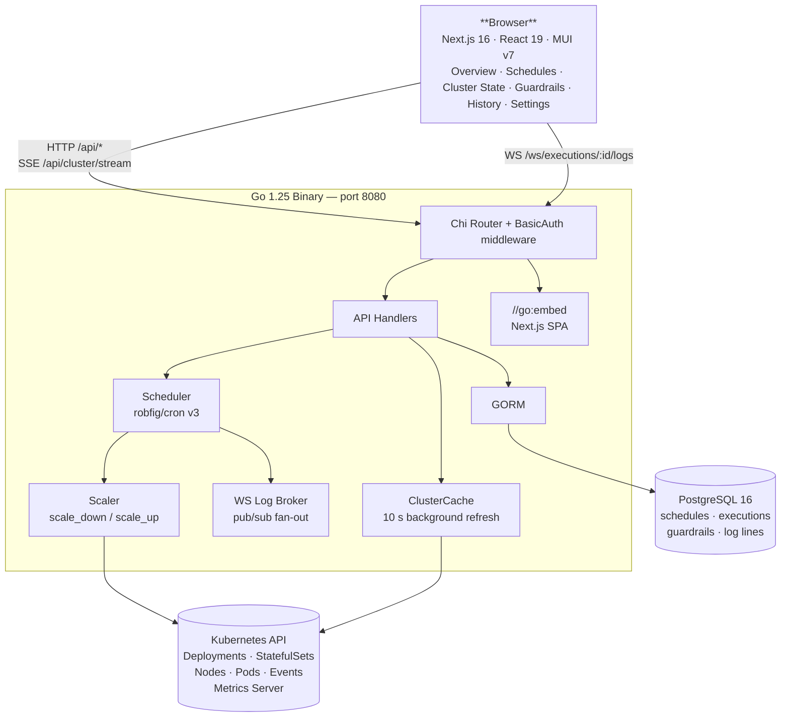

# kube-phoenix 🐦‍🔥

[](https://github.com/MacXsimilian/kube-phoenix/actions/workflows/ci.yml)
[](https://goreportcard.com/report/github.com/macxsimilian/kube-phoenix/backend)
[](https://github.com/MacXsimilian/kube-phoenix/blob/master/LICENSE)
[](https://github.com/MacXsimilian/kube-phoenix/stargazers)
[](https://github.com/MacXsimilian/kube-phoenix/issues)

**Schedule your Kubernetes cluster to sleep at night and wake in the morning. Stop paying for idle nodes.**

kube-phoenix is a self-hosted web application for managing cluster sleep/wake schedules. It replaces ad-hoc bash CronJobs with a proper operator: a Go backend with a full-featured UI, cron scheduling, live log streaming, guardrails to protect critical workloads, and a Helm chart for one-command deployment.

---

## Table of Contents

- [Why kube-phoenix?](#why-kube-phoenix)
- [How it works](#how-it-works)
- [Architecture](#architecture)
- [Features](#features)
- [Quick Start](#quick-start)
  - [Helm install (recommended)](#helm-install)
  - [Local development](#local-development)
  - [Production build](#production-build)
  - [Docker](#docker)
- [Deployment](#deployment)
  - [External database](#external-database)
  - [Accessing the UI](#accessing-the-ui)
  - [AWS ALB (TargetGroupBinding)](#aws-alb-targetgroupbinding)
  - [Helm values reference](#helm-values-reference)
- [Configuration](#configuration)
  - [Environment variables](#environment-variables)
  - [Authentication](#authentication)
- [Schedules](#schedules)
  - [Schedule fields](#schedule-fields)
  - [Default schedules](#default-schedules)
- [API Reference](#api-reference)
- [CI/CD](#cicd)
  - [CI pipeline](#ci-pipeline)
  - [Release workflow](#release-workflow)
- [Contributing](#contributing)
- [Project structure](#project-structure)
- [Roadmap](#roadmap)
- [Troubleshooting](#troubleshooting)

---

## Why kube-phoenix?

| Feature                               | kube-phoenix | Karpenter | KEDA | Raw CronJobs |
| :------------------------------------ | :----------: | :-------: | :--: | :----------: |
| Visual schedule management            |      ✅      |    ❌     |  ❌  |      ❌      |
| Dry-run before applying               |      ✅      |    ❌     |  ❌  |      ❌      |
| Live execution logs                   |      ✅      |    ❌     |  ❌  |      ❌      |
| Guardrails / namespace exclusions     |      ✅      |    ⚠️     |  ⚠️  |      ❌      |
| Restores exact replica counts on wake |      ✅      |    ❌     |  ❌  |      ❌      |
| Per-schedule namespace scope          |      ✅      |    ❌     |  ❌  |      ❌      |
| Works with any node autoscaler        |      ✅      |    ❌     |  ✅  |      ✅      |
| Single binary, no extra infra         |      ✅      |    ✅     |  ❌  |      ✅      |

**Karpenter** can drain idle nodes but cannot restore workloads to their original replica counts, has no schedule UI, and no dry-run mode.

**KEDA** scales workloads based on event/metric sources — not time-of-day schedules with full cluster drain.

**Raw CronJobs** with `kubectl scale` scripts work but have no observability, no guardrails, no plan mode, and are painful to configure and debug.

---

## How it works

kube-phoenix runs two operations — **scale down** and **scale up** — on a cron schedule. Both support **plan mode** (dry-run, logs only) and **apply mode** (executes for real). Start in plan mode until you are confident in your configuration.

### Scale down

```
For each matching Deployment / StatefulSet
  │
  ├─► Annotate with previous-replicas=<current>
  ├─► Scale replicas to 0
  │
  └─► For each node (respecting guardrails)
        ├─► Cordon node
        ├─► Evict / delete non-DaemonSet pods
        └─► Delete node
```

### Scale up

```
For each matching Deployment / StatefulSet
  │
  ├─► Read previous-replicas annotation
  ├─► Restore replica count
  └─► Remove annotation

For each node
  └─► Uncordon   (Karpenter / Cluster Autoscaler provisions
                  new nodes as pending pods appear)
```

---

## Architecture



---

## Features

- **Overview** — cluster health at a glance: current scale state, pulsing live indicator, partial-sleep namespace breakdown, schedule next-run countdown (absolute time + urgency colour, pulsing dot when under 1 hour), and live activity feed with inline log drawer
- **Cluster State** — live view of all Deployments, StatefulSets, and nodes with resizable drill-down detail drawers; pod detail includes live CPU/memory usage, annotations, node instance type, and Kubernetes events
- **Guardrails** — protect namespaces, node labels, and taints from ever being touched by the scaler
- **Schedules** — multiple sleep and wake schedules with cron expressions, per-schedule timezones, and optional namespace filters for partial scale-down; inline enable/disable toggle persists immediately without opening the edit dialog
- **History** — full execution log with live WebSocket streaming; scrollable run summary with jump-to-error navigation and error/workload count badges
- **Manual triggers** — run any schedule immediately in plan (dry-run) or apply mode
- **Settings** — light/dark/system theme switcher (persisted in `localStorage`); danger zone with a double-confirmation Reset Database operation (drops all tables, reseeds defaults)

### Cluster State drill-down

The Cluster State page offers three levels of detail in resizable side drawers:

**Nodes tab**
- Click a node row → Node detail drawer — resource bars (CPU/mem), zone, instance type, cordon status, and a searchable pod list grouped by namespace with **live CPU/memory usage per pod** (from Metrics Server)
- Click a pod in the node drawer → Pod detail replaces in-place; a breadcrumb back button returns to the node view

**Workloads tab**
- Sortable table with a live row count footer and an "affected-only" filter that previews what the next sleep run would scale
- Click a workload row → Workload detail drawer — replica progress bar (ready/current/saved), kind and status chips, searchable pod list with **live CPU/memory usage per pod** (from Metrics Server)
- Click a pod in the workload drawer → Pod detail drawer opens alongside it

**Pod detail** shows:
- Phase, QoS class, node name, instance type, pod IP, host IP, age
- Per-container: image, ready indicator, restart count, live CPU/memory usage (via Metrics Server — degrades gracefully if absent), requests/limits, last terminated reason
- Pod conditions (Ready, ContainersReady, Initialized, PodScheduled) as colour-coded chips
- Kubernetes events with Warning events highlighted in red
- Labels and annotations (collapsible)

---

## Quick Start

### Helm install

The fastest path to a running instance. Requires Helm 3 and a Kubernetes cluster.

```bash
helm upgrade --install kube-phoenix oci://ghcr.io/macxsimilian/helm/kube-phoenix \
  --namespace kube-phoenix \
  --create-namespace \
  --set secret.basicAuthPassword=<your-password>
```

Then access the UI:

```bash
kubectl port-forward -n kube-phoenix svc/kube-phoenix 8080:80
# Open http://localhost:8080
```

All schedules are seeded **disabled** in **plan mode** — nothing will scale until you explicitly enable a schedule and switch it to `apply` mode.

See [Deployment](#deployment) for external database, Ingress, and AWS ALB options.

### Local development

**Prerequisites:** Go 1.25+, Node.js 22+, Docker

```bash
# 1. Start PostgreSQL
make dev

# 2. Backend — http://localhost:8080  (separate terminal)
make dev-backend

# 3. Frontend — http://localhost:3000  (separate terminal)
make dev-frontend
```

With no `BASIC_AUTH_USER` / `BASIC_AUTH_PASSWORD` set, authentication is disabled in dev mode.

### Production build

```bash
make build
# Builds frontend → copies to backend/web/static → compiles Go binary
# Output: bin/kube-phoenix
```

### Docker

```bash
make docker-build
# Produces: ghcr.io/macxsimilian/kube-phoenix:<git-sha>
```

---

## Deployment

The Helm chart deploys the application, an optional in-cluster PostgreSQL StatefulSet, RBAC resources, and a dedicated namespace. For the basic install command see [Quick Start → Helm install](#helm-install).

### External database

To use an existing PostgreSQL instance (RDS, Aurora, Cloud SQL, etc.):

```bash
helm upgrade --install kube-phoenix helm/kube-phoenix \
  --namespace kube-phoenix \
  --create-namespace \
  --set postgresql.enabled=false \
  --set externalDatabase.url="host=my-rds.example.com user=kube_phoenix password=secret dbname=kube_phoenix port=5432 sslmode=require"
```

Alternatively, set the individual `externalDatabase.*` fields (`host`, `port`, `username`, `password`, `database`, `sslmode`) instead of a full DSN.

### Accessing the UI

**Kubernetes Ingress:**

```yaml
ingress:
  enabled: true
  className: nginx          # or "alb", "traefik", etc.
  host: kube-phoenix.example.com
  tls:
    - hosts:
        - kube-phoenix.example.com
      secretName: kube-phoenix-tls
```

### AWS ALB (TargetGroupBinding)

`TargetGroupBinding` (TGB) attaches the application directly to an existing ALB target group without a `LoadBalancer` service or Ingress controller. The AWS Load Balancer Controller registers and deregisters pod IPs as pods scale.

The chart deploys a `ClusterIP` service. The `TargetGroupBinding` CR binds it to the target group ARN. Do not create a `LoadBalancer` service or Ingress on top of a TGB deployment.

**Prerequisites:**

1. [AWS Load Balancer Controller](https://kubernetes-sigs.github.io/aws-load-balancer-controller) installed in the cluster
2. An ALB with an HTTPS listener (port 443) already provisioned
3. A target group created with: target type `ip`, protocol HTTP, port `8080`, health check path `/healthz`
4. A listener rule forwarding traffic to the target group
5. A DNS CNAME or alias pointing your domain to the ALB

**Example values:**

```yaml
targetGroupBinding:
  enabled: true
  targetGroupARN: "arn:aws:elasticloadbalancing:eu-central-1:ACCOUNT:targetgroup/kube-phoenix/ID"
  targetType: ip
  # vpcID: "vpc-0abc123def456"  # omit if the controller auto-detects it
```

### Helm values reference

| Value                                  | Default                              | Description                                                                                  |
| :------------------------------------- | :----------------------------------- | :------------------------------------------------------------------------------------------- |
| `image.repository`                     | `ghcr.io/macxsimilian/kube-phoenix`  | Image repository                                                                             |
| `image.tag`                            | `latest`                             | Image tag to deploy                                                                          |
| `replicaCount`                         | `1`                                  | Number of app replicas                                                                       |
| `postgresql.enabled`                   | `true`                               | Deploy in-cluster PostgreSQL StatefulSet                                                     |
| `postgresql.auth.username`             | `kube_phoenix`                       | PostgreSQL username                                                                          |
| `postgresql.auth.password`             | `kube_phoenix`                       | PostgreSQL password — **change in production**                                               |
| `postgresql.auth.database`             | `kube_phoenix`                       | PostgreSQL database name                                                                     |
| `postgresql.persistence.enabled`       | `true`                               | Persist PostgreSQL data via a PVC                                                            |
| `postgresql.persistence.size`          | `1Gi`                                | PVC size                                                                                     |
| `postgresql.persistence.storageClass`  | `""`                                 | StorageClass — `""` uses the cluster default                                                 |
| `externalDatabase.url`                 | `""`                                 | Full DSN when `postgresql.enabled=false`                                                     |
| `secret.basicAuthUser`                 | `admin`                              | Basic Auth username                                                                          |
| `secret.basicAuthPassword`             | `kube-phoenix`                       | Basic Auth password — **change in production**                                               |
| `secret.existingSecret`                | `""`                                 | Pre-existing Secret containing `DATABASE_URL`, `BASIC_AUTH_USER`, `BASIC_AUTH_PASSWORD`     |
| `ingress.enabled`                      | `false`                              | Enable Kubernetes Ingress                                                                    |
| `ingress.className`                    | `""`                                 | Ingress class name                                                                           |
| `ingress.annotations`                  | `{}`                                 | Ingress annotations                                                                          |
| `ingress.host`                         | `""`                                 | Hostname to expose the app on                                                                |
| `ingress.tls`                          | `[]`                                 | TLS configuration                                                                            |
| `targetGroupBinding.enabled`           | `false`                              | Enable AWS TargetGroupBinding                                                                |
| `targetGroupBinding.targetGroupARN`    | `""`                                 | ARN of the pre-created target group                                                          |
| `targetGroupBinding.targetType`        | `ip`                                 | `ip` or `instance`                                                                           |
| `targetGroupBinding.vpcID`             | `""`                                 | VPC ID — only needed if the controller cannot auto-detect it                                 |
| `resources.requests.cpu`               | `50m`                                | CPU request                                                                                  |
| `resources.requests.memory`            | `64Mi`                               | Memory request                                                                               |
| `resources.limits.cpu`                 | `200m`                               | CPU limit                                                                                    |
| `resources.limits.memory`              | `256Mi`                              | Memory limit                                                                                 |

Full reference: [helm/kube-phoenix/values.yaml](helm/kube-phoenix/values.yaml)

---

## Configuration

### Environment variables

| Variable              | Required | Description                                                                                                                                                                              |
| :-------------------- | :------- | :--------------------------------------------------------------------------------------------------------------------------------------------------------------------------------------- |
| `DATABASE_URL`        | Yes      | PostgreSQL DSN — e.g. `host=localhost user=kube_phoenix password=kube_phoenix dbname=kube_phoenix port=5432 sslmode=disable`                                                             |
| `BASIC_AUTH_USER`     | No       | HTTP Basic Auth username. Unset = auth disabled (dev mode).                                                                                                                              |
| `BASIC_AUTH_PASSWORD` | No       | HTTP Basic Auth password.                                                                                                                                                                |
| `CORS_ALLOWED_ORIGIN` | No       | Allowed CORS origin (e.g. `https://kube-phoenix.example.com`). Unset = no cross-origin requests permitted. Useful when the frontend is served from a different origin during development. |

### Authentication

kube-phoenix uses a branded login screen backed by HTTP Basic Auth. Credentials are stored in `sessionStorage` and injected into every API request — no browser native auth dialog.

Set `BASIC_AUTH_USER` and `BASIC_AUTH_PASSWORD` to enable authentication. When both are unset the application runs without authentication (dev mode).

WebSocket log streams authenticate via a `?token=<base64(user:pass)>` query parameter — browsers cannot set `Authorization` headers on WebSocket upgrades.

---

## Schedules

Each schedule defines when the scaler fires, how it fires, and which namespaces it targets.

### Schedule fields

| Field                | Description                                                                        |
| :------------------- | :--------------------------------------------------------------------------------- |
| **Name**             | Human-readable label                                                               |
| **Type**             | `scale_down` (sleep) or `scale_up` (wake) — immutable after creation              |
| **Cron expression**  | Standard 5-field cron (`minute hour dom month dow`)                                |
| **Timezone**         | IANA timezone — e.g. `Europe/Budapest`. Defaults to `UTC`.                         |
| **Mode**             | `plan` — logs what would happen, no changes; `apply` — executes for real          |
| **Namespace filter** | Comma-separated namespace names to target. Leave empty to target all namespaces.   |
| **Enabled**          | Whether the schedule is active. Disabled schedules are skipped by the cron engine. |
| **Position**         | Display order within each type group. Set automatically; updated via drag-and-drop. |

The toggle switch on each schedule card persists the change immediately — no need to open the edit dialog. The switch shows an optimistic update while the request is in flight and reverts automatically on failure.

Cards within each section (Sleep / Wake) can be reordered by dragging the handle on the right edge. The new order is persisted to the database and shared across all users — dragging in one section never affects the other.

### Default schedules

Four schedules are seeded on first startup, all in **plan mode** and **disabled**. Enable and switch to `apply` when you are confident the guardrails and namespace filters are correct. All default schedules use the `Europe/Budapest` timezone — adjust to your own timezone after installation.

| Name          | Cron            | Type         | When (Europe/Budapest) |
| :------------ | :-------------- | :----------- | :--------------------- |
| Weekday Sleep | `5 19 * * 1-5`  | `scale_down` | Mon–Fri 19:05          |
| Weekday Wake  | `0 7 * * 1-5`   | `scale_up`   | Mon–Fri 07:00          |
| Weekend Sleep | `0 0 * * 6,0`   | `scale_down` | Sat–Sun 00:00          |
| Weekend Wake  | `0 7 * * 1`     | `scale_up`   | Mon 07:00              |

---

## API Reference

All `/api/*` and `/ws/*` endpoints require Basic Auth when configured. `/healthz` is always open.

WebSocket connections authenticate via `?token=<base64(user:pass)>`.

| Method | Path | Description |
|---|---|---|
| `GET` | `/healthz` | Health check (DB ping) |
| `GET` | `/api/schedules` | List all schedules ordered by position (includes `nextRun` per schedule) |
| `POST` | `/api/schedules` | Create schedule |
| `PUT` | `/api/schedules/reorder` | Reorder within a type — body: `{"type":"scale_down","ids":[3,1,2]}` |
| `GET` | `/api/schedules/:id` | Get schedule |
| `PUT` | `/api/schedules/:id` | Update schedule (`type` is immutable) |
| `DELETE` | `/api/schedules/:id` | Delete schedule |
| `GET` | `/api/executions` | List executions (filters: `schedule_id`, `status`, `page`, `page_size`) |
| `GET` | `/api/executions/:id` | Get execution |
| `GET` | `/api/executions/:id/logs` | Get all log lines for an execution |
| `GET` | `/ws/executions/:id/logs` | WebSocket — live log streaming |
| `GET` | `/api/cluster/stream` | SSE stream — pushed overview updates every ~10 s |
| `GET` | `/api/cluster/workloads` | List Deployments and StatefulSets |
| `GET` | `/api/cluster/nodes` | List nodes with protection status |
| `GET` | `/api/cluster/nodes/:name/pods` | List non-DaemonSet pods on a node |
| `GET` | `/api/cluster/pods/:namespace/:name` | Full pod detail — containers, conditions, events, labels, annotations |
| `GET` | `/api/cluster/workloads/:namespace/:kind/:name/pods` | List pods belonging to a Deployment or StatefulSet |
| `GET` | `/api/guardrails` | Get guardrails config |
| `PUT` | `/api/guardrails` | Update guardrails |
| `POST` | `/api/trigger` | Manually trigger a schedule — `{"scheduleId": 1, "mode": "plan"}` |
| `POST` | `/api/admin/reset-db` | Reset database — streams NDJSON progress; body: `{"confirm":"RESET DATABASE"}` |

---

## CI/CD

Two GitHub Actions workflows handle all CI and release automation.

### CI pipeline

```
Push to master / PR
─────────────────────────────────────────────────
ci.yml
  ├── frontend build
  │     npm install
  │     npm audit (high severity gate)
  │     npm run build
  ├── backend build
  │     go vet / go test + coverage / go build
  │     govulncheck (Go CVE database)
  │     golangci-lint + gosec (SAST)
  ├── helm lint
  └── secret scan (TruffleHog — verified leaks only)
```

CI runs on every push to `master` and on all pull requests. Docker builds happen only on release — CI never pushes images.

| Job                | Trigger   | What it does                                                        |
| :----------------- | :-------- | :------------------------------------------------------------------ |
| **Frontend build** | push + PR | `npm install`, `npm audit`, `npm run build`                         |
| **Backend build**  | push + PR | `go vet`, `go test`, `go build`, `govulncheck`, golangci-lint + gosec |
| **Helm lint**      | push + PR | `helm lint helm/kube-phoenix`                                       |
| **Secret scan**    | push + PR | TruffleHog scans the diff for verified leaked secrets               |

### Release workflow

[release-please](https://github.com/googleapis/release-please) automates versioning, CHANGELOG generation, and image publishing. Never create tags manually.

```
Merge Release PR to master
──────────────────────────────────────────────────
release-please.yml
  ├── release-please-action
  │     reads conventional commits → bumps version
  │     creates tag + GitHub Release
  ├── docker build & push (semver + latest tags)
  ├── trivy scan (CRITICAL/HIGH gate on released image)
  └── helm chart push → oci://ghcr.io/macxsimilian/helm
```

| Job                     | Trigger           | What it does                                                    |
| :---------------------- | :---------------- | :-------------------------------------------------------------- |
| **release-please**      | push to `master`  | Opens/updates Release PR; on merge: creates tag + GitHub Release |
| **Docker build & push** | release created   | Builds and pushes to GHCR with semver and `latest` tags         |
| **Trivy scan**          | after docker push | Fails on CRITICAL/HIGH unfixed CVEs                             |
| **Helm push**           | release created   | Packages and pushes chart to GHCR OCI registry                  |

Images published on release:

```
ghcr.io/macxsimilian/kube-phoenix:<semver>
ghcr.io/macxsimilian/kube-phoenix:latest
```

**How to make a release:**

1. Merge PRs to `master` using conventional commit messages.
2. release-please opens a Release PR with the CHANGELOG diff and bumped version.
3. Review and merge the Release PR.
4. Docker image and Helm chart are published automatically.

**One-time setup:** Settings → Actions → General → Workflow permissions → Read and write.

---

## Contributing

See [CONTRIBUTING.md](CONTRIBUTING.md) for the full guide — local setup, branching strategy, commit conventions, and PR checklist.

**Quick reference — conventional commit prefixes:**

| Prefix                        | Version bump | Use for                                |
| :---------------------------- | :----------- | :------------------------------------- |
| `feat:`                       | minor        | new feature                            |
| `fix:`                        | patch        | bug fix                                |
| `perf:`                       | patch        | performance improvement                |
| `feat!:` / `BREAKING CHANGE:` | major        | breaking API or behaviour change       |
| `docs:`                       | none         | documentation only                     |
| `ci:`                         | none         | CI/CD changes                          |
| `chore:`                      | none         | maintenance, dependencies, config      |
| `refactor:`                   | none         | code restructure, no behaviour change  |

---

## Project structure

```
kube-phoenix/
├── Dockerfile                      # 3-stage: node:22 → golang:1.25 → distroless
├── Makefile
├── docker-compose.yml              # Local dev PostgreSQL
├── .github/
│   ├── workflows/
│   │   ├── ci.yml                  # Main CI pipeline
│   │   └── release-please.yml      # Auto-versioning + image publish
│   └── dependabot.yml              # Security update PRs (actions, gomod, npm)
├── backend/
│   ├── cmd/server/main.go          # Entry point, graceful shutdown
│   ├── internal/
│   │   ├── api/                    # HTTP handlers + Chi router
│   │   ├── scheduler/              # robfig/cron wrapper + WebSocket log broker
│   │   ├── scaler/                 # Scale-down / scale-up logic
│   │   ├── k8s/                    # Kubernetes client wrapper (incl. Metrics Server)
│   │   ├── store/                  # GORM models + queries
│   │   └── middleware/             # HTTP Basic Auth (header + WS query param)
│   └── web/
│       ├── embed.go                # //go:embed static — SPA handler with fallback
│       └── static/                 # Next.js output — generated at build time
├── frontend/
│   └── src/
│       ├── app/                    # Pages: overview, cluster, guardrails, schedules, history, settings
│       ├── components/             # Reusable UI components
│       │   ├── auth/               # Login screen
│       │   ├── layout/             # AppShell, Sidebar
│       │   └── ...
│       ├── lib/                    # API client (auth-aware), auth context, TypeScript types
│       └── theme/                  # MUI theme — dark (default) + light mode
└── helm/kube-phoenix/
    ├── Chart.yaml
    ├── values.yaml
    └── templates/                  # namespace, sa, clusterrole, secret, deployment,
                                    # service, ingress, postgresql, targetgroupbinding
```

---

## Tech stack

| Layer     | Technology                                                |
| :-------- | :-------------------------------------------------------- |
| Backend   | Go 1.25, chi v5.2, GORM v1.31, robfig/cron v3, client-go |
| Frontend  | Next.js 16, React 19, Material UI v7, TanStack Query v5   |
| Database  | PostgreSQL 16                                             |
| Packaging | Helm 4, GHCR (OCI), GitHub Actions                        |

The Go backend embeds the Next.js static export via `//go:embed` — one binary, one container, no separate web server.

---

## Roadmap

| Item                        | Status      | Notes                                           |
| :-------------------------- | :---------- | :---------------------------------------------- |
| Keycloak / OIDC auth        | Planned     | Replace HTTP Basic Auth; retain WS token flow   |
| Slack / email notifications | Planned     | Alert on scale failures and manual triggers     |
| Multi-cluster support       | Planned     | Switch between kubeconfig contexts in the UI    |
| OpenAPI spec                | Planned     | Swagger UI served at `/api/docs`                |
| GitLab CI pipeline          | Planned     | Mirror of the GitHub Actions workflow           |
| Emergency wake button       | In progress | One-click full cluster wake bypassing schedule  |

---

## Troubleshooting

### A schedule ran but nothing was scaled

1. Check the execution log in the **History** page — every skip is logged with a reason.
2. Confirm the schedule is in **apply** mode, not **plan** mode. All default schedules start in plan mode.
3. Confirm the schedule is **enabled** — the toggle on the Schedules page.
4. Check that the target namespaces are not in **Guardrails → Skip Namespaces**.

### The backend crashes on startup

The most common cause is a missing or malformed `DATABASE_URL`.

```
FATAL: DATABASE_URL is required
```

Check that the environment variable is set and the PostgreSQL instance is reachable from the pod. Run `kubectl logs -n kube-phoenix deployment/kube-phoenix` for the full error.

### Cluster State shows no workloads or nodes

The Kubernetes client uses the pod's ServiceAccount token (in-cluster config). Possible causes:

- **Running locally without a cluster:** expected — cluster endpoints return empty data, not an error.
- **RBAC not applied:** verify the ClusterRole and ClusterRoleBinding exist: `kubectl get clusterrolebinding kube-phoenix`.
- **Cache not yet populated:** on cold start the ClusterCache populates asynchronously. Wait a few seconds and refresh.

### A workload is stuck with the `previous-replicas` annotation

This happens when a scale-up run was interrupted or partially failed. The workload has `replicas=0` and the annotation present, so it looks sleeping but the wake didn't complete.

Fix manually:

```bash
# Restore replicas (replace <n> with the saved value from the annotation)
kubectl scale deployment <name> -n <namespace> --replicas=<n>

# Remove the annotation
kubectl annotate deployment <name> -n <namespace> previous-replicas-
```

Then recheck the History log for the failed execution to understand why the wake failed.

### Metrics Server data is missing in pod detail

kube-phoenix calls the Kubernetes Metrics Server API for live CPU/memory. If the Metrics Server is not installed in your cluster, usage values will show as `—` rather than causing an error. Install it with:

```bash
kubectl apply -f https://github.com/kubernetes-sigs/metrics-server/releases/latest/download/components.yaml
```

### WebSocket log streaming disconnects immediately

WebSocket connections authenticate via `?token=<base64(user:pass)>`. If credentials are wrong, the connection is closed with `4401`. Verify your browser is sending the correct base64 token — the kube-phoenix UI handles this automatically when you log in through the login screen.

### CORS errors in the browser during local development

Set `CORS_ALLOWED_ORIGIN=http://localhost:3000` on the backend process when running the frontend dev server separately from the backend.

---

> Built by [@MacXsimilian](https://github.com/MacXsimilian). The scaler drains nodes — run in plan mode first.
