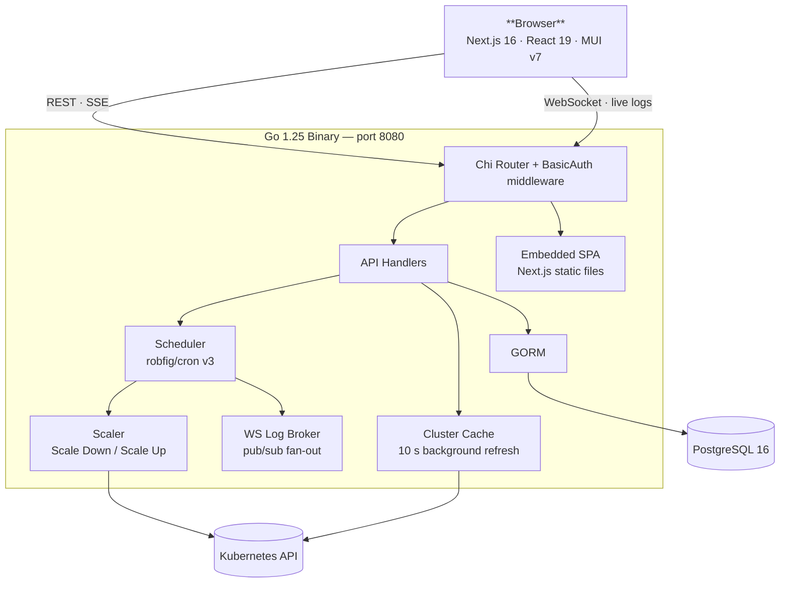

# kube-phoenix 🐦‍🔥

[](https://github.com/MacXsimilian/kube-phoenix/actions/workflows/ci.yml)
[](https://goreportcard.com/report/github.com/macxsimilian/kube-phoenix/backend)
[](https://github.com/MacXsimilian/kube-phoenix/blob/master/LICENSE)
[](https://github.com/MacXsimilian/kube-phoenix/stargazers)
[](https://github.com/MacXsimilian/kube-phoenix/issues)

**Schedule your Kubernetes cluster to sleep at night and wake in the morning. Stop paying for idle nodes.**

kube-phoenix is a self-hosted web application for managing cluster sleep/wake schedules. It replaces ad-hoc bash CronJobs with a proper operator: a Go backend with a full-featured UI, cron scheduling, live log streaming, guardrails to protect critical workloads, and a Helm chart for one-command deployment.

---

## Quick Start

Requires Helm 3 and a Kubernetes cluster.

```bash
helm upgrade --install kube-phoenix oci://ghcr.io/macxsimilian/helm/kube-phoenix \
  --namespace kube-phoenix \
  --create-namespace \
  --set secret.basicAuthPassword=<your-password>
```

```bash
kubectl port-forward -n kube-phoenix svc/kube-phoenix 8080:80
# Open http://localhost:8080
```

All schedules are seeded **disabled** in **plan mode** — nothing will scale until you explicitly enable a schedule and switch it to `apply` mode.

→ Full deployment guide (external DB, Ingress, AWS ALB, Helm values): [docs/deployment.md](docs/deployment.md)

### Local development

**Prerequisites:** Go 1.25+, Node.js 22+, Docker

```bash
make dev          # start PostgreSQL
make dev-backend  # http://localhost:8080 (separate terminal)
make dev-frontend # http://localhost:3000 (separate terminal)
```

Authentication is disabled when `BASIC_AUTH_USER` / `BASIC_AUTH_PASSWORD` are unset.

### Production build

```bash
make build
# Builds frontend → copies to backend/web/static → compiles Go binary
# Output: bin/kube-phoenix
```

### Docker

```bash
make docker-build
# Produces: ghcr.io/macxsimilian/kube-phoenix:<git-sha>
```

---

## How it works

kube-phoenix runs two operations — **scale down** and **scale up** — on a cron schedule. Both support **plan mode** (dry-run, logs only) and **apply mode** (executes for real). Start in plan mode until you are confident in your configuration.

### Scale down

```
For each matching Deployment / StatefulSet
  │
  ├─► Annotate with previous-replicas=<current>
  ├─► Scale replicas to 0
  │
  └─► For each node (respecting guardrails)
        ├─► Cordon node
        ├─► Evict / delete non-DaemonSet pods
        └─► Delete node
```

### Scale up

```
For each matching Deployment / StatefulSet
  │
  ├─► Read previous-replicas annotation
  ├─► Restore replica count
  └─► Remove annotation

For each node
  └─► Uncordon   (Karpenter / Cluster Autoscaler provisions
                  new nodes as pending pods appear)
```

---

## Architecture



---

## Features

- **Overview** — cluster health at a glance: current scale state, live indicator, partial-sleep namespace breakdown, schedule next-run countdown, and live activity feed with inline log drawer
- **Cluster State** — live view of all Deployments, StatefulSets, and nodes with resizable drill-down drawers; pod detail includes live CPU/memory usage, annotations, node instance type, and Kubernetes events
- **Guardrails** — protect namespaces, node labels, and taints from ever being touched by the scaler
- **Schedules** — multiple sleep and wake schedules with cron expressions, per-schedule timezones, and optional namespace filters for partial scale-down; inline enable/disable toggle and drag-to-reorder
- **History** — full execution log with live WebSocket streaming; jump-to-error navigation and error/workload count badges
- **Manual triggers** — run any schedule immediately in plan (dry-run) or apply mode
- **Settings** — light/dark/system theme switcher; danger zone with double-confirmation Reset Database

---

## Tech stack

| Layer     | Technology                                                |
| :-------- | :-------------------------------------------------------- |
| Backend   | Go 1.25, chi v5.2, GORM v1.31, robfig/cron v3, client-go |
| Frontend  | Next.js 16, React 19, Material UI v7, TanStack Query v5   |
| Database  | PostgreSQL 16                                             |
| Packaging | Helm 4, GHCR (OCI), GitHub Actions                        |

The Go backend embeds the Next.js static export via `//go:embed` — one binary, one container, no separate web server.

---

## Roadmap

| Item                        | Status      | Notes                                           |
| :-------------------------- | :---------- | :---------------------------------------------- |
| Keycloak / OIDC auth        | Planned     | Replace HTTP Basic Auth; retain WS token flow   |
| Slack / email notifications | Planned     | Alert on scale failures and manual triggers     |
| Multi-cluster support       | Planned     | Switch between kubeconfig contexts in the UI    |
| OpenAPI spec                | Planned     | Swagger UI served at `/api/docs`                |
| GitLab CI pipeline          | Planned     | Mirror of the GitHub Actions workflow           |
| Emergency wake button       | In progress | One-click full cluster wake bypassing schedule  |

---

## Contributing

See [CONTRIBUTING.md](CONTRIBUTING.md) for local setup, branching strategy, commit conventions, and PR checklist.

---

## Docs

| Topic | Link |
|---|---|
| Deployment (external DB, Ingress, AWS ALB, Helm values) | [docs/deployment.md](docs/deployment.md) |
| Configuration (env vars, auth, schedules) | [docs/configuration.md](docs/configuration.md) |
| API reference | [docs/api.md](docs/api.md) |
| Troubleshooting | [docs/troubleshooting.md](docs/troubleshooting.md) |

---

> Built by [@MacXsimilian](https://github.com/MacXsimilian). The scaler drains nodes — run in plan mode first.
