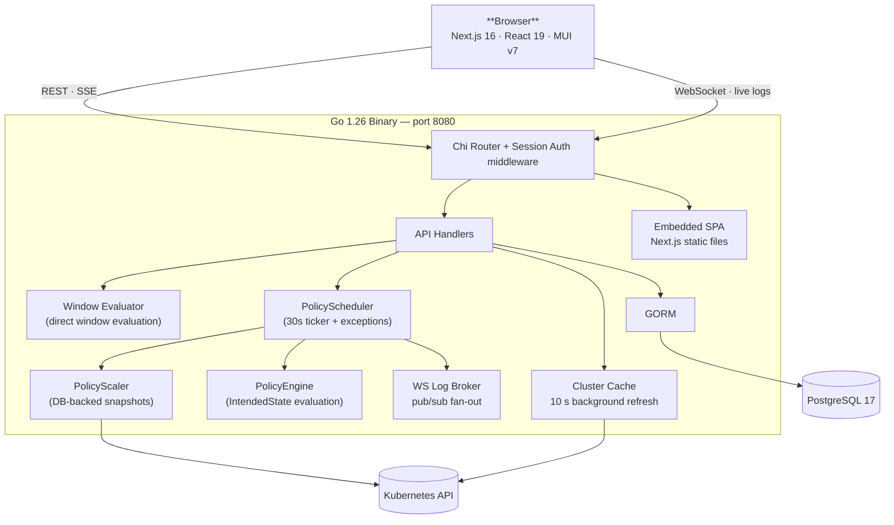

# kube-phoenix 🐦‍🔥

[](https://github.com/MacXsimilian/kube-phoenix/actions/workflows/ci.yml)
[](https://github.com/MacXsimilian/kube-phoenix/releases/latest)
[](https://goreportcard.com/report/github.com/macxsimilian/kube-phoenix/backend)
[](backend/go.mod)
[](frontend/package.json)
[](openapi.yaml)
[](https://github.com/MacXsimilian/kube-phoenix/actions/workflows/security.yml)
[](https://github.com/MacXsimilian/kube-phoenix/pkgs/container/kube-phoenix)
[](https://github.com/MacXsimilian/kube-phoenix/pkgs/container/helm%2Fkube-phoenix)
[](#observability)
[](https://github.com/MacXsimilian/kube-phoenix/blob/master/LICENSE)
[](https://github.com/MacXsimilian/kube-phoenix/stargazers)
[](https://github.com/MacXsimilian/kube-phoenix/issues)

**Define when your Kubernetes cluster sleeps and wakes. Stop paying for idle nodes.**

kube-phoenix is a self-hosted web application for managing cluster sleep/wake policies. Define sleep windows ("Mon-Fri 7 PM - 7 AM"), and kube-phoenix handles the rest: scaling workloads to zero, draining nodes, and restoring everything on schedule. It replaces ad-hoc bash CronJobs with a proper operator: a Go backend with a full-featured UI, policy-based scheduling, live log streaming, guardrails to protect critical workloads, and a Helm chart for one-command deployment.

---

## Quick Start

Requires Helm 3 and a Kubernetes cluster.

```bash
helm upgrade --install kube-phoenix oci://ghcr.io/macxsimilian/helm/kube-phoenix \
  --namespace kube-phoenix \
  --create-namespace \
  --set secret.adminUser=admin \
  --set secret.adminPassword=<your-password>
```

```bash
kubectl port-forward -n kube-phoenix svc/kube-phoenix 8080:80
# Open http://localhost:8080
```

New policies start in **plan mode** — nothing will scale until you explicitly switch a policy to `apply` mode.

→ Full deployment guide (external DB, Ingress, AWS ALB, Helm values): [docs/deployment.md](docs/deployment.md)

### Local development

**Prerequisites:** Go 1.26+, Node.js 24+, Docker

```bash
make dev          # start PostgreSQL
make dev-backend  # http://localhost:8080 (separate terminal)
make dev-frontend # http://localhost:3000 (separate terminal)
```

On first startup the admin user is seeded from `ADMIN_USER` / `ADMIN_PASSWORD` env vars. Authentication is disabled when neither is set (dev mode).

### Production build

```bash
make build
# Builds frontend → copies to backend/web/static → compiles Go binary
# Output: backend/bin/kube-phoenix
```

### Docker

```bash
make docker-build
# Produces: ghcr.io/macxsimilian/kube-phoenix:<git-sha>
```

---

## How it works

A **Policy** declares _when_ workloads should sleep using **sleep windows** — human-readable time ranges like "Mon–Fri 7 PM – 7 AM".

```
Policy: "Dev environments"
  sleepWindows:
    - days: Mon–Fri, startTime: 19:00, endTime: 07:00
  namespaceFilter: "staging,dev"
  labelSelector:  "team=backend"
  mode: apply
```

A 30-second ticker evaluates all windows against the current time (in each policy's timezone) and triggers sleep or wake executions when the intended state differs from the actual state. The full lifecycle includes:

- **Overrides** — time-windowed overrides that take precedence (`stay_awake`, `force_sleep`) or skip the next transition (`skip_sleep`, `skip_wake`)
- **Scheduled Exceptions** — future windows with ticket references (e.g. "keep staging up this weekend for a release") with a pending → active → completed lifecycle
- **Startup recovery** — on pod restart, the intended state at `now` is computed and any mismatch triggers an automatic recovery execution
- **DB-backed replica storage** — replica counts are stored in `WorkloadSnapshot` rows (not just K8s annotations), so restores are reliable even if annotations were overwritten

### Sleep

```
For each matching Deployment / StatefulSet
  │
  ├─► Save replica count (WorkloadSnapshot in DB + previous-replicas annotation)
  ├─► Scale replicas to 0
  │
  └─► For each node (respecting guardrails)
        ├─► Cordon node
        ├─► Evict / delete non-DaemonSet pods
        └─► Delete node
```

### Wake

```
For each matching Deployment / StatefulSet
  │
  ├─► Read saved replica count (DB snapshot preferred, annotation as fallback)
  ├─► Restore replica count
  └─► Close snapshot record

For each node
  └─► Uncordon   (Karpenter / Cluster Autoscaler provisions
                  new nodes as pending pods appear)
```

---

## Architecture



---

## Features

- **Overview** — cluster health at a glance: current scale state, live indicator, partial-sleep namespace breakdown, policy next-run countdown, and live activity feed
- **Cluster State** — live view of all Deployments, StatefulSets, and nodes with resizable drill-down drawers; pod detail includes live CPU/memory usage, annotations, node instance type, Kubernetes events, and a streaming container log viewer with search navigation
- **Guardrails** — protect namespaces, node labels, and taints from ever being touched by the scaler
- **Policies** — declarative sleep window policies: define "Mon–Fri 7 PM – 7 AM" and the system handles the rest; namespace and label selector targeting, plan/apply mode, one-time overrides (stay_awake, force_sleep, skip_sleep, skip_wake), DB-backed replica snapshots, startup recovery, 24h mini timeline on cards, and a weekly timeline visualization on the detail page
- **Scheduled Exceptions** — future one-time windows with ticket references (JIRA/GitHub), a pending→active→completed lifecycle, and optional "sleep on end" to restore workloads automatically when the window closes
- **History** — full execution log with live WebSocket streaming; jump-to-error navigation and workload count badges
- **Manual triggers** — Sleep Now / Wake Now buttons on each policy
- **Users** — multi-user management with three RBAC roles (admin, operator, viewer) and granular permissions; admin-only page for creating, editing, and deleting users
- **Audit Log** — searchable audit trail with before/after diffs, filterable by user, action, and resource; configurable retention
- **Authentication** — session-based auth via HTTP-only cookies with CSRF double-submit protection; optional Keycloak OIDC integration (Authorization Code + PKCE, AD group-to-role mapping, account linking); login rate limiting (per-IP and per-username)
- **Settings** — light/dark/system theme switcher; danger zone with double-confirmation Reset Database
- **Swagger UI** — interactive API docs at `/api/docs/`; raw OpenAPI 3.1 spec at `/api/docs/openapi.yaml`

---

## Tech stack

| Layer     | Technology                                                |
| :-------- | :-------------------------------------------------------- |
| Backend   | Go 1.26, chi v5.2, GORM v1.31, client-go                 |
| Frontend  | Next.js 16, React 19, Material UI v7, TanStack Query v5   |
| Database  | PostgreSQL 17                                             |
| Packaging | Helm 4, GHCR (OCI), GitHub Actions                        |

The Go backend embeds the Next.js static export via `//go:embed` — one binary, one container, no separate web server.

---

## Roadmap

| Item                        | Status      | Notes                                           |
| :-------------------------- | :---------- | :---------------------------------------------- |
| Multi-user management       | Done        | Session auth, RBAC (admin/operator/viewer), audit log |
| Keycloak / OIDC auth        | Done        | Authorization Code + PKCE, AD group mapping     |
| Policy model                | Done        | Unified sleep/wake policies with overrides, exceptions, DB snapshots, recovery |
| Scheduled Exceptions        | Done        | Future one-time windows with ticket refs and sleep-on-end |
| Slack / email notifications | Planned     | Alert on scale failures and manual triggers     |
| Multi-cluster support       | Planned     | Switch between kubeconfig contexts in the UI    |
| OpenAPI spec                | Done        | Swagger UI served at `/api/docs/`               |
| GitLab CI pipeline          | Planned     | Mirror of the GitHub Actions workflow           |
| Emergency wake button       | Planned     | One-click full cluster wake bypassing policy schedule |

---

## Observability

kube-phoenix exposes a Prometheus metrics endpoint at `/metrics` (no authentication required, suitable for in-cluster scraping).

```yaml
# prometheus.yml scrape config
- job_name: kube-phoenix
  static_configs:
    - targets: ['kube-phoenix.kube-phoenix.svc.cluster.local:8080']
```

| Metric | Type | Labels | Description |
|--------|------|--------|-------------|
| `kube_phoenix_executions_total` | Counter | `status`, `mode`, `direction` | Total policy executions |
| `kube_phoenix_execution_duration_seconds` | Histogram | `mode`, `direction`, `status` | Execution wall-clock duration |
| `kube_phoenix_workloads_scaled_total` | Counter | `direction` | Workloads scaled (sleep/wake) |
| `kube_phoenix_nodes_drained_total` | Counter | — | Nodes drained during sleep |
| `kube_phoenix_nodes_deleted_total` | Counter | — | Nodes deleted during sleep |
| `kube_phoenix_active_policies` | Gauge | `mode` | Enabled policies by mode |
| `kube_phoenix_auth_attempts_total` | Counter | `status`, `method` | Login attempts by outcome and method (local/oidc) |
| `kube_phoenix_user_actions_total` | Counter | `action`, `resource_type` | User-initiated mutations (policy.create, policy.update, policy.delete, etc.) |
| `kube_phoenix_active_sessions` | Gauge | — | Currently active user sessions |
| `kube_phoenix_rate_limit_hits_total` | Counter | `type` | Rate limiter rejections (per_ip/per_username) |
| `kube_phoenix_audit_drops_total` | Counter | — | Audit entries dropped due to full buffer |

---

## Contributing

See [CONTRIBUTING.md](CONTRIBUTING.md) for local setup, branching strategy, commit conventions, and PR checklist.

---

## Docs

| Topic | Link |
|---|---|
| Architecture & system design | [ARCHITECTURE.md](ARCHITECTURE.md) |
| Deployment (external DB, Ingress, AWS ALB, Helm values) | [docs/deployment.md](docs/deployment.md) |
| Configuration (env vars, auth, policies) | [docs/configuration.md](docs/configuration.md) |
| API reference + Swagger UI | [docs/api.md](docs/api.md) |
| Troubleshooting | [docs/troubleshooting.md](docs/troubleshooting.md) |
| Release history | [CHANGELOG.md](CHANGELOG.md) |

---

> Built by [@MacXsimilian](https://github.com/MacXsimilian). The scaler drains nodes — run in plan mode first.
