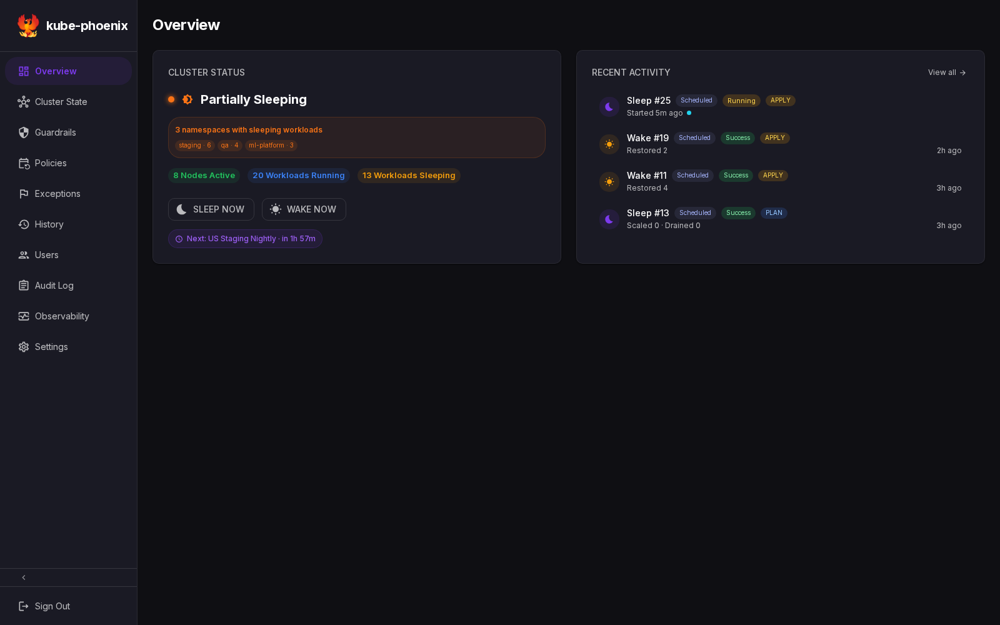

# kube-phoenix 🐦‍🔥

[](https://github.com/MacXsimilian/kube-phoenix/actions/workflows/ci.yml)
[](https://github.com/MacXsimilian/kube-phoenix/releases/latest)
[](backend/go.mod)
[](frontend/package.json)
[](openapi.yaml)
[](https://github.com/MacXsimilian/kube-phoenix/actions/workflows/security.yml)
[](https://securityscorecards.dev/viewer/?uri=github.com/MacXsimilian/kube-phoenix)
[](https://github.com/MacXsimilian/kube-phoenix/pkgs/container/kube-phoenix)
[](https://github.com/MacXsimilian/kube-phoenix/pkgs/container/helm%2Fkube-phoenix)
[](docs/observability.md#prometheus-metrics)
[](https://github.com/MacXsimilian/kube-phoenix/blob/master/LICENSE)
[](https://github.com/MacXsimilian/kube-phoenix/stargazers)
[](https://github.com/MacXsimilian/kube-phoenix/issues)


**Scheduled sleep and wake for Kubernetes workloads.**

kube-phoenix uses policies to scale Deployments and StatefulSets to zero during off-hours and restore saved replica counts on wake. Configure sleep windows such as Monday–Friday, 19:00–07:00 in a chosen timezone, preview the work in plan mode, and explicitly choose apply mode for live changes. One Go binary serves the API and browser interface.



*Actual application screenshot with mock data; the cluster status and executions are illustrative.*

## What It Does

- **Policies and exceptions:** recurring sleep windows, namespace/workload selectors, and one-time stay-awake or force-sleep exceptions.
- **Replica restoration:** PostgreSQL snapshots preserve pre-sleep replica counts across process restarts.
- **Guardrails:** protected namespaces, node labels/taints, priority ordering, and configurable scaling concurrency.
- **Recovery and drift handling:** startup reconciliation, corrective wakes, and optional sleep enforcement.
- **Operator visibility:** cluster inventories, pod details/logs, execution history, audit logs, and Prometheus metrics.
- **Access and portability:** session authentication, admin/operator/viewer roles, optional OIDC, and per-resource JSON export/import.

Sleep also considers cordoning, draining, and deleting unprotected nodes **across the cluster**. A namespace filter scopes workload scaling; node protection is separate. Wake restores workloads and relies on an external autoscaler such as Karpenter for missing capacity. It does not uncordon or recreate nodes.

The Metrics Dashboard is alpha. API Rivers is a cosmetic/mock visualization. See [observability](docs/observability.md) for the distinction between measurements, estimates, and illustrative animation.

## Quick Start

For evaluation, use a disposable Kubernetes cluster (1.25+) and Helm 3.8+ with OCI support. CI validates the chart with Helm 4.3.0; see [deployment](docs/deployment.md) for the full requirements and production configuration.

Create a local values file; these example credentials are for a disposable local environment:

```bash
cat > /tmp/kube-phoenix-local-values.yaml <<'YAML'
createNamespace: false
secret:
  adminUser: admin
  adminPassword: change-this-local-password
session:
  cookieSecure: false
YAML

helm upgrade --install kube-phoenix oci://ghcr.io/macxsimilian/helm/kube-phoenix \
  --namespace kube-phoenix --create-namespace \
  -f /tmp/kube-phoenix-local-values.yaml --wait --timeout 5m
kubectl port-forward -n kube-phoenix svc/kube-phoenix 8080:80
```

Open **http://localhost:8080**, then sign in with `admin` / `change-this-local-password`. The HTTP cookie setting is for this port-forward; use Secure cookies with HTTPS deployments.

New policies default to plan mode. Follow [your first policy](docs/first-policy.md) to protect nodes, verify the preview, apply a sleep, and check restoration. For a frontend preview without Kubernetes or PostgreSQL, run `make dev-mock`; see [local development](docs/local-development.md).

## Documentation

Choose a starting point, or browse the complete [documentation home](docs/README.md).

| I want to… | Read |
| :--------- | :--- |
| Install and operate kube-phoenix | [Deployment](docs/deployment.md) → [First policy](docs/first-policy.md) → [Configuration](docs/configuration.md) |
| Work on the code | [Local development](docs/local-development.md) → [Architecture](ARCHITECTURE.md) → [Backend](docs/backend-dev-guide.md) or [Frontend](docs/frontend-dev-guide.md) |
| Integrate or investigate behavior | [API guide](docs/api.md), [OpenAPI](openapi.yaml), [Troubleshooting](docs/troubleshooting.md), [Policy smoke test](docs/testing/policy-smoke-test.md) |

## Community and Contributing

See [CONTRIBUTING.md](CONTRIBUTING.md) for branching, commit conventions, and the PR checklist. Report problems or discuss ideas in [GitHub issues](https://github.com/MacXsimilian/kube-phoenix/issues). Release history is in [CHANGELOG.md](CHANGELOG.md).

## License

Apache License 2.0 — see [LICENSE](LICENSE).
