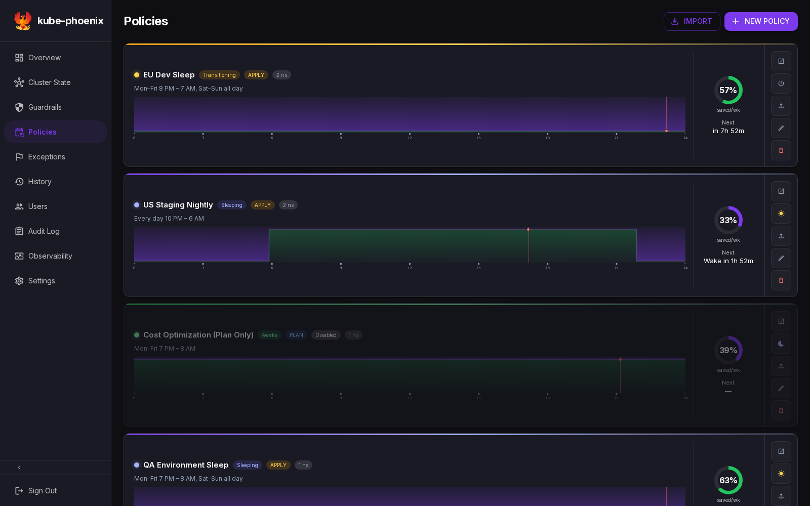

# Documentation

Start with the path that matches your task. Setup guides explain how to run the application; references explain current behavior; design records preserve the reasoning and historical requirements.

[Install and operate](#install-and-operate) · [Develop](#develop) · [Integrate and verify](#integrate-and-verify) · [Design records](#design-records)

## Install and Operate

1. [Deploy kube-phoenix](deployment.md), or choose a mode in [local development](local-development.md).
2. [Create your first policy](first-policy.md): protect nodes, preview a sleep, apply it, and verify restoration.
3. Use [configuration](configuration.md) for settings and [troubleshooting](troubleshooting.md) for symptoms.

*Actual application screenshot with mock policies and cluster data. Follow the walkthrough using your own disposable-cluster resources.*

| Guide | Use it for |
| :---- | :--------- |
| [Deployment](deployment.md) | Helm installation, PostgreSQL, HTTPS/ingress, OIDC, upgrades |
| [PostgreSQL upgrade](postgresql-upgrade.md) | Move bundled PostgreSQL 17 data to 18 with retained storage and rollback |
| [First policy](first-policy.md) | A scoped manual plan → apply → wake exercise |
| [Configuration](configuration.md) | Environment defaults, authentication, policy fields, guardrails |
| [Export/import](config-export-import.md) | Copy one resource between environments with preview and conflict resolution |
| [Troubleshooting](troubleshooting.md) | Diagnose scaling, login, connection, and data-display problems |
| [Observability](observability.md) | Interpret metrics and estimates; understand the alpha dashboard and cosmetic/mock API Rivers |

## Develop

Read [architecture](../ARCHITECTURE.md) for boundaries, then use the relevant contributor landing page. The deeper references describe ownership, flows, and implementation constraints.

| Start here | Focused references |
| :--------- | :----------------- |
| [Local development](local-development.md) | Mock frontend, local services, or a real test cluster |
| [Backend developer guide](backend-dev-guide.md) | [Policy engine](development/backend-policy-engine.md), [data/transport flow](development/backend-data-flow.md) |
| [Frontend developer guide](frontend-dev-guide.md) | [Data flow](development/frontend-data-flow.md), [UI patterns](development/frontend-ui-patterns.md) |
| [Contributing](../CONTRIBUTING.md) | Branching, commits, PR format, and review conventions |

## Integrate and Verify

| Reference | Use it for |
| :-------- | :--------- |
| [API guide](api.md) | Session/CSRF client setup, resource navigation, streaming behavior |
| [OpenAPI](../openapi.yaml) | Canonical endpoint, request, response, parameter, and error schemas |
| [Window scheduling](window-native-scheduling.md) | Current timezone/window semantics and separately labeled legacy cron migration |
| [Policy smoke test](testing/policy-smoke-test.md) | Short, repeatable manual verification on a disposable cluster |
| [Policy regression catalogue](test-plan-policy.md) | Broader expected scenarios; record executed results separately |
| [Helm values](../helm/kube-phoenix/values.yaml) and [schema](../helm/kube-phoenix/values.schema.json) | Deploy-time keys and validation |
| [Screenshot gallery](images/screenshots/README.md) | Actual application captures with mock data and source provenance |
| [Changelog](../CHANGELOG.md) | Release history |

## Design Records

[Policy-based scaling requirements](feature-policy-based-scaling.md) is a design record, with current implementation status called out. Its success criteria describe intended verification, not a report of completed tests. The [window scheduling reference](window-native-scheduling.md) keeps cron conversion history separate from the current scheduling contract.

## Where Facts Live

| Fact | Primary source |
| :--- | :------------- |
| API shapes | [openapi.yaml](../openapi.yaml) |
| Runtime defaults and setting behavior | [Configuration](configuration.md), backed by linked implementation |
| Helm defaults | [values.yaml](../helm/kube-phoenix/values.yaml) |
| Dependency versions | [go.mod](../backend/go.mod), [package.json](../frontend/package.json), [Dockerfile](../Dockerfile) |
| System boundaries | [Architecture](../ARCHITECTURE.md) |
| Field/function inventories | Source code linked from the developer references |

Keep task instructions in the relevant guide and link to these sources when details change. Screenshots illustrate the interface; their captions identify mock data.
