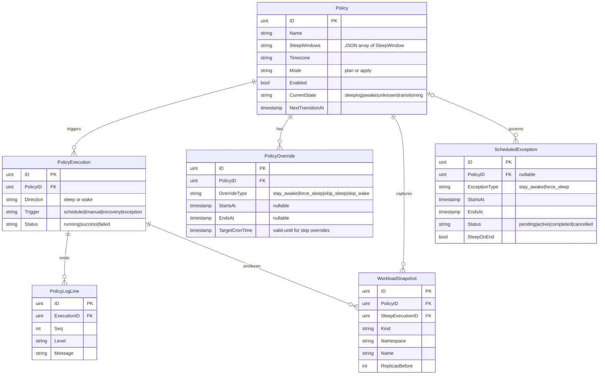
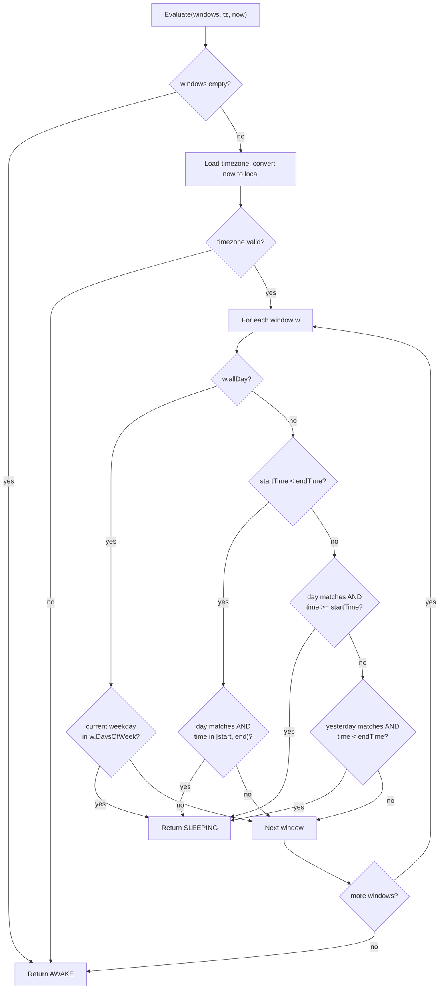
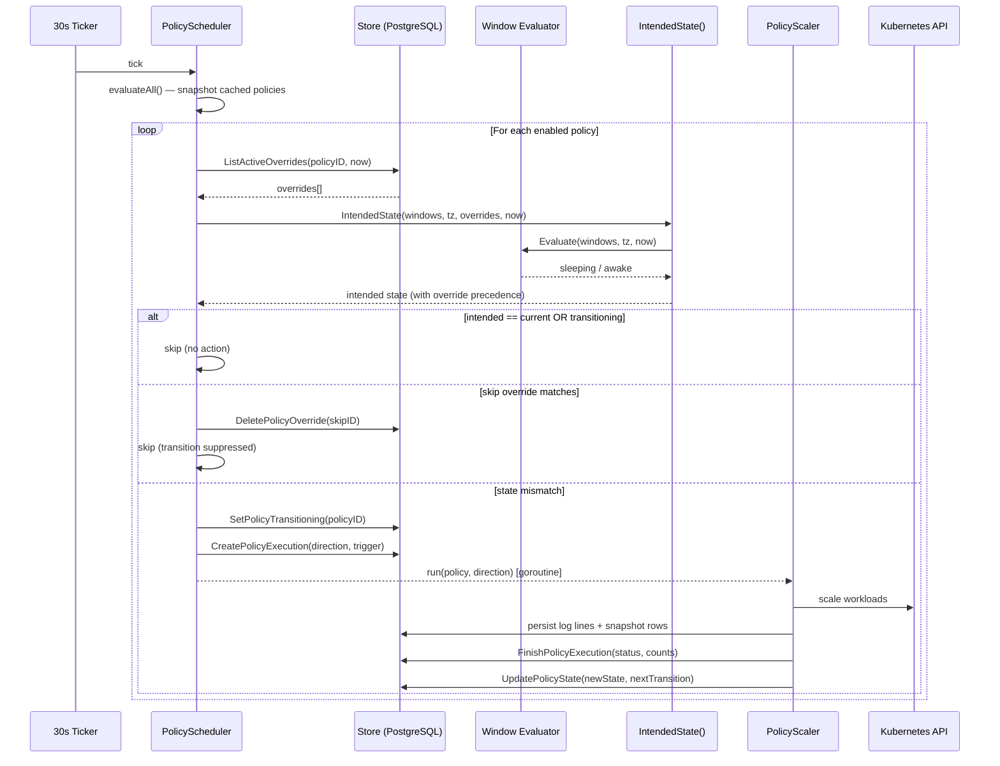

# Architecture: Window-Native Policy Scheduling

## 1. Overview

kube-phoenix policies use **sleep windows** as the sole schedule source of truth. Each window defines a recurring period (days of week + time range or all-day) during which targeted workloads should be scaled to zero. A 30-second ticker evaluates all windows in the policy's timezone, compares the intended state against the current state, and triggers sleep or wake executions on mismatch.

The previous cron-based system compiled sleep windows into `robfig/cron` expressions and reverse-engineered "most recent fire" times to determine state. That approach was fragile — overnight windows, timezone edge cases, and all-day schedules required increasingly complex cron compilation and reverse-parsing logic. The window-native model eliminates this indirection entirely: the evaluator reads windows directly, making the scheduling logic deterministic and straightforward to reason about.

---

## 2. Data Model

### SleepWindow

```go
type SleepWindow struct {
    DaysOfWeek []int  `json:"daysOfWeek"` // 0=Sun, 1=Mon, ..., 6=Sat
    StartTime  string `json:"startTime"`  // "HH:MM" 24h; ignored when AllDay=true
    EndTime    string `json:"endTime"`    // "HH:MM" 24h; ignored when AllDay=true
    AllDay     bool   `json:"allDay"`     // entire calendar day is sleeping
}
```

`SleepWindow` is not a database model. It is serialized as a JSON array in the `Policy.SleepWindows` text column.

### Policy

```go
type Policy struct {
    ID              uint       `gorm:"primaryKey"`
    Name            string
    Description     string
    NamespaceFilter string     // comma-separated namespaces; empty = all
    LabelSelector   string     // Kubernetes label selector syntax
    SleepWindows    string     // JSON array of SleepWindow (text column)
    Timezone        string     // IANA timezone (e.g. "America/New_York")
    Mode            string     // "plan" | "apply"
    Enabled         bool
    TimeoutMinutes  int        // 0 = server default (120 min)
    CurrentState    string     // sleeping | awake | unknown | transitioning
    StateSince      *time.Time
    LastSleepAt     *time.Time
    LastWakeAt      *time.Time
    NextTransitionAt *time.Time // next predicted state change (cached)
    CreatedAt       time.Time
    UpdatedAt       time.Time
}
```

**Removed fields** (legacy cron model): `SleepCron`, `WakeCron`, `NextSleepAt`, `NextWakeAt`.

**Added fields**: `NextTransitionAt` — a single timestamp replacing the two previous next-fire fields.

### PolicyOverride

```go
type PolicyOverride struct {
    ID             uint
    PolicyID       uint
    OverrideType   string     // stay_awake | force_sleep | skip_sleep | skip_wake
    StartsAt       *time.Time // nil for skip overrides
    EndsAt         *time.Time // nil for skip overrides
    TargetCronTime *time.Time // reused as "valid until" for skip overrides
    Reason         string
    CreatedBy      string
    CreatedAt      time.Time
}
```

Windowed overrides (`stay_awake`, `force_sleep`) have a `StartsAt`/`EndsAt` range. Skip overrides (`skip_sleep`, `skip_wake`) use `TargetCronTime` as a "valid until" expiry — when the scheduler detects a matching transition, it consumes and deletes the override.

### ScheduledException

```go
type ScheduledException struct {
    ID              uint
    PolicyID        *uint      // optional — can be freestanding
    ExceptionType   string     // "stay_awake" | "force_sleep"
    StartsAt        time.Time
    EndsAt          time.Time
    TicketRef       string     // JIRA-123, GH-456, etc.
    Reason          string
    SleepOnEnd      bool       // return to policy state when exception ends
    NamespaceFilter string
    LabelSelector   string
    WorkloadTargets string     // JSON array of WorkloadTarget
    Status          string     // pending | active | completed | cancelled
    CreatedBy       string
    CreatedAt       time.Time
    UpdatedAt       time.Time
}
```

### Entity Relationships



---

## 3. Window Evaluator

**Source:** `backend/internal/policy/evaluator.go`

### Evaluate()

`Evaluate(windows []SleepWindow, timezone string, now time.Time) → IntendedState`

Converts `now` to the policy timezone, then checks each window. Any match returns `StateSleeping`; no match returns `StateAwake`. An empty window set always returns `StateAwake`.

**Boundary semantics:** start time is inclusive, end time is exclusive — `[start, end)`.

**Window types:**

| Type | Condition | Sleeping when |
|------|-----------|---------------|
| All-day | `AllDay == true` | Current weekday is in `DaysOfWeek` |
| Same-day | `StartTime < EndTime` | Day matches AND time in `[start, end)` |
| Overnight | `StartTime >= EndTime` | (Day matches AND time >= start) OR (yesterday matches AND time < end) |

### NextTransition()

`NextTransition(windows []SleepWindow, timezone string, now time.Time) → *time.Time`

Computes the next time the evaluated state will flip. Algorithm:

1. Collect all boundary times (window start and end instants) for the next 8 days.
2. Sort boundaries chronologically.
3. Walk forward from `now`, evaluating each boundary. The first boundary where `Evaluate()` returns a different state than the current state is the next transition.
4. Returns `nil` if no transition is found (e.g., all-day sleep on every day of the week).

### Decision Flowchart



---

## 4. Scheduler Architecture

**Source:** `backend/internal/scheduler/policy_scheduler.go`, `backend/internal/scheduler/policy_engine.go`

### Ticker Loop

The `PolicyScheduler` runs a `time.Ticker` at a 30-second interval. Each tick calls `evaluateAll()`, which:

1. Takes a snapshot of all cached policies under the mutex.
2. Releases the mutex.
3. Evaluates each policy independently.

### Override Precedence

The `IntendedState()` function in `policy_engine.go` resolves the intended state with this precedence (highest to lowest):

| Priority | Override Type | Result |
|----------|--------------|--------|
| 1 | Active `force_sleep` override (time window) | Sleeping |
| 2 | Active `stay_awake` override (time window) | Awake |
| 3 | Window evaluator result | Sleeping or Awake |

If no windows are configured and no overrides apply, the state is `Unknown` (no action taken).

### Skip Overrides

Skip overrides (`skip_sleep`, `skip_wake`) are checked *after* the intended state is determined but *before* the execution is triggered. If a matching skip override exists and has not expired (checked via `TargetCronTime` as a "valid until" field), the transition is suppressed and the override is consumed (deleted).

### State Transition Detection

For each enabled policy, `evaluatePolicy()`:

1. Loads active overrides from the database.
2. Computes `IntendedState()`.
3. Compares against `CurrentState`.
4. Skips if states match or if `CurrentState == "transitioning"` (execution already in progress).
5. Checks for skip overrides — if present, consumes and returns.
6. Otherwise, triggers an execution (sleep or wake).

### Execution Lifecycle

When a transition is triggered:

1. The policy is set to `"transitioning"` state (mutex-protected).
2. A `PolicyExecution` record is created with status `"running"`.
3. A goroutine runs the scaler with a timeout (policy-configured or default 2h).
4. Log lines are streamed to the database and broadcast via the WebSocket broker.
5. On completion, the execution status, workload counts, and policy state are updated.
6. `NextTransitionAt` is recalculated and persisted.

### Startup Recovery

`RecoverPolicies()` runs once at startup. For each enabled policy, it evaluates the intended state and compares against the stored `CurrentState`. Any mismatch triggers a recovery execution to bring the cluster into the correct state.

### Exception Ticker

`TickExceptions()` is called periodically to manage `ScheduledException` lifecycle:

- **Pending -> Active:** When `now >= StartsAt`, sets status to `"active"` and triggers a wake execution on the associated policy.
- **Active -> Completed:** When `now > EndsAt`, sets status to `"completed"` and optionally triggers a sleep execution if `SleepOnEnd` is true.

### Sequence Diagram: Full Tick Cycle



---

## 5. API

### Endpoints

| Method | Path | Description |
|--------|------|-------------|
| `GET` | `/api/policies` | List all policies |
| `GET` | `/api/policies/:id` | Get a single policy |
| `POST` | `/api/policies` | Create a policy |
| `PATCH` | `/api/policies/:id` | Update a policy (partial) |
| `DELETE` | `/api/policies/:id` | Delete a policy |
| `POST` | `/api/policies/:id/sleep` | Trigger immediate sleep |
| `POST` | `/api/policies/:id/wake` | Trigger immediate wake |

### Create Policy Request

```json
{
  "name": "Dev environments",
  "description": "Sleep dev namespaces overnight",
  "namespaceFilter": "staging,dev",
  "labelSelector": "team=backend",
  "sleepWindows": [
    {
      "daysOfWeek": [1, 2, 3, 4, 5],
      "startTime": "19:00",
      "endTime": "07:00",
      "allDay": false
    },
    {
      "daysOfWeek": [0, 6],
      "startTime": "00:00",
      "endTime": "00:00",
      "allDay": true
    }
  ],
  "timezone": "America/New_York",
  "mode": "plan",
  "enabled": true,
  "timeoutMinutes": 30
}
```

### Policy Response

The response wraps the stored `Policy` with two computed fields:

- `sleepWindows` — deserialized from the JSON text column into an array of `SleepWindow` objects.
- `nextTransitionAt` — computed live by the scheduler via `NextTransition()`.

### Validation Rules

| Field | Rule |
|-------|------|
| `name` | Required, max 255 characters |
| `sleepWindows` | Required, at least one window |
| `sleepWindows[].daysOfWeek` | Non-empty, values 0-6, no duplicates |
| `sleepWindows[].startTime` / `endTime` | `HH:MM` format (two-digit hour and minute), must differ |
| `sleepWindows[].allDay` | When true, `startTime`/`endTime` are ignored |
| `timezone` | Valid IANA timezone (defaults to `"UTC"`) |
| `mode` | `"plan"` or `"apply"` (defaults to `"plan"`) |
| `timeoutMinutes` | 0–1440 |
| `namespaceFilter` | Comma-separated RFC 1123 DNS labels, each max 63 characters |

### What Changed from the Cron-Based API

- Removed: `sleepCron`, `wakeCron` fields from request/response.
- Removed: Cron validation and compilation logic in handlers.
- Added: `sleepWindows` array with `allDay` support.
- The `nextTransitionAt` field replaces the pair of `nextSleepAt` / `nextWakeAt`.

---

## 6. Frontend

### WindowPicker

**Source:** `frontend/src/components/policies/WindowPicker.tsx`

The `WindowPicker` component provides the schedule editing UI:

- **Preset buttons** — one-click templates for common patterns: "Weekday nights", "Weekends", "Nights + weekends", "Business hours".
- **Per-window cards** — each window is an independent card with:
  - An **all-day toggle** (MUI Switch) that hides time pickers when enabled.
  - **Sleep/Wake time pickers** — hour and minute dropdowns (5-minute granularity).
  - **Day-of-week buttons** — toggle individual days with visual press state.
  - **"next day" chip** — appears when a window is overnight (end <= start).
- **Add/remove windows** — users can add multiple independent windows, each with its own days and times.
- **Summary text** — `windowsToText()` renders a human-readable description below the picker (e.g., "Mon-Fri 7 PM - 7 AM, Sat-Sun all day").
- **Never-wake warning** — displayed when all 7 days are covered by all-day windows.

### WeeklyTimeline

**Source:** `frontend/src/components/policies/WeeklyTimeline.tsx`

An SVG-based weekly timeline that visualizes sleep windows, overrides, and exceptions as colored blocks across a 7-day x 24-hour grid. Features:

- Renders sleep windows as indigo blocks on the appropriate day rows.
- Overlays override and exception windows in distinct colors.
- Shows a "now" marker line converted to the policy's timezone using `toLocaleString()`.
- All-day windows render as full-width bars.
- Overnight windows split across two rows (evening portion on the start day, morning portion on the next day).

### Frontend Types

**Source:** `frontend/src/lib/types.ts`

```typescript
interface SleepWindow {
  daysOfWeek: number[]  // 0=Sun, 1=Mon, ..., 6=Sat
  startTime: string     // "HH:MM" 24h
  endTime: string       // "HH:MM" 24h
  allDay: boolean       // entire calendar day is sleeping
}

interface Policy {
  id: number
  name: string
  sleepWindows: SleepWindow[] | null
  timezone: string
  mode: 'plan' | 'apply'
  enabled: boolean
  currentState: 'sleeping' | 'awake' | 'unknown' | 'transitioning'
  nextTransitionAt?: string | null
  // ... other fields
}
```

No cron fields exist in the frontend types.

---

## 7. Migration

**Source:** `backend/internal/store/store.go`

The migration runs automatically on startup in `store.New()` and is fully idempotent:

### Step 1: Schema Migration

`db.AutoMigrate()` adds the `NextTransitionAt` column to the `policies` table (GORM handles "add column if not exists" semantics).

### Step 2: Cron-to-Window Conversion

`migrateWindowsFromCrons()` runs only if the legacy `sleep_cron` column still exists:

1. Queries all policies where `sleep_windows` is empty/null but `sleep_cron` or `wake_cron` is populated.
2. For each policy, calls `CronsToWindows(sleepCron, wakeCron)` to reverse-parse the cron expressions into a `SleepWindow`.
3. If reverse-parsing fails (complex cron expressions), falls back to an all-day window on every day of the week.
4. Writes the resulting JSON array to the `sleep_windows` column.

`CronsToWindows()` handles:
- Single-time cron expressions (`minute hour * * dow`).
- Day-of-week fields with ranges (`1-5`) and comma-separated values (`0,6`).
- Same-day and overnight window detection based on sleep/wake time comparison.
- Validation that wake days align with sleep days (accounting for overnight offset).

### Step 3: Column Drops

After migration, the legacy columns are dropped via idempotent `ALTER TABLE ... DROP COLUMN IF EXISTS`:

- `sleep_cron`
- `wake_cron`
- `next_sleep_at`
- `next_wake_at`

### Idempotency

- The column existence check (`information_schema.columns`) prevents re-running the conversion after the columns have been dropped.
- `DROP COLUMN IF EXISTS` is safe to run repeatedly.
- GORM's `AutoMigrate` only adds columns that do not already exist.

---

## 8. Deleted Code

The following code and dependencies were removed as part of this migration:

| Item | Location | Purpose |
|------|----------|---------|
| `robfig/cron/v3` | `go.mod` | Cron expression parsing and scheduling |
| `CompileWindowsToCrons()` | `policy/` | Compiled `SleepWindow[]` into sleep/wake cron expressions |
| `MostRecentFire()` | `policy/` | Reverse-engineered the last time a cron expression fired |
| `NextFire()` | `policy/` | Computed next cron fire time |
| `stateFromCrons()` | `scheduler/` | Determined sleeping/awake by comparing most-recent sleep vs wake fire |
| Cron entry registration | `scheduler/` | `robfig/cron` scheduler entry management (AddFunc, Remove, etc.) |
| Cron validation | `api/` | Cron expression syntax validation in API handlers |
| `SleepCron` / `WakeCron` fields | `store/models.go` | Database columns for raw cron expressions |
| `NextSleepAt` / `NextWakeAt` fields | `store/models.go` | Separate next-fire timestamps |
| Cron mode toggle | `frontend/` | UI toggle between "window mode" and "cron mode" |
| CronBuilder component | `frontend/` | Raw cron expression editor |
| "All windows must share same times" constraint | `policy/` | Legacy validation requiring uniform start/end across windows |

`CronsToWindows()` and `parseSingleCron()` in `backend/internal/policy/windows.go` are retained temporarily for migration. They will be removed once all installations have migrated.
