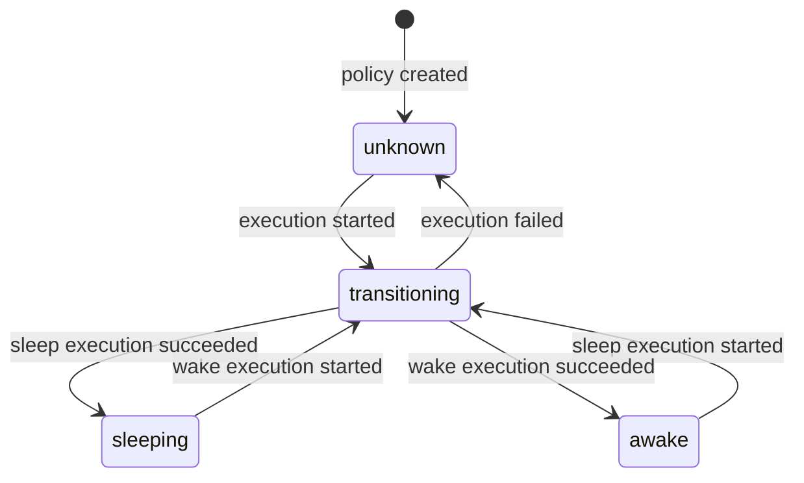
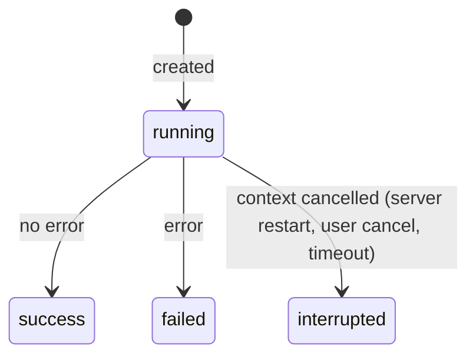
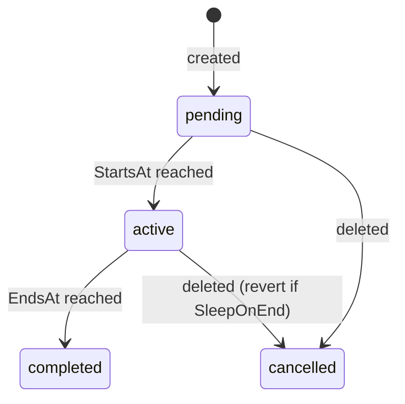

# Backend Developer Guide

> Deep-dive technical reference for contributors working on the kube-phoenix Go backend.
> Written for experienced Go developers who are new to this codebase.

---

## Table of Contents

1. [Overview](#1-overview)
2. [Package Map](#2-package-map)
3. [Data Model Deep Dive](#3-data-model-deep-dive)
4. [Request Lifecycle](#4-request-lifecycle)
5. [Policy Execution Engine](#5-policy-execution-engine)
6. [Cluster Data Pipeline](#6-cluster-data-pipeline)
7. [Real-Time Communication](#7-real-time-communication)
8. [Observability](#8-observability)
9. [Testing Guide](#9-testing-guide)
10. [Common Patterns and Conventions](#10-common-patterns-and-conventions)

---

## 1. Overview

kube-phoenix is a Kubernetes cluster sleep/wake policy engine that reduces cloud spend by scaling workloads to zero and draining nodes during off-hours, then restoring them on schedule. The backend is a single Go binary that serves a REST API, WebSocket and SSE endpoints, Prometheus metrics, and an embedded Next.js SPA -- all from a single HTTP listener on port 8080. A configurable evaluation ticker (default 30 seconds) continuously reconciles intended state (derived from policy sleep windows and exceptions) against actual cluster state, triggering sleep or wake executions when they diverge.

**Tech stack:** Go (Chi v5 router, GORM ORM, gorilla/websocket), PostgreSQL 17, client-go for Kubernetes API access, Prometheus client for metrics.

**Run locally:**

```bash
make dev-backend
```

This requires `DATABASE_URL` to be set (PostgreSQL connection string). The Kubernetes client is optional -- if unavailable, cluster endpoints return 503 but everything else works.

---

## 2. Package Map

### `cmd/server` -- Entry Point

**File:** `backend/cmd/server/main.go`

**Purpose:** Bootstrap the application, wire dependencies, start background goroutines, and handle graceful shutdown.

**Key responsibilities:**
- Load `*config.AppConfig` via `config.Load()` -- a single startup-time parse of every backend env var (database, K8s, sessions, admin seed, retention, etc.). All downstream constructors receive their slice of `cfg` rather than reading `os.Getenv` themselves.
- Initialize `store.Store` via `store.New(cfg.DatabaseURL, store.PoolConfig{...})` populated from `cfg.DB*` fields, run `SeedDefaults(cfg.AdminUser, cfg.AdminPassword)`, and recover interrupted state via `recoverInterruptedState()` (which wraps `MarkInterruptedPolicyExecutions()` and `ResetStuckTransitioningPolicies()`).
- Create the Kubernetes client via `k8s.New(k8sclient.Config{...})` populated from `cfg.Kubeconfig`, `cfg.ClusterName`, `cfg.K8sQPS`, `cfg.K8sBurst`; tolerate its absence (sets `k8s = nil`).
- Start `ClusterCache`, `PolicyScheduler`, the observability collector, the `AuditWriter`, and maintenance tickers (session cleanup every 15m, audit retention daily). Every background goroutine is tracked by a single `sync.WaitGroup` -- most through the `runTracked` helper, the maintenance tickers via direct `wg.Add(1)` -- so shutdown can join them all.
- Build the Chi router via `api.NewRouter(ctx, cfg, ...)` and start `http.Server` with `ReadTimeout=15s`, `WriteTimeout=0` (disabled for WebSocket/SSE), `IdleTimeout=60s`.
- Listen for `SIGINT`/`SIGTERM` and run the shutdown sequence below.

**Shutdown sequence:** order matters and is enforced by code, not by deferred cleanup. Two cancellation contexts (`bgCtx` for collector/scheduler/cache/tickers, `auditCtx` for the `AuditWriter`) let the audit writer outlive HTTP shutdown so it captures entries produced by handlers that are still finishing.

1. `srv.Shutdown(shutdownCtx)` -- stop accepting new requests and wait up to 30s for in-flight handlers to return. They may still enqueue audit entries onto the writer's channel during this window.
2. `bgCancel()` -- stop the collector, scheduler tickers, cache, and maintenance tickers.
3. `auditCancel()` -- triggers the `AuditWriter` drain loop, which flushes queued entries until the channel is empty or `drainTimeout` (5s) elapses.
4. `wg.Wait()` -- block until every background goroutine has returned.
5. `defer st.Close()` -- only now safe to drop the database connection.

The Helm chart's `terminationGracePeriodSeconds` (45s) is sized to fit `srv.Shutdown` + audit drain + buffer.

**Key functions:**
- `main()` -- orchestrates all of the above.
- `runTracked(wg, name, fn)` -- launches `fn` in a goroutine bound to `wg`, recovering from panics so a crash in any worker cannot leak a `WaitGroup` count. New background workers must join the same `WaitGroup` (either through this helper or via explicit `wg.Add(1)`/`wg.Done()`), never via bare `go fn(ctx)`.
- `startMaintenanceTickers(ctx, st, retentionDays, wg)` -- spawns session cleanup and data retention goroutines (audit logs, old executions) onto the same `WaitGroup`.
- `runTicker(ctx, interval, name, fn)` -- generic ticker loop used by all background tasks. Each tick is wrapped in `safeTick` with panic recovery.

---

### `internal/config` -- Application Configuration

**File:** `backend/internal/config/config.go`

**Purpose:** Single source of truth for backend environment variables. Loaded once at startup; downstream packages receive typed fields instead of calling `os.Getenv` directly. OIDC settings stay in `internal/auth/oidc.go` (already cohesive); scheduler tunables come from guardrails in the database.

**Key types:**
- `AppConfig` -- flat struct with typed fields grouped by concern (Database, HTTP/sessions, Kubernetes, Admin/auth bootstrap, Maintenance).

**Key functions:**
- `Load() (*AppConfig, error)` -- parses every supported env var, applies defaults that match historical behavior, and returns the populated config.
- `intEnvOr`, `durationEnvOr` -- private helpers that read an env var with a default, logging a warning on parse failure.

Downstream constructors take their own typed inputs (`store.PoolConfig`, `k8sclient.Config`); `main` builds those structs inline from the relevant `cfg` fields rather than the config package exporting per-consumer adapters.

**Dependencies:** Standard library only.

---

### `internal/api` -- HTTP Handlers and Router

**Purpose:** Define all HTTP endpoints, the middleware stack, request parsing, validation, and JSON response formatting.

**Key types:**
- `Handler` -- central struct holding `*store.Store`, `*k8s.Client`, `*scheduler.PolicyScheduler`, `*k8s.ClusterCache`, `*observability.Collector`, rate limiters, session timeouts (`idleTimeout`, `maxLifetime`), `*AuditWriter`, OIDC config, and `cookieSecure` (derived from `COOKIE_SECURE` env var, defaults to true). Every handler method is a method on `Handler`.
- `AuditWriter` -- async buffered writer that drains a 4096-entry channel and persists `store.AuditLog` records in the background. Depends on a one-method `auditLogSink` interface (satisfied by `*store.Store`) so its lifecycle can be unit-tested without a real database. Security-critical actions (`auth.*`, `user.*`, `admin.*`) bypass the channel and write synchronously via `WriteSync` to guarantee delivery. Constructed in `cmd/server/main.go` and passed into `NewRouter` so `main` owns the lifecycle and can drain the channel during graceful shutdown.
- `policyResponse` -- wraps `store.Policy` with computed `NextTransitionAt` and deserialized `SleepWindows`.
- `WorkloadResponse` -- typed JSON response shape for cluster workloads (in `cluster.go`).
- `NodeResponse`, `NodeTaintResponse` -- typed JSON response shapes for cluster nodes (in `cluster_nodes.go`).
- `PodDetailResponse`, `NodePodResponse` -- typed JSON response shapes for cluster pods (in `cluster_pods.go`).

**Key files and what they contain:**

| File | Handlers |
|:-----|:---------|
| `router.go` | `NewRouter(ctx, cfg, ...)` -- builds the full Chi router with middleware stack; delegates to `registerAuthRoutes`, `registerPolicyRoutes`, `registerClusterRoutes`, `registerAdminRoutes`, `registerObservabilityRoutes`. Pulls cookie/CORS/session/admin/K8s tunables off `cfg` and stores them on the `Handler`. |
| `auth.go` | `login` (delegates to `loginRateLimited`, `verifyCredentials`, `completeLogin`), `logout`, `me`, `listSessions`, `changePassword`, `updateUserSettings`, `createSessionCookies`, `clearSessionCookies` |
| `oidc.go` | `oidcConfig`, `oidcLogin`, `oidcCallback`, `oidcExchangeAndVerify`, `oidcExtractClaims` |
| `policies.go` | `listPolicies`, `getPolicy`, `createPolicy`, `updatePolicy`, `deletePolicy`, `triggerPolicySleep`, `triggerPolicyWake`, `cancelPolicyExecution`, `requirePolicy`, `triggerPolicyAction` (shared helper for manual sleep/wake triggers). Inline `policyAuditSnapshot` helper builds the audit payload for create/update events. |
| `policies_validation.go` | Cross-cutting input validators called from `createPolicy`/`updatePolicy` (`validateAndPreparePolicy`, `validatePolicyMode/Timezone/Name/Description/LabelSelector/Timeout`, `validatePolicyFields`, `validatePolicyUpdates`, `validateNamespaceFilter`) and the apply-mode overlap check (`checkPolicyOverlap`). |
| `exceptions.go` | `listExceptions`, `getException`, `createException`, `updateException`, `deleteException` |
| `policy_executions.go` | `listPolicyExecutions`, `getPolicyExecution`, `getPolicyExecutionLogs`, `getPolicyExecutionSnapshots`, `getPolicySnapshots`, `wsPolicyExecutionLogs` |
| `cluster.go` | `getWorkloads`, `buildWorkloadResponse` |
| `cluster_nodes.go` | `getNodes`, `buildNodeResponse`, `nodeProtectionStatus` |
| `cluster_pods.go` | `getPodDetail`, `getPodLogs`, `getNodePods`, `getWorkloadPods` |
| `overview.go` | `getOverview`, `streamCluster` (SSE), `buildOverview` |
| `guardrails.go` | `getGuardrails`, `updateGuardrails` |
| `users.go` | `listUsers`, `createUser`, `updateUser`, `deleteUser` |
| `audit.go` | `AuditWriter.Start()`, `Handler.audit()`, `Handler.auditDeniedMiddleware()`, `marshalOrNull()`, `clientIP()`, `listAuditLogs` |
| `admin.go` | `resetDB` -- streams NDJSON progress events while dropping/recreating all tables; `emergencyScale` -- disables all policies, cancels active exceptions, scales sleeping workloads to 1 replica, streams NDJSON progress |
| `ws.go` | `wsReadPump`, `wsSendLines`, `wsSendReplayAfterDB`, `wsDrainChannel`, `wsStreamLoop` -- WebSocket helpers |
| `helpers.go` | `jsonOK`, `jsonCreated`, `jsonError`, `jsonInternalError`, `parseID`, `parsePageSize`, `reloadScheduler`, `handleStoreError`, `requireUser`, `nonNilMap` |
| `cluster_info.go` | `getClusterInfo` -- returns Kubernetes API server URL, version, auth mode, and cluster name |
| `version.go` | `getVersion` -- returns build version (set via `-ldflags`), Go version, and server uptime. No auth required. |
| `observability.go` | `registerObservabilityRoutes` -- SSE stream, history, threshold CRUD |
| `errmsg.go` | Error message constants (`ErrInvalidID`, `ErrNotFound`, `ErrInvalidBody`), field length limits (`maxNameLen`, `maxDescriptionLen`, `maxReasonLen`, `maxTicketRefLen`, `maxLabelSelectorLen`), and valid enum sets (`validExecStatuses`, `validExceptionStatuses`, `validExceptionTypes`) |

**Validation helpers:** `validatePolicyMode` and `validatePolicyTimezone` are shared functions used by both `createPolicy` and `updatePolicy` to enforce valid mode and timezone values.

**Dependencies:** `store`, `k8s`, `scheduler`, `auth`, `middleware`, `metrics`, `policy`, `nodeutil`, `stringutil`, `web`, `docs`, `observability`.

---

### `internal/scheduler` -- Policy Scheduler and Engine

**Purpose:** Evaluate policies on a configurable tick interval (default 30 seconds) and orchestrate sleep/wake executions when intended state diverges from actual state.

**Key types:**
- `PolicyScheduler` -- owns the tick loop, in-memory policy cache (`map[uint]cachedPolicy`), runner, `Broker`, `inflightPolicies` (tracks which policies have a running execution), and `inflightCancels` (cancel functions for running executions, used by `CancelExecution`). Store and runner dependencies are held as interfaces (`schedulerStore`, `policyRunner`) for testability. Protected by `sync.Mutex`.
- `cachedPolicy` -- pairs a `store.Policy` with its parsed `[]policy.SleepWindow`.
- `PolicyState` -- string enum: `"sleeping"`, `"awake"`, `"unknown"`.
- `evalContext` -- per-tick configuration passed through evaluation functions: `now`, `autoWake`, `reconcileWhileAwake`, `exceptionsByPolicy`.
- `Broker` -- in-process pub/sub for execution log lines (see `broker.go`).
- `SchedulerConfig` -- groups the four runtime-tunable settings: `TickInterval`, `AutoWake`, `ReconcileWhileAwake`, `EnforceSleep`.

**Key functions:**
- `NewPolicyScheduler(st, k8sClient, cfg SchedulerConfig)` -- constructor.
- `Start(ctx)` / `Stop()` -- lifecycle; `Start` calls `reload()` then launches `tickLoop`. `Stop` cancels the context and waits for in-flight executions via the `inflight` WaitGroup.
- `Reload()` -- re-reads all enabled policies from DB; called after any policy CRUD.
- `RecoverPolicies(ctx)` -- startup reconciliation (called automatically inside `Start()` before the tick loop launches): compares `CurrentState` against `IntendedState` and queues recovery executions for mismatches.
- `RunSleepNow(policyID, trigger)` / `RunWakeNow(policyID, trigger)` -- manual triggers; both delegate to `runNow(policyID, direction, trigger)` which fetches the policy and calls `run`. Returns the new execution ID.
- `CancelExecution(policyID)` -- cancels a running execution by calling the stored cancel function from `inflightCancels`. Returns `ErrNoInflightExecution` if nothing is running.
- `IsAlreadyRunning(err)` -- helper that checks whether an error is `ErrPolicyTransitioning` or `ErrPolicyExecutionInflight`.
- `TickExceptions(ctx)` -- called every 60s; delegates to `maybeStartException` (pending → active when `StartsAt` passes, dispatches `RunSleepNow` for `force_sleep` or `RunWakeNow` for `stay_awake`) and `maybeEndException` (active → completed when `EndsAt` passes, triggers the inverse revert action if `SleepOnEnd` is enabled). Once active, exceptions also feed into `IntendedState` on every scheduler tick so the normal schedule cannot override them.
- `RunExceptionAction(ps, policyID, exType, trigger)` / `RevertExceptionAction(...)` -- exported helpers that dispatch sleep/wake based on exception type (start = direct action, end = inverse). Used by the scheduler and API handler.
- `execContext()` -- returns a context derived from the scheduler's parent context, so `Stop()` can signal in-flight executions to abort. Falls back to `context.Background()` if the scheduler was never started.
- `run(ctx, policy, direction, trigger)` -- core orchestration: registers the policy in `inflightPolicies`, sets `transitioning` state via `claimTransition`, creates `PolicyExecution`, spawns goroutine with panic recovery that delegates to `executeAndFinalize`. The goroutine cleans up `inflightPolicies` and `inflightCancels` on exit.
- `executeAndFinalize(ctx, policy, direction, execID, startedAt)` -- extracted goroutine body: creates a timeout context, stores the cancel function in `inflightCancels`, creates the log channel, and delegates to `executeScaler` (sleep/wake dispatch) and `drainLogChannel` (batched log persistence + real-time WebSocket publish). Post-execution cleanup is delegated to `finalizeExecution` (determines final status -- `success`, `failed`, or `interrupted` when the context was cancelled -- calls `FinishPolicyExecution`), `recordExecutionMetrics` (Prometheus counters and histograms), and `updatePolicyState` (sets `sleeping`, `awake`, or `unknown` in both DB and cache).
- `evaluateAll()` -- snapshots the cached policy map, batch-fetches active exceptions (`ListActiveExceptionsForPolicies`) for all enabled policies, builds an `evalContext`, and calls `evaluatePolicy` for each.
- `evaluatePolicy(cp, ctx)` -- computes `IntendedState` and routes to one of three paths: `reconcilePolicy` (current matches intended), `resetStuckTransition` (stuck in transitioning), or `executeTransition` (state change needed).
- `reconcilePolicy(p, ctx)` -- called when a policy is already in its intended state. When `reconcileWhileAwake` is enabled and the policy is awake, delegates to `reconcileAwakePolicy`. When `enforceSleep` is enabled and the policy is sleeping, delegates to `enforceSleepPolicy`.
- `reconcileAwakePolicy(p, now)` -- detects drift from failed wakes by counting open snapshots that need restoring (`CountOpenSnapshotsForRestore`). If drift is found and the per-policy backoff (5 minutes) has elapsed, runs a corrective wake with trigger `"reconcile"`. Bypasses the `autoWake` gate.
- `enforceSleepPolicy(p, now)` -- enforce sleep drift detection. When `enforceSleep` is enabled and the policy is sleeping, uses targeted K8s GETs against open snapshots (`HasDriftedFromSleep`) to detect workloads that were externally scaled up during a sleep window. If drift is found and the per-policy backoff (5 minutes) has elapsed, runs a corrective sleep with trigger `"enforce_sleep"`. Respects system namespace guardrails and active `stay_awake` exceptions.
- `executeTransition(p, intended, ctx)` -- handles scheduled sleep/wake transitions, respecting the `autoWake` gate and the failed-transition backoff (5 minutes between retries after a failure).
- `stuckTimeout(p)` -- computes the stuck-transition timeout for a policy from its `TimeoutMinutes` plus a 5-minute grace period, floored at 15 minutes. Prevents legitimate long drains from being falsely reset.
- `resetStuckTransition(p, now)` -- resets policies stuck in `transitioning` for longer than `stuckTimeout(p)` back to `unknown`.
- `UpdateSettings(cfg SchedulerConfig) error` -- apply new eval interval, auto-wake, reconcile-while-awake, and enforce-sleep at runtime; restarts the ticker goroutine only if the interval changed.

**Policy Engine (`policy_engine.go`):**
- `StateInput` -- struct grouping windows, timezone, exceptions, and time for `IntendedState` evaluation.
- `IntendedState(StateInput) PolicyState` -- precedence: `force_sleep` exception > `stay_awake` exception > window evaluation.
- ~~`ActiveException`~~ -- removed (was unused).

**Broker (`broker.go`):**
- `Subscribe(execID) (chan PolicyLogLine, []PolicyLogLine)` -- creates a buffered channel (capacity 256) and returns a snapshot of the per-execution replay buffer (last 256 published lines). The replay buffer covers lines not yet flushed to the database, closing the gap between persisted history and the live stream.
- `Publish(execID, line)` -- appends to the per-execution replay ring buffer, then non-blocking fan-out to all subscriber channels; drops lines for slow subscribers.
- `Unsubscribe(execID, ch)` -- removes and closes the channel (double-close safe).
- `Close(execID)` -- closes all subscriber channels and cleans up the replay buffer.

**Dependencies:** `store`, `k8s`, `scaler`, `policy`, `metrics`.

---

### `internal/scaler` -- Kubernetes Scaling Operations

**Purpose:** Execute the actual Kubernetes mutations for sleep and wake operations.

**Key types:**
- `Runner` -- holds `*k8s.Client` and `*store.Store`; provides low-level scale/drain operations.
- `PolicyRunner` -- wraps `Runner` and adds DB-backed `WorkloadSnapshot` logic. This is what the scheduler uses.
- `LogLine` -- `{Level, Message, Time}` emitted to a channel during runs.
- `Counts` -- aggregates: `Saved`, `Scaled`, `Drained`, `Deleted`, `Skipped`, `Protected`, `Errors`, `Requests` (K8s API calls). Tracks `StartedAt` for duration and req/s calculations. Thread-safe request counting via `AddRequests(n)`.
- `workloadEntry` -- uniform representation of a Deployment or StatefulSet with a `Scale` function pointer.

**Key functions (PolicyRunner):**
- `RunPolicySleep(ctx, policy, execID, logCh)` -- scales matched workloads concurrently using `runConcurrent`, bounded by `guardrails.ScalingConcurrency`. For each workload: scale to 0, then persist `WorkloadSnapshot` to DB. Then drain and delete unprotected nodes. Returns an error when all workloads fail (`Errors > 0 && Scaled == 0`), causing the execution to be marked `failed`.
- `RunPolicyWake(ctx, policy, execID, logCh)` -- loads open snapshots and restores them concurrently using `runConcurrent`, bounded by `guardrails.ScalingConcurrency`. Restores each workload to `ReplicasBefore`, closes snapshots. Nodes are not managed (Karpenter handles provisioning). Returns an error when all workloads fail (`Errors > 0 && Scaled == 0`).
- `sleepWorkload(params, entry)` -- processes a single workload during sleep; handles already-zero detection. Scales to zero, then persists the snapshot. If the scale fails, no snapshot row is written, so a future wake is not confused.
- `wakeWorkload(params, snap)` -- processes a single snapshot during wake; handles already-zero, lookup errors, external scaling detection, and restore. If a workload was externally scaled back to the exact target count, the snapshot is closed without a redundant API call (delegated to `handleExternallyScaled`).
- `runConcurrent[T](items, concurrency, fn, counts)` -- generic worker pool bounded by a semaphore, with mutex-protected counts and panic recovery with stack trace logging.
- `workloadOps(kind)` -- returns the k8s operations (get-replicas, scale) for the given workload kind. Eliminates the duplicated Deployment/StatefulSet switch blocks in `lookupWorkload` and `restoreWorkload`.
- `lookupWorkload(ctx, kind, ns, name)` -- delegates to `workloadOps` to check if a workload still exists in the cluster. Returns `(exists, currentReplicas, error)`, using `apierrors.IsNotFound` to distinguish 404 from transient errors.
- `restoreWorkload(ctx, kind, ns, name, target)` -- delegates to `workloadOps` to scale the workload back to its target replica count. Returns an error for unknown workload kinds.

**Key functions (Runner):**
- `collectFilteredEntries(deployments, statefulsets, skipNS, nsFilter, counts)` -- filters workloads by namespace and converts to `workloadEntry` slice. Filtered-out items always increment `counts.Skipped`.
- `drainNodes(ctx, mode, guardrails, logCh, counts)` -- list nodes, identify protected ones, drain and delete the rest concurrently (bounded by `ScalingConcurrency`).
- `drainAndDeleteNode(ctx, mode, drainTarget, logCh) (drained, deleted, errored)` -- cordon, drain (dynamic timeout: `podCount*15 + 60` seconds), delete node object. Returns result booleans for thread-safe aggregation by `drainConcurrent`.
- `isLabelProtected(labels, skipNodeLabels)` / `isTaintProtected(taints, skipNodeTaints)` -- thin wrappers that delegate to `nodeutil.MatchLabel` and `nodeutil.MatchTaint` respectively.

**Dependencies:** `k8s`, `store`, `nodeutil`, `stringutil`.

---

### `internal/k8s` -- Kubernetes API Client

**Purpose:** Typed wrapper around `client-go` that exposes the specific Kubernetes operations kube-phoenix needs.

**Key types:**
- `Client` -- wraps `*kubernetes.Clientset`. Created via `New()` which tries in-cluster config first, then falls back to `KUBECONFIG` or `~/.kube/config`.
- `ClusterInfoResult` -- `{APIServer, KubernetesVersion, AuthMode, ClusterName}` returned by `ClusterInfo()`.
- `ContainerMetrics` -- `{CPUMillis, MemBytes}` from the Metrics Server API.
- `ClusterCache` -- in-memory mirror of cluster state driven by SharedInformers (see below).
- `CachedSnapshot` -- point-in-time copy: `Nodes`, `Pods`, `Deployments`, `StatefulSets`, `FetchedAt`.
- `PodLogOptions` -- `{Container, TailLines, Previous, Follow}` used by `GetPodLogs`.

**Key functions (Client):**
- `paginatedList[T]()` -- generic helper that pages through all List results using `Continue` tokens, collecting items across pages. All List operations (Deployments, StatefulSets, Nodes, Pods) use this helper.
- `ListDeployments(ctx, namespace)` / `ListDeploymentsBySelector(ctx, namespace, labelSelector)` -- list with optional label filter. `GetDeployment(ctx, ns, name)` -- single fetch.
- `ScaleDeployment(ctx, ns, name, replicas)` -- get scale subresource, set replicas, update. Uses `scaleWithRetry` for retry-on-conflict with exponential backoff (500ms, 1.5s, 3s).
- Equivalent methods for StatefulSets: `ListStatefulSets`, `ListStatefulSetsBySelector`, `ScaleStatefulSet`, `GetStatefulSet`. Scale operations use the same retry-on-conflict logic.
- `ListNodes(ctx)` / `GetNode(ctx, name)` / `CordonNode(ctx, name)` / `DrainNode(ctx, name, timeout)` / `DeleteNode(ctx, name)`. `CordonNode` uses `retryOnConflict`.
- `retryOnConflict(fn)` -- internal helper that retries a function on 409 Conflict with exponential backoff (500ms, 1.5s, 3s; three attempts).
- `scaleWithRetry(ctx, ns, name, replicas, getScale, updateScale)` -- thin wrapper calling `retryOnConflict` for scale subresource operations.
- `DrainNode` -- cordons, evicts all non-DaemonSet pods (falling back to force-delete), then polls until drained or timeout.
- `ListPods(ctx, ns)` / `ListAllPods(ctx)` / `ListPodsOnNode(ctx, nodeName)` / `GetPod(ctx, ns, name)`.
- `GetPodLogs(ctx, ns, name, PodLogOptions)` -- returns `io.ReadCloser` for streaming. `PodLogOptions` bundles `Container`, `TailLines`, `Previous`, and `Follow` fields.
- `GetPodEvents(ctx, ns, podName)` -- events filtered by `involvedObject.name`.
- `GetAllPodMetrics(ctx)` -- hits `/apis/metrics.k8s.io/v1beta1/pods`, returns `map[string]ContainerMetrics` keyed by `"namespace/podName"`. Returns empty map (not error) when metrics server is unavailable.
- `GetPodMetrics(ctx, ns, name)` -- per-container metrics for a single pod.
- `ClusterInfo(ctx)` -- returns `ClusterInfoResult{APIServer, KubernetesVersion, AuthMode, ClusterName}`. Cached with a 5-minute TTL. `ClusterName` is read from the `CLUSTER_NAME` env var.

**Dependencies:** `k8s.io/client-go`, `k8s.io/api`, `k8s.io/apimachinery`.

---

### `internal/k8s` (ClusterCache)

**File:** `backend/internal/k8s/cache.go`

**Purpose:** Event-driven in-memory mirror of cluster state using SharedInformers, so HTTP handlers read from memory instead of hitting the K8s API on every request.

**Key types:**
- `ClusterCache` -- holds a `SharedInformerFactory`, typed listers, `CachedSnapshot` behind `sync.RWMutex`, subscriber channels, and a debouncer.
- `CachedSnapshot` -- `{Nodes, Pods, Deployments, StatefulSets, FetchedAt}`.

**Key functions:**
- `NewClusterCache(clientset)` -- constructor; accepts `kubernetes.Interface`, creates informers and wires event handlers.
- `Start(ctx)` -- starts informer watches and blocks until caches sync (30s timeout). After return, `Snapshot().Ready()` is true.
- `Stop()` -- cancels pending debounce timer and clears subscribers.
- `rebuildSnapshot()` -- serialised (via `rebuildMu`) rebuild that reads all four listers, deep-copies results, swaps the snapshot, and notifies subscribers. Partial failures preserve previously-good data per resource type. `FetchedAt` is only advanced when at least one lister succeeds.
- `Snapshot()` -- returns a copy of the current state (read lock).
- `Subscribe()` -- returns a `chan struct{}` (buffer 1) that receives a signal on each rebuild.
- `Unsubscribe(ch)` -- removes a subscriber.

**Dependencies:** `k8s.io/client-go/informers`, `k8s.io/client-go/listers`, `metrics`.

---

### `internal/store` -- Database Layer

**Purpose:** GORM-based persistence layer for all application state. Manages schema migration, connection pooling, seeds, and all CRUD queries.

**Key types (models):**
- `Guardrails`, `User`, `Session`, `AuditLog`, `Policy`, `PolicyExecution`, `PolicyLogLine`, `WorkloadSnapshot`, `ScheduledException`, `WorkloadTarget`.

(Detailed field documentation in [Section 3](#3-data-model-deep-dive).)

**Key files:**

| File | Content |
|:-----|:--------|
| `store.go` | `New(dsn, PoolConfig)` -- opens PostgreSQL connection, configures pool (defaults: 10 open, 5 idle, 5m lifetime, 2m idle timeout; the first three are tunable via `DB_MAX_OPEN_CONNS`, `DB_MAX_IDLE_CONNS`, `DB_CONN_MAX_LIFETIME_MIN`), runs `AutoMigrate` (gated by `AUTO_MIGRATE` env var; set to `false` to skip), adds CHECK constraints via `addEnumCheckConstraints`, migrates legacy cron columns. `Ping()`, `DB()`, `Close()` (returns the underlying `*sql.DB` connection to the pool), `UpdatePoolMetrics()` (publishes `sql.DBStats` gauges to Prometheus). |
| `models.go` | All GORM model struct definitions with tags. |
| `status.go` | String constants: `PolicyState*`, `PolicyMode*`, `ExecStatus*`, `ExceptionStatus*`, `ExceptionType*`. |
| `policies.go` | `ListPolicies`, `ListEnabledPolicies` (SQL-filtered, used by scheduler), `GetPolicy`, `CreatePolicy`, `UpdatePolicy`, `UpdatePolicyState`, `SetPolicyTransitioning` (atomic conditional update, sets both `current_state` and `state_since`, returns `ErrTransitionAlreadyClaimed` on race), `DeletePolicy` (transactional cascade), `HasApplyPolicyOverlap`. Execution CRUD: `CreatePolicyExecution`, `GetPolicyExecution`, `ListPolicyExecutions`, `FinishPolicyExecution`, `MarkInterruptedPolicyExecutions`, `ResetStuckTransitioningPolicies`. Retention: `CleanOldExecutions` (deletes finished executions older than threshold, preserving those with open snapshots; cascades to log lines and snapshots via FK). Log lines: `AppendPolicyLogLine` (single insert), `AppendPolicyLogLines` (batch insert, used by the scheduler for flushing up to 50 lines at a time), `GetPolicyLogLines` (capped at 5000 rows). Snapshots: `CreateWorkloadSnapshot`, `GetOpenSnapshots`, `CountOpenSnapshotsForRestore`, `GetSnapshotsForExecution`, `GetSnapshotsForPolicy` (capped at 5000 rows), `CloseSnapshot`, `MarkSnapshotDeletedAtWake`, `MarkSnapshotExternallyScaled`, `DeleteWorkloadSnapshot`. Exceptions: `Create/Get/List/Update ScheduledException`, `HasOverlappingException` (checks for time-overlapping exceptions of opposite type on the same policy, used during create and update validation), `CancelScheduledException` (atomic status + cancelled_at + cancel_reason, guarded by `WHERE status IN ('pending','active')`), `ListOpenExceptions`, `ListActiveExceptionsForPolicies` (batch fetch of active exceptions by policy IDs and time range, used by scheduler tick), `ListActiveExceptionsForPolicy` (single-policy variant, used by startup recovery), `UpdateScheduledExceptionStatus` (atomic conditional transition: requires `expectedStatus` to match current row state, prevents concurrent double-transitions). |
| `queries.go` | `GetGuardrails`, `UpdateGuardrails`, `SeedDefaults(adminUser, adminPassword)`, `DropAllTables`, `MigrateSchema`. |
| `store_helpers.go` | `selectiveUpdate` -- shared GORM helper that applies only allowed fields from an update map. Used by `UpdateUser`. |
| `users.go` | `OIDCUserInfo` struct (bundles OIDC claims for `GetOrCreateOIDCUser`), `CreateUser`, `GetUserByID`, `GetUserByUsername` (scoped to `source=local`), `ListUsers`, `UpdateUser`, `DeleteUser` (relies on FK CASCADE for session cleanup), `UpdateLastLogin`, `ChangePassword`, `UpdateUserTimezone`, `GetOrCreateOIDCUser(OIDCUserInfo)`, `HashPassword`, `CheckPassword`, `DeleteUserSessions`. |
| `sessions.go` | `GenerateToken`, `CreateSession`, `GetSessionByToken` (with expiry check), `ExtendSession` (sliding window capped at `max_expires_at`), `DeleteSession`, `DeleteUserSessions`, `CleanExpiredSessions`, `CountActiveSessions`. |
| `audit.go` | `CreateAuditLog`, `ListAuditLogs` (filtered, paginated), `CleanOldAuditLogs`. |
| `observability.go` | Metric snapshots, downsampling, threshold CRUD, pruning. |

**Dependencies:** `gorm.io/gorm`, `gorm.io/driver/postgres`, `golang.org/x/crypto/bcrypt`, `policy` (for migration helper).

---

### `internal/policy` -- Sleep Window Evaluation

**Purpose:** Pure evaluation logic for sleep windows. No database or Kubernetes dependencies.

**Key types:**
- `SleepWindow` -- `{Name string, DaysOfWeek []int, StartTime string, EndTime string, AllDay bool}`. `Name` is an optional display label. Days use 0=Sun...6=Sat. Times are `"HH:MM"` in 24-hour format.
- `IntendedState` -- string enum: `"sleeping"` or `"awake"`.

**Key functions:**
- `Evaluate(windows, timezone, now)` -- returns `StateSleeping` if `now` falls inside any window, `StateAwake` otherwise. Handles same-day windows (e.g. 09:00-17:00) and overnight windows (e.g. 19:00-07:00) by checking both the evening portion (current day) and morning portion (previous day).
- `NextTransition(windows, timezone, now)` -- scans all window boundary times within the next 8 days, finds the earliest one where the evaluated state differs from the current state. Returns `nil` if no transition found.
- `ValidateWindows(windows)` -- structural validation: 1–10 windows, non-empty days, valid HH:MM format, no duplicate days, start != end.
- `CronsToWindows(sleepCron, wakeCron)` -- migration helper that reverse-parses legacy cron expressions into `SleepWindow` format.

**Key internal functions:**
- `windowContains(w, currentDOW, currentMinutes)` -- checks if a day/time falls inside a single window.
- `collectBoundaries(windows, local, numDays)` -- generates all window start/end boundary times for `NextTransition`.
- `dayInSet(day, daysOfWeek)` -- membership check.
- `timeToMinutes(t)` / `parseTime(t)` -- convert "HH:MM" to minutes-of-day.

**Dependencies:** None (standard library only).

---

### `internal/middleware` -- HTTP Middleware

**File:** `backend/internal/middleware/auth.go`

**Purpose:** Session authentication, CSRF protection, and RBAC permission checks.

**Key functions:**
- `SessionAuth(st, idleTimeout) func(http.Handler) http.Handler` -- reads the `__kp_session` cookie, looks up the session via `store.GetSessionByToken`, checks `User.Enabled`, extends the sliding window, and places the `*store.User` into the request context.
- `CSRFProtect` -- double-submit cookie pattern: for POST/PUT/DELETE, validates that the `X-CSRF-Token` header matches the `__kp_csrf` cookie value. GET/HEAD/OPTIONS are exempt.
- `RequirePermission(perm) func(http.Handler) http.Handler` -- extracts the user from context and checks `auth.HasPermission(user.Role, perm)`.
- `UserFromContext(ctx) *store.User` -- retrieves the authenticated user from context (or nil).
- `GenerateCSRFToken()` -- 32-byte hex random token.
- `SetCSRFCookie(w, token, secure)` -- sets the JS-readable CSRF cookie (`HttpOnly: false`).

**Dependencies:** `store`, `auth`.

---

### `internal/auth` -- Authentication Utilities

**Purpose:** OIDC provider setup, RBAC permissions, PKCE helpers, and rate limiting.

**Key files:**

**`permissions.go`:**
- `Permission` type (string enum): `PermViewAll`, `PermScheduleEdit`, `PermScheduleTrigger`, `PermGuardrailEdit`, `PermUserManage`, `PermAdminResetDB`, `PermAdminEmergencyScale`, `PermAuditView`, `PermPasswordChange`.
- `RolePermissions` map: `admin` has all 9, `operator` has 6 (no `user.manage`, `admin.reset_db`, or `admin.emergency_scale`), `viewer` has 3 (`view.all`, `audit.view`, `password.change`).
- `HasPermission(role, perm) bool` -- lookup.
- `PermissionsForRole(role) []Permission` -- returns the ordered list for `/api/auth/me`.
- `ValidRole(role) bool` -- checks against `RolePermissions` keys.

**`oidc.go`:**
- `OIDCConfig` -- configuration struct populated from env vars.
- `OIDCProvider` -- wraps `go-oidc` verifier, `oauth2.Config`, and Keycloak discovery metadata.
- `NewOIDCProvider(ctx, cfg)` -- performs OIDC discovery, creates the verifier and OAuth2 config. Supports `SkipTLSVerify` for development.
- `MapGroupsToRole(groups, adminGroups, operatorGroups)` -- case-insensitive group-to-role mapping; priority: admin > operator > viewer.
- `GenerateState()` -- 16-byte hex random string for the OIDC state parameter.
- `GeneratePKCEVerifier()` -- 43-character base64url string for RFC 7636 PKCE.
- `OIDCConfigFromEnv()` -- reads `OIDC_ISSUER_URL`, `OIDC_CLIENT_ID`, `OIDC_CLIENT_SECRET`, `OIDC_REDIRECT_URL`, `OIDC_GROUPS_CLAIM`, `OIDC_ROLE_ADMIN_GROUPS`, `OIDC_ROLE_OPERATOR_GROUPS`, `OIDC_SKIP_TLS_VERIFY`. Returns nil if `OIDC_ISSUER_URL` is unset.

**`ratelimit.go`:**
- `RateLimiter` -- in-memory sliding-window counter per key. Self-cleaning: `Allow(key)` evicts expired keys on access, preventing unbounded memory growth. Returns false if the limit is reached. `Reset(key)` clears on successful login.

**Dependencies:** `go-oidc/v3`, `golang.org/x/oauth2`, `stringutil`.

---

### `internal/observability` -- Metrics Collector and Call Recorder

**Purpose:** Application-level observability primitives that sit above Prometheus metrics.

**Key files:**
- `collector.go` -- metrics collector that samples system metrics on a configurable interval, maintains a ring buffer of historical snapshots, and exposes an SSE stream for real-time dashboard consumption.
- `call_recorder.go` -- API call recorder that tracks route-level request latency, providing per-endpoint timing data for the observability dashboard.

**Dependencies:** `store`, `metrics`.

---

### `internal/metrics` -- Prometheus Metrics

**File:** `backend/internal/metrics/metrics.go`

**Purpose:** Defines and registers all Prometheus metrics via `promauto`.

(Full metric details in [Section 8](#8-observability).)

**Dependencies:** `prometheus/client_golang`.

---

### `internal/stringutil` -- String Utilities

**File:** `backend/internal/stringutil/stringutil.go`

**Purpose:** Shared CSV-splitting helpers used by both `scaler` and `api` packages.

**Key functions:**
- `SplitCSV(s) []string` -- splits comma-separated string, trims whitespace, discards empties.
- `SplitCSVSet(s) map[string]bool` -- same but returns a set.

**Dependencies:** None (standard library only).

---

### `internal/nodeutil` -- Node Protection Utilities

**File:** `backend/internal/nodeutil/protection.go`

**Purpose:** Shared node protection logic used by both `api/cluster_nodes.go` (for computing node protection status in API responses) and `scaler/scaler.go` (for deciding which nodes to drain).

**Key functions:**
- `MatchLabel(labels map[string]string, skipNodeLabels string) string` -- returns the matched `key=value` entry if any node label matches, or `""` if none match.
- `MatchTaint(taints []corev1.Taint, skipNodeTaints string) string` -- returns the matched `key=value:effect` entry if any node taint matches, or `""` if none match.
- `IsCriticalPod(priorityClassName string) bool` -- returns true if the pod uses `system-node-critical` or `system-cluster-critical` PriorityClassName. Used by both `scaler/nodes.go` and `api/cluster_nodes.go` to protect nodes running Kubernetes-critical pods.

**Dependencies:** `k8s.io/api/core/v1`.

---

### `web` -- Embedded Frontend

**File:** `backend/web/embed.go`

**Purpose:** Embeds the compiled Next.js static export via `//go:embed all:static` and serves it with SPA fallback.

**Key function:**
- `SPAHandler() http.Handler` -- file server that tries the requested path first; on 404, serves `index.html` for client-side routing.

**Dependencies:** `embed`, `io/fs`, `net/http`.

---

## 3. Data Model Deep Dive

### GORM Models

All models are defined in `backend/internal/store/models.go`. GORM's `AutoMigrate` manages the schema. CHECK constraints for all enum-like columns (`policies.mode`, `policies.current_state`, `policy_executions.status`, `policy_executions.direction`, `scheduled_exceptions.status`, `users.role`, `users.source`) are added via `addEnumCheckConstraints()` in `store.go`. All FK relationships use GORM association tags with explicit `OnDelete` behavior (CASCADE or SET NULL).

#### Guardrails (singleton, ID=1)

```go
type Guardrails struct {
    ID               uint      // always 1
    ProtectedNamespaces string    // CSV: "kube-system,kube-public,..." -- protected by default
    SkipNsNode       string    // CSV: namespaces whose pods protect the node from draining
    SkipNodeLabels   string    // CSV key=value pairs: nodes with these labels are protected
    SkipNodeTaints               string    // CSV key=value:effect: nodes with these taints are protected
    ScalingPriorityNamespaces     string    // CSV, ordered: scale these namespaces first
    SchedulerEvalInterval        string    // parsed by ParseSchedulerEvalInterval(); default "30s"
    SchedulerAutoWake            bool      // default true
    SchedulerReconcileWhileAwake bool      // default true
    SchedulerEnforceSleep        bool      // default false; re-enforce sleep on drifted workloads
    ScalingConcurrency           int       // default 10; max concurrent workload scale operations
    ProtectCriticalPodNodes      bool      // default false; opt-in protection for nodes running non-DaemonSet system-node-critical / system-cluster-critical pods
    UpdatedAt                   time.Time
}
```

Seeded with production defaults in `SeedDefaults()`. The scaler reads these before every execution to determine what to skip.

`ParseSchedulerEvalInterval() time.Duration` is a method on `Guardrails` that parses `SchedulerEvalInterval` as a Go duration string and falls back to 30s on empty, invalid, or non-positive values.

#### User

```go
type User struct {
    ID              uint
    Username        string    // unique composite index with Source
    GivenName       string    // from OIDC claims
    FamilyName      string    // from OIDC claims
    Email           string
    PasswordHash    string    // bcrypt, omitted from JSON
    Role            string    // "admin" | "operator" | "viewer"
    Source          string    // "local" | "oidc"
    OIDCSubject     *string   // OIDC sub claim, unique, nullable
    Enabled         bool      // disabled users cannot log in or use existing sessions
    DefaultTimezone string    // IANA timezone (default "UTC"), used as default for new policies
    CreatedAt       time.Time
    UpdatedAt       time.Time
    LastLoginAt     *time.Time
}
```

- Unique index on `(username, source)` allows the same username from different sources.
- `OIDCSubject` has a separate unique index for fast OIDC user lookup.
- Password hashing uses `bcrypt.DefaultCost`.
- OIDC users have no password; their role is updated on every login from group claims.

#### Session

```go
type Session struct {
    ID           uint
    Token        string    // 64-char hex, unique index
    UserID       uint      // FK -> users (CASCADE delete)
    User         User      // preloaded on lookup
    IPAddress    string
    UserAgent    string
    ExpiresAt    time.Time // sliding window, extended on each request
    MaxExpiresAt time.Time // hard cap (default 24h from creation)
    CreatedAt    time.Time
}
```

- `Token` is generated by `crypto/rand` (32 bytes, hex-encoded).
- `GetSessionByToken` checks both `expires_at > now()` and `max_expires_at > now()`.
- `ExtendSession` uses `LEAST(new_expiry, max_expires_at)` to respect the hard cap.
- Cleanup runs every 15 minutes via the session-cleanup ticker.

#### AuditLog

```go
type AuditLog struct {
    ID           uint
    UserID       *uint     // FK -> users (SET NULL on delete)
    Username     string    // denormalized for when user is deleted
    Action       string    // e.g. "policy.create", "auth.login", "admin.reset_db"
    ResourceType string    // e.g. "policy", "user", "exception"
    ResourceID   *uint
    Before       string    // JSONB: serialized state before the change
    After        string    // JSONB: serialized state after the change
    IPAddress    string
    Timestamp    time.Time
}
```

- Written asynchronously via `AuditWriter` (buffered channel, capacity 4096). Security-critical actions (`auth.*`, `user.*`, `admin.*`) bypass the buffer and write synchronously to guarantee delivery.
- If the buffer is full for non-critical actions, the writer blocks up to 500ms before dropping and incrementing `kube_phoenix_audit_drops_total`.
- On graceful shutdown, the writer's drain loop flushes queued entries until the channel is empty or `drainTimeout` (5s) elapses. The drain budget is checked at the top of each iteration so a slow database cannot stall shutdown for more than one in-flight write past the budget. Final `flushed` and `dropped` counts are logged.
- Retention is configurable via `AUDIT_RETENTION_DAYS` (default 90). A daily maintenance ticker deletes audit logs and finished policy executions (cascading to log lines and snapshots) older than the threshold. Executions with open (un-restored) snapshots are preserved regardless of age.

#### Policy

```go
type Policy struct {
    ID              uint
    Name            string
    Description     string
    NamespaceFilter string    // CSV; empty = target all namespaces
    LabelSelector   string    // full k8s label selector syntax (e.g. "app=nginx,tier=frontend")
    SleepWindows    string    // JSON array of policy.SleepWindow, stored as TEXT
    Timezone        string    // IANA timezone (e.g. "Europe/Berlin")
    Mode            string    // "plan" (dry-run) | "apply" (mutating)
    Enabled         bool
    TimeoutMinutes  int       // 0 = server default (120 min)
    CurrentState    string    // "sleeping" | "awake" | "unknown" | "transitioning"
    StateSince      *time.Time
    LastSleepAt     *time.Time
    LastWakeAt      *time.Time
    NextTransitionAt *time.Time
    CreatedAt       time.Time
    UpdatedAt       time.Time
}
```

- `SleepWindows` is the sole source of truth for scheduling. Stored as a JSON string in a TEXT column, parsed by `json.Unmarshal` into `[]policy.SleepWindow`.
- `CurrentState` is updated by the scheduler after each execution completes.
- `Mode` defaults to `"plan"` -- new policies must be explicitly switched to `"apply"`.
- Conflict detection: `HasApplyPolicyOverlap` prevents creating two apply-mode policies targeting overlapping namespaces.

#### PolicyExecution

```go
type PolicyExecution struct {
    ID         uint
    PolicyID   uint       // FK -> policies (CASCADE)
    Direction  string     // "sleep" | "wake"
    Trigger    string     // "scheduled" | "manual_sleep" | "manual_wake" | "recovery" | "reconcile" | "enforce_sleep" | "exception_start" | "exception_end"
    StartedAt  time.Time
    FinishedAt *time.Time
    Status     string     // "running" | "success" | "failed" | "interrupted" | "skipped"
    Mode       string     // "plan" | "apply"
    CountScaled, CountSkipped, CountErrors, CountProtected, CountDrained, CountDeleted int
}
```

- `MarkInterruptedPolicyExecutions()` runs at startup to mark any `running` executions as `interrupted` (server crashed mid-execution).
- `ResetStuckTransitioningPolicies()` runs at startup to move any policy stuck in `transitioning` back to `unknown`, so the scheduler can re-evaluate immediately instead of waiting for the per-policy stuck-transition timeout.
- Count fields are populated by `FinishPolicyExecution` from the `Counts` struct returned by the scaler.

#### PolicyLogLine

```go
type PolicyLogLine struct {
    ID          uint
    ExecutionID uint      // FK -> policy_executions (CASCADE)
    Seq         int       // monotonic per execution, composite index with ExecutionID
    Level       string    // "info" | "ok" | "plan" | "error" | "warn"
    Message     string
    Timestamp   time.Time
}
```

- Ordered by `seq asc` for deterministic replay.
- Persisted in real-time during execution; also published to the Broker for WebSocket streaming.

#### WorkloadSnapshot

```go
type WorkloadSnapshot struct {
    ID               uint
    PolicyID         uint
    SleepExecutionID uint      // which execution created this snapshot
    WakeExecutionID  *uint     // null while workload is still sleeping
    Kind             string    // "Deployment" | "StatefulSet"
    Namespace        string
    Name             string
    ReplicasBefore   int32     // saved replica count at sleep time
    ReplicasRestored *int32    // nil until woken
    RestoredAt       *time.Time
    WasAlreadyZero   bool      // workload was at 0 before we touched it
    WasDeletedAtWake bool      // workload gone when we tried to restore
    WasExternallyScaled bool   // workload was scaled by external actor during sleep
    CapturedAt       time.Time
}
```

- "Open" snapshots have `WakeExecutionID IS NULL AND WasDeletedAtWake = false`.
- `CloseSnapshot` links the snapshot to the wake execution and records `ReplicasRestored`.
- The `WorkloadSnapshot` table is the sole source of truth for what is sleeping. There is no on-cluster annotation fallback.

#### ScheduledException

```go
type ScheduledException struct {
    ID              uint
    PolicyID        *uint     // required (freestanding exceptions are rejected at the API layer)
    ExceptionType   string    // "stay_awake" | "force_sleep"
    StartsAt        time.Time
    EndsAt          time.Time
    TicketRef       string    // e.g. "JIRA-123"
    Reason          string
    SleepOnEnd      bool      // default true: trigger sleep when exception ends
    NamespaceFilter string    // reserved for future freestanding exception support
    LabelSelector   string
    WorkloadTargets string    // JSONB array of WorkloadTarget
    Status          string    // "pending" | "active" | "completed" | "cancelled"
    StartExecutionID *uint
    EndExecutionID   *uint
    CancelledAt     *time.Time
    CancelReason    string
    CreatedBy       string
    CreatedAt       time.Time
    UpdatedAt       time.Time
}
```

- DB CHECK constraint: `status IN ('pending','active','completed','cancelled')`.
- Lifecycle managed by `TickExceptions`: pending -> active when `StartsAt` passes, active -> completed when `EndsAt` passes.
- Deletion of an active exception triggers the revert action (sleep for `stay_awake`, wake for `force_sleep`) if `SleepOnEnd` is enabled, and sets status to `cancelled`.

### Model Relationships

```
Policy ---< PolicyExecution ---< PolicyLogLine
  |
  +---< WorkloadSnapshot (sleep_execution_id, wake_execution_id)
  |
  +---< ScheduledException (optional FK)

User ---< Session (CASCADE delete)
User ---< AuditLog (SET NULL on delete)
```

`DeletePolicy` uses a transaction to cascade: delete snapshots, exceptions, then executions (log lines cascade via FK), then the policy itself.

### Status State Machines

#### Policy.CurrentState



The `transitioning` state is the concurrency guard. While a policy is `transitioning`, the evaluation ticker skips it, and manual triggers return 409 Conflict. A per-policy staleness timeout (derived from `TimeoutMinutes` + 5 min grace, minimum 15 min) automatically resets stuck `transitioning` policies to `unknown` so the scheduler can re-evaluate them.

#### PolicyExecution.Status



`interrupted` is set when the execution context is cancelled -- this covers server restarts (via `MarkInterruptedPolicyExecutions` at startup), user-initiated cancellation (via `POST /policies/{id}/cancel`), and execution timeouts.

#### ScheduledException.Status



### Sleep Window Storage and Evaluation

Sleep windows are stored as a JSON string in `policies.sleep_windows`:

```json
[
  {
    "daysOfWeek": [1, 2, 3, 4, 5],
    "startTime": "19:00",
    "endTime": "07:00",
    "allDay": false
  }
]
```

This example means: sleep from 19:00 to 07:00 (overnight) on weekdays.

**Evaluation flow:**
1. `policy.Evaluate(windows, timezone, now)` converts `now` to the policy's timezone.
2. For each window, `windowContains(w, dayOfWeek, minuteOfDay)` checks:
   - **AllDay:** just checks if the current day is in `DaysOfWeek`.
   - **Same-day** (startTime < endTime): current day must be in set AND time in `[start, end)`.
   - **Overnight** (startTime >= endTime): either current day is in set AND time >= start (evening portion), OR yesterday was in set AND time < end (morning portion).
3. If any window matches, return `StateSleeping`; otherwise `StateAwake`.

**Precedence** (evaluated before windows in `scheduler.IntendedState`):
1. Active `force_sleep` exception -> always sleeping.
2. Active `stay_awake` exception -> always awake.
3. No active exception -> evaluate windows.

---

## 4. Request Lifecycle

### HTTP Request Flow

Every request follows this path:

```
Client
  -> Chi Router
    -> chiMiddleware.RequestID     (assigns X-Request-Id)
    -> chiMiddleware.Logger        (structured access log)
    -> chiMiddleware.Recoverer     (panic recovery -> 500)
    -> securityHeaders()           (X-Frame-Options: DENY, X-Content-Type-Options: nosniff,
                                    Referrer-Policy: strict-origin-when-cross-origin,
                                    CSP: default-src 'self'; style-src 'self' 'unsafe-inline';
                                    script-src 'self' 'unsafe-inline'; img-src 'self' data:;
                                    connect-src 'self' ws: wss:)
    -> corsHandler()               (CORS headers)
    -> Body size limit (1 MB)      (inline middleware)
    -> [route match]
      -> For /metrics, /healthz:   (no auth)
      -> For /api/auth/login, /api/auth/oidc/*:  (no auth)
      -> For all other routes:
        -> authmw.SessionAuth      (cookie -> session -> user in context)
        -> authmw.CSRFProtect      (double-submit cookie for mutations)
        -> [optional] authmw.RequirePermission(perm)  (RBAC check)
        -> Handler method
          -> Validate input
          -> Call store / k8s / scheduler
          -> h.audit(r, action, ...) (non-blocking async write)
          -> jsonOK(w, result) / jsonCreated(w, result) / jsonError(w, msg, code)
```

**CORS configuration:**
- If `CORS_ALLOWED_ORIGIN` is set, only that origin is allowed.
- If `ADMIN_USER` is set (production mode) without `CORS_ALLOWED_ORIGIN`, CORS blocks all cross-origin requests (same-origin only).
- Otherwise (dev mode), `*` is allowed.

**Body size limit:** All requests have a 1 MB body limit via `http.MaxBytesReader`.

### Authentication Flow (Local Login)

1. Client sends `POST /api/auth/login` with `{username, password}`.
2. Rate limiting: `ipLimiter.Allow(r.RemoteAddr)` (10 attempts per 15 min per IP) and `userLimiter.Allow(username)` (5 per 15 min per user). On rejection, returns 429 with `Retry-After: 900`.
3. Look up local user by username via `store.GetUserByUsername` (scoped to `source=local`; OIDC users authenticate via the OIDC callback, not this endpoint). Failed lookups are audited as `auth.login_failed`.
4. Verify password with `bcrypt.CompareHashAndPassword`. Bad passwords are audited as `auth.login_failed`.
5. Check `user.Enabled` -- disabled accounts get 403 and are audited as `auth.login_failed`.
6. On success: reset both rate limiters, create session:
   - Generate 64-char hex token via `crypto/rand`.
   - Create `Session` record with `ExpiresAt = now + idleTimeout` (default 8h) and `MaxExpiresAt = now + maxLifetime` (default 24h).
   - Set `__kp_session` cookie (HttpOnly, Secure, SameSite=Strict).
   - Generate CSRF token, set `__kp_csrf` cookie (not HttpOnly -- JS must read it).
7. Return `{user: {...}}`.

### Authentication Flow (OIDC)

1. Client calls `GET /api/auth/oidc/login`.
2. Server generates random state and PKCE verifier, stores both in short-lived cookies (5 min TTL, path `/api/auth/oidc`, SameSite=Lax for cross-site redirect).
3. Redirects to Keycloak's authorization endpoint with PKCE S256 challenge.
4. User authenticates at Keycloak, which redirects to `GET /api/auth/oidc/callback?code=...&state=...`.
5. Server validates state cookie matches query param, retrieves PKCE verifier cookie.
6. Exchanges authorization code for tokens via `oauth2.Exchange` with PKCE verifier.
7. Verifies ID token signature and claims via `go-oidc`.
8. Extracts claims: `sub`, `preferred_username`, `email`, `given_name`, `family_name`, and groups (from configured claim name).
9. Maps groups to role via `MapGroupsToRole` (case-insensitive comparison).
10. Upserts user via `store.GetOrCreateOIDCUser` -- creates or updates role/email/name.
11. Creates session + cookies (same as local login).
12. Redirects to `/` (the SPA).

**OIDC Logout:** `POST /api/auth/logout` clears the local session. For OIDC users, it also returns the Keycloak `end_session_endpoint` URL so the browser can terminate the SSO session.

---

## 5. Policy Execution Engine

This is the heart of kube-phoenix. Understanding this section is essential for any backend work.

### The Evaluation Tick Loop

```go
// policy_scheduler.go
// interval is snapshotted from ps.cfg.TickInterval in Start() under the mutex.
func (ps *PolicyScheduler) tickLoop(ctx context.Context, interval time.Duration) {
    ticker := time.NewTicker(interval)
    for {
        select {
        case <-ctx.Done(): return
        case <-ticker.C: ps.evaluateAll()
        }
    }
}
```

`evaluateAll()` takes a snapshot of the in-memory policy cache (under mutex), then evaluates each policy without holding the lock. The tick interval is configurable via the Guardrails UI (Scheduler Behaviour card) and defaults to 30 seconds.

### How IntendedState is Determined

For each enabled policy, the scheduler calls `IntendedState(StateInput{...})`:

1. **Check active exceptions** (highest priority):
   - If any active `force_sleep` exception -> return `sleeping`.
   - If any active `stay_awake` exception -> return `awake`.
2. **Evaluate windows:**
   - If no windows defined -> return `unknown` (skip this tick).
   - Call `policy.Evaluate(windows, timezone, now)` -> returns `sleeping` or `awake`.

### How a Sleep/Wake Execution is Orchestrated

When `evaluatePolicy` detects a mismatch (intended != current, and current != transitioning):

1. **`run(ctx, policy, direction, trigger)`:**
   - Lock mutex, check `inflightPolicies` -> return `ErrPolicyExecutionInflight` if already running.
   - Register in `inflightPolicies`, unlock mutex.
   - Call `claimTransition` -> sets `CurrentState = transitioning` and `StateSince` in DB. On race, cleans up `inflightPolicies` and returns `ErrTransitionAlreadyClaimed`.
   - Create `PolicyExecution` record with `status=running`.
   - Spawn goroutine (tracked by `inflight` WaitGroup, with panic recovery):

3. **Inside the goroutine (`executeAndFinalize`):**
   - Create a `context.WithTimeout` using `policy.TimeoutMinutes` (default 2 hours).
   - Store the cancel function in `inflightCancels` (enables `CancelExecution`).
   - Create a buffered `logCh` channel (capacity 512).
   - Start a log-persist goroutine that reads from `logCh`, assigns sequential numbers, batch-inserts to `policy_log_lines` (50 per flush via `AppendPolicyLogLines`), and publishes to `Broker`.
   - Call `PolicyRunner.RunPolicySleep` or `RunPolicyWake`.
   - Close `logCh`, wait for the persist goroutine to drain.
   - Call `Broker.Close(execID)` to signal all WebSocket subscribers.
   - Call `finalizeExecution` -- determines final status: `success` (no error), `interrupted` (context cancelled), or `failed` (other error). Calls `store.FinishPolicyExecution` with final counts.
   - Call `recordExecutionMetrics` -- records Prometheus counters and histograms.
   - Call `updatePolicyState` -- sets `sleeping` (if sleep succeeded), `awake` (if wake succeeded), or `unknown` (if failed/interrupted) in both the DB and in-memory cache.
   - Cleanup: remove from `inflightPolicies` and `inflightCancels`.

### The Scaling Pipeline

#### Sleep: `PolicyRunner.RunPolicySleep`

1. Load guardrails -> build `skipNS` set (system + user-managed namespaces).
2. Fetch open snapshots for this policy -> build `snappedSet` to prevent double-sleeping.
3. List Deployments and StatefulSets (filtered by `policy.LabelSelector`).
4. Call `collectFilteredEntries` to filter by `skipNS` and `policy.NamespaceFilter`.
5. Sort entries by `ScalingPriorityNamespaces` — workloads in priority namespaces are moved to the front of the processing queue in list order.
6. For each workload entry, call `sleepWorkload`:
   - If already snapshotted -> skip (prevents double-sleep).
   - If replicas == 0 -> snapshot with `WasAlreadyZero=true`, skip scale.
   - If plan mode -> log "Would sleep..." and continue.
   - If apply mode -> scale to 0, then persist `WorkloadSnapshot` to DB.
   - On scale failure -> no snapshot exists to orphan (safe by ordering).
7. Call `drainNodes` to handle node draining.

#### Wake: `PolicyRunner.RunPolicyWake`

1. Load open snapshots for this policy.
2. Sort snapshots by `ScalingPriorityNamespaces` — priority namespaces are restored first.
3. For each snapshot:
   - If `WasAlreadyZero` -> close snapshot (we did not own those replicas), skip.
   - Look up workload in cluster. If gone -> mark `WasDeletedAtWake`, skip.
   - If current replicas != 0 -> log warning (externally scaled), mark `WasExternallyScaled`, but still restore.
   - If plan mode -> log "Would restore..." and continue.
   - If apply mode -> scale to `ReplicasBefore`, close snapshot.

### Node Draining

During sleep, after workloads are scaled to 0:

1. List all nodes.
2. List all pods to identify:
   - Nodes hosting non-DaemonSet pods in `SkipNsNode` namespaces (critical nodes).
   - When `ProtectCriticalPodNodes` is enabled (opt-in, default off), nodes hosting non-DaemonSet pods with `system-node-critical` or `system-cluster-critical` PriorityClassName.
   - Non-DaemonSet pod count per node.
3. For each node:
   - If protected by label match (`SkipNodeLabels`) -> skip.
   - If protected by taint match (`SkipNodeTaints`) -> skip.
   - If hosting critical-namespace or critical-priority pods -> skip.
   - Otherwise:
     - Compute drain timeout: `podCount * 15 + 60` seconds.
     - **Cordon:** Set `node.Spec.Unschedulable = true`.
     - **Evict:** Send PodDisruptionBudget-aware evictions for all non-DaemonSet pods. Fall back to force-delete (grace period 0) on eviction failure.
     - **Wait:** Poll every 2s until no non-DaemonSet pods remain (or timeout).
     - **Delete:** Remove the node object from the API server.

### Plan Mode vs Apply Mode

Every scaler operation checks `isApply(mode)`:
- **Apply:** actually mutates Kubernetes resources and creates DB snapshots.
- **Plan:** logs "Would ..." messages at the `plan` level without any mutations. Snapshot rows are not created. This is the default for new policies.

### Log Streaming Pipeline

```
Scaler goroutine
  -> emit(logCh, level, msg)          [package-level helper; non-blocking send to buffered channel]
    -> log-persist goroutine
      -> batch lines (50 per flush)
      -> store.AppendPolicyLogLines()  [batch insert to DB]
      -> broker.Publish(execID, line)  [fan-out to WebSocket subscribers]
        -> subscriber channels (cap 256)
          -> WebSocket handler writes JSON to client
```

### Concurrency Guard

Two-layer guard prevents double execution:

1. Before starting a run, the scheduler locks the mutex and checks `inflightPolicies`. If the policy is already in flight, the run is rejected with `ErrPolicyExecutionInflight`.
2. The policy is registered in `inflightPolicies`, then `claimTransition` sets `CurrentState = transitioning` and `StateSince` in the DB. If another caller won the race, `ErrTransitionAlreadyClaimed` is returned and `inflightPolicies` is cleaned up.
3. The evaluation ticker also skips policies in `transitioning` state.
4. After the execution completes, the state is set to the final value (`sleeping`, `awake`, or `unknown`) in both the DB and in-memory cache, and the policy is removed from `inflightPolicies` and `inflightCancels`.
5. If `CreatePolicyExecution` fails after entering `transitioning`, the state is rolled back to `unknown`.
6. A per-policy staleness timeout (derived from the policy's `TimeoutMinutes` + 5 min grace, minimum 15 min) resets stuck `transitioning` policies automatically.

---

## 6. Cluster Data Pipeline

### ClusterCache

**What it caches:** Nodes, Pods, Deployments, StatefulSets.

**Update mechanism:** SharedInformers maintain persistent WATCH connections. Any resource change triggers a debounced snapshot rebuild (2-second trailing edge). Each resource type is updated independently -- if a lister fails, the cached value for that resource is preserved from the last successful read. `FetchedAt` is advanced only when at least one lister succeeds.

**SSE streaming:** Each rebuild calls `notify()`, which sends a non-blocking signal to all subscriber channels. The SSE handler (`streamCluster`) subscribes on connect and writes `data: {...}\n\n` on each signal.

### `/api/cluster/workloads`

1. Try `cache.Snapshot()` -- if `Ready()`, use cached Deployments and StatefulSets.
2. Fallback: fetch Deployments and StatefulSets in parallel from the K8s API.
3. Build `WorkloadResponse` for each:
   - Current replicas from `spec.replicas`.
   - Saved replicas looked up via `Handler.savedReplicasMap()`, which queries `store.GetAllOpenSnapshots()` and keys by `Kind/Namespace/Name`.
   - Status: `"sleeping"` (saved!=nil, current==0), `"partial"` (saved!=nil, 0 < current < saved), `"running"` (otherwise).

### `/api/cluster/nodes`

1. Load guardrails (for node protection rules).
2. Try cache, or fetch nodes + pods in parallel.
3. For each node:
   - Instance type and zone from standard K8s labels (with beta fallbacks).
   - Pod count: non-DaemonSet pods only.
   - CPU/memory: allocatable from node status, requested summed from pod specs.
   - Protection status: computed by `nodeProtectionStatus` (in `cluster_nodes.go`) using `nodeutil.MatchLabel`, `nodeutil.MatchTaint`, `SkipNsNode` (critical namespace pods), and `nodeutil.IsCriticalPod` (when `ProtectCriticalPodNodes` is enabled).
   - Cordon status from `node.Spec.Unschedulable`.
   - Full label map from `node.Labels` (nil-safe via `nonNilMap`).
   - Taints converted from `node.Spec.Taints` via `convertTaints` (key, value, effect).

### `/api/cluster/nodes/{name}/pods` and `/api/cluster/workloads/{ns}/{kind}/{name}/pods`

Both use `filterAndBuildPodResponses`:
1. List pods (on node or in namespace).
2. Fetch all ReplicaSets -> build `rsOwnerMap` (resolves RS -> Deployment ownership).
3. For each non-DaemonSet pod: resolve owner chain, optionally filter by owner kind/name.
4. Fetch pod metrics from Metrics Server (`GetAllPodMetrics`).
5. Build `NodePodResponse` with resource requests, usage, owner info, status, age.

### `/api/cluster/pods/{ns}/{name}`

Detailed pod view: container specs with resource requests/limits/usage, conditions, events, node instance type.

### `/api/cluster/pods/{ns}/{name}/logs`

Streams pod logs directly from the K8s API. Supports:
- `container` query param (required for multi-container pods).
- `tailLines` (default 250, max 10000).
- `previous=true` for terminated container logs.
- `follow=true` for streaming mode (uses `ResponseController.Flush` for chunked transfer). Sets `X-Accel-Buffering: no` to prevent nginx/ingress proxy buffering.

---

## 7. Real-Time Communication

### SSE: `/api/cluster/stream`

**Protocol:** Server-Sent Events (text/event-stream).

**Flow:**
1. Client connects. Headers set: `Content-Type: text/event-stream`, `Cache-Control: no-cache`, `X-Accel-Buffering: no`.
2. Current overview is sent immediately (so client gets data before first tick).
3. Handler subscribes to `ClusterCache.Subscribe()`.
4. On each cache refresh signal, `buildOverview()` is called and sent as `data: {...}\n\n` with a 5-second write deadline for backpressure (slow clients are disconnected rather than blocking the server).
5. Connection lives until client disconnects or request context is cancelled.

**Overview payload (`OverviewResponse`):**
- `clusterStatus`: `"awake"` | `"sleeping"` | `"partial"`.
- `runningCount`, `sleepingCount`, `nodeCount`.
- `sleepingByNs`: top 4 namespaces with sleeping workloads.
- `nextRun`: name and time of the next scheduled transition.
- `cacheAgeMs`: staleness indicator.

### WebSocket: `/ws/policy-executions/{id}/logs`

**Protocol:** WebSocket with JSON frames.

**Flow:**
1. Handler validates execution ID, fetches execution record.
2. Upgrades to WebSocket (gorilla/websocket). Origin check: `Origin` header host must match `Host` header.
3. Sets `SetReadLimit(4096)` to cap incoming frame size. Starts `wsReadPump` goroutine (reads pong frames, manages read deadline of 60s).
4. **Replay:** Fetches all existing log lines from DB and sends them as JSON frames.
5. If execution is no longer `running` -> close connection (all logs already sent).
6. **Subscribe:** Subscribes to `Broker` for the execution ID.
7. **Race check:** Re-reads execution status. If finished between step 4 and 6, drains any remaining broker messages and closes.
8. **Stream loop (`wsStreamLoop`):** Selects on:
   - Broker channel -> write JSON frame.
   - Ping ticker (30s) -> send WebSocket ping.
   - Client disconnect (`done` channel from read pump).
   - Request context cancellation.
9. On broker channel close (execution finished) -> handler returns.
10. Cleanup: unsubscribe from broker, close WebSocket connection.

**Timeouts:**
- `wsWriteTimeout = 10s` -- per-frame write deadline.
- `wsPingInterval = 30s` -- keepalive pings.
- `wsPongTimeout = 60s` -- client must respond to pings within this window.

### REST Polling Fallback

`GET /api/policy-executions/{id}/logs` returns all log lines for an execution from the database. This is the fallback for clients that do not support WebSocket.

---

## 8. Observability

### Prometheus Metrics

All metrics are registered via `promauto` in `backend/internal/metrics/metrics.go` and exposed at `GET /metrics` (no auth required).

| Metric | Type | Labels | What it measures |
|:-------|:-----|:-------|:-----------------|
| **Policy execution** | | | |
| `kube_phoenix_executions_total` | Counter | `mode`, `direction`, `status` | Completed policy executions. `mode` is plan/apply. `direction` is sleep/wake. `status` is success/failed. |
| `kube_phoenix_execution_duration_seconds` | Histogram | `mode`, `direction`, `status` | Wall-clock duration of each execution. Buckets: 5, 15, 30, 60, 120, 300, 600, 1800. |
| `kube_phoenix_workloads_scaled_total` | Counter | `direction` | Workloads (Deployments + StatefulSets) affected by scaling operations. |
| `kube_phoenix_nodes_drained_total` | Counter | -- | Nodes drained during sleep operations. |
| `kube_phoenix_nodes_deleted_total` | Counter | -- | Nodes deleted during sleep operations. |
| `kube_phoenix_active_policies` | Gauge | `mode` | Number of enabled policies, partitioned by plan/apply. Updated on scheduler reload. |
| **HTTP request** | | | |
| `kube_phoenix_http_requests_total` | Counter | `method`, `path`, `status_code` | Every HTTP request. `path` is the Chi route pattern (e.g. `/api/policies/{id}`), not the actual URL. |
| `kube_phoenix_http_request_duration_seconds` | Histogram | `method`, `path` | HTTP request latency. Buckets: 0.005, 0.01, 0.025, 0.05, 0.1, 0.25, 0.5, 1, 2.5, 5, 10. |
| **Kubernetes client** | | | |
| `kube_phoenix_k8s_requests_total` | Counter | `verb`, `resource`, `status` | Every K8s API call. `verb`: list/get/scale/annotate/cordon/drain/delete. `resource`: deployment/statefulset/node/pod/etc. `status`: success/error. |
| `kube_phoenix_k8s_request_duration_seconds` | Histogram | `verb`, `resource` | K8s API call latency. Buckets: 0.01, 0.05, 0.1, 0.25, 0.5, 1, 2.5, 5, 10, 30. |
| **CRUD operations** | | | |
| `kube_phoenix_policy_operations_total` | Counter | `operation`, `status` | Policy create/update/delete outcomes (store-level, not validation rejections). |
| `kube_phoenix_exception_operations_total` | Counter | `operation`, `status` | Scheduled exception create/update/delete outcomes. |
| **Auth & sessions** | | | |
| `kube_phoenix_auth_attempts_total` | Counter | `status`, `method` | Login attempts. `status` is success/failure. `method` is local/oidc. |
| `kube_phoenix_user_actions_total` | Counter | `action`, `resource_type` | User-initiated mutations. `action` is e.g. `policy.create`, `user.delete`. |
| `kube_phoenix_active_sessions` | Gauge | -- | Currently valid sessions. Incremented on login, decremented on logout/cleanup. |
| `kube_phoenix_rate_limit_hits_total` | Counter | `type` | Rate limit rejections. `type` is `per_ip` or `per_username`. |
| `kube_phoenix_audit_drops_total` | Counter | -- | Audit log entries dropped because the async write buffer was full. |
| **WebSocket** | | | |
| `kube_phoenix_ws_connections_total` | Counter | -- | Total WebSocket connections opened (live execution log streaming). |
| `kube_phoenix_ws_active_connections` | Gauge | -- | Currently active WebSocket connections. |
| **Scheduler** | | | |
| `kube_phoenix_scheduler_evaluations_total` | Counter | -- | Total scheduler evaluation ticks. If this stops incrementing, the scheduler is stuck. |
| `kube_phoenix_scheduler_evaluation_duration_seconds` | Histogram | -- | Time per evaluation tick. Buckets: 0.001, 0.005, 0.01, 0.05, 0.1, 0.5, 1, 5. |
| `kube_phoenix_scheduler_panics_total` | Counter | -- | Recovered panics in scheduler and background goroutines. |
| **Cluster cache** | | | |
| `kube_phoenix_cache_rebuilds_total` | Counter | -- | Cluster cache snapshot rebuilds (SharedInformer-backed). |
| `kube_phoenix_cache_rebuild_duration_seconds` | Histogram | -- | Time spent rebuilding the cache snapshot. Buckets: 0.001, 0.005, 0.01, 0.05, 0.1, 0.5, 1. |
| `kube_phoenix_cache_hits_total` | Counter | -- | Cache hits (requests served from ClusterCache without K8s API call). |
| `kube_phoenix_cache_misses_total` | Counter | -- | Cache misses (requests that required a K8s API call). |
| **Database pool** | | | |
| `kube_phoenix_db_pool_open_connections` | Gauge | -- | Current number of open database connections (from `sql.DBStats`). |
| `kube_phoenix_db_pool_in_use` | Gauge | -- | Database connections currently in use. |
| `kube_phoenix_db_pool_idle` | Gauge | -- | Database connections currently idle. |

### Structured Logging

The application uses `log/slog` with JSON output (configured in `main.go`):

```go
slog.SetDefault(slog.New(slog.NewJSONHandler(os.Stdout, nil)))
```

All log calls use structured key-value pairs:
```go
slog.Info("policy scheduler: starting execution",
    "policyID", p.ID, "execID", execID, "direction", direction, "trigger", trigger)
```

Chi middleware adds request-level logging (via `chiMiddleware.Logger`).

### Audit Log System

**Architecture:** Asynchronous, buffered channel (capacity 4096). Security-critical actions (`auth.*`, `user.*`, `admin.*`) are written synchronously via `WriteSync()` to guarantee delivery.

**Flow:**
1. Handler calls `h.audit(r, action, resourceType, resourceID, before, after)`.
2. `audit()` extracts user from context, calls `marshalOrNull()` on `before` and `after` to produce valid JSON strings (`"null"` when the argument is nil), then builds an `AuditLog` entry.
3. Non-blocking send to `auditWriter.ch`:
   - If buffer has room: entry is queued.
   - If buffer is full: entry is dropped, `kube_phoenix_audit_drops_total` is incremented, warning logged.
4. `AuditWriter.Start()` goroutine drains the channel and persists entries to PostgreSQL.
5. On context cancellation (shutdown), the drain loop flushes queued entries until the channel is empty or `drainTimeout` (5s) elapses, then logs `flushed`/`dropped` counts. `main` cancels the audit context only *after* `srv.Shutdown` returns, so audit entries produced by handlers that finish during HTTP shutdown are still captured.

**`marshalOrNull(v interface{}) string`:** Serialises `v` to a JSON string. Returns the literal string `"null"` when `v` is nil or marshalling fails. This is important because the `before`/`after` columns are `jsonb` in PostgreSQL, which rejects empty strings — `"null"` is the correct JSON representation of an absent value.

**`clientIP(r *http.Request) string`:** Extracts the real client IP. Checks `X-Real-IP` first (set by nginx/ingress), then the first entry of `X-Forwarded-For`, and finally strips the port from `r.RemoteAddr`. Used for both audit log `IPAddress` and login rate limiting, ensuring correct client IPs behind a reverse proxy.

**What gets logged (with `after` context for auth actions):**
- `auth.login` — `after: {"username": "...", "method": "local"|"oidc"}`
- `auth.logout` — `after: {"method": "local"|"oidc"}`
- `auth.password_change` — `after: {"method": "self-service"}`
- `policy.create`, `policy.update`, `policy.delete`, `policy.sleep`, `policy.wake`, `policy.cancel`, `policy.export`, `policy.import`
- `exception.create`, `exception.update`, `exception.delete`, `exception.export`, `exception.import`
- `user.create`, `user.update`, `user.delete`
- `guardrail.update`, `guardrail.export`, `guardrail.import`
- `admin.reset_db`

Each entry records `before` and `after` state as JSONB. Creates store `before = "null"`, deletes store `after = "null"`. The frontend diff view uses these to classify each field as added, removed, changed, or unchanged.

---

## 9. Testing Guide

### Running Tests

```bash
# All backend tests
cd backend && go test ./...

# Specific package
go test ./internal/policy/...
go test ./internal/auth/...
go test ./internal/middleware/...

# With verbose output
go test -v ./internal/policy/...

# With race detection
go test -race ./...
```

### Existing Test Coverage

Test files exist for:

| Package | Test File | What it tests |
|:--------|:----------|:-------------|
| `internal/policy` | `evaluator_test.go` | `Evaluate()` and `NextTransition()` -- same-day windows, overnight windows, all-day windows, timezone handling |
| `internal/policy` | `windows_test.go` | `ValidateWindows()` -- structural validation, `CronsToWindows()` -- legacy migration |
| `internal/scheduler` | `policy_scheduler_test.go` | Scheduler evaluation pipeline with mock store and runner interfaces -- drift detection, reconcile backoff, stuck transition reset |
| `internal/scheduler` | `policy_engine_test.go` | `IntendedState()` exception precedence |
| `internal/auth` | `permissions_test.go` | `HasPermission()`, `PermissionsForRole()`, `ValidRole()` |
| `internal/auth` | `ratelimit_test.go` | `RateLimiter.Allow()`, `Reset()`, sliding window behavior |
| `internal/auth` | `oidc_test.go` | `MapGroupsToRole()`, `OIDCConfigFromEnv()` |
| `internal/middleware` | `auth_test.go` | `SessionAuth`, `CSRFProtect`, `RequirePermission` middleware behavior |

### Test Patterns Used

**Table-driven tests** -- the dominant pattern, especially in `policy/evaluator_test.go`:

```go
tests := []struct {
    name     string
    windows  []SleepWindow
    timezone string
    now      time.Time
    want     IntendedState
}{
    { "weekday evening in window", ... },
    { "weekend morning outside window", ... },
}
for _, tt := range tests {
    t.Run(tt.name, func(t *testing.T) {
        got := Evaluate(tt.windows, tt.timezone, tt.now)
        if got != tt.want { ... }
    })
}
```

**httptest** -- used in middleware tests to simulate HTTP request/response cycles:

```go
req := httptest.NewRequest("POST", "/api/...", body)
w := httptest.NewRecorder()
handler.ServeHTTP(w, req)
assert(w.Code == http.StatusOK)
```

### What is Not Covered

- **Integration tests with a real database:** Store operations are not tested in isolation. Adding these would require a test PostgreSQL instance or an in-memory alternative.
- **K8s client tests:** The `k8s.Client` methods are thin wrappers around `client-go` and are not unit-tested. Integration tests would require a fake or envtest cluster.
- **API handler tests:** No httptest-based handler tests exist. These would be valuable for validating request parsing, validation, and response shapes.
- **Scaler tests:** No tests for the scaling pipeline. These would be high-value since the scaler is the most critical path.

### How to Add Tests for New Handlers

1. Create a test file in `internal/api/` (e.g., `policies_test.go`).
2. Use `httptest.NewRecorder()` and `httptest.NewRequest()`.
3. Set up a `Handler` with mock dependencies (store, k8s client).
4. For routes with URL parameters, use `chi.NewRouteContext()`:

```go
rctx := chi.NewRouteContext()
rctx.URLParams.Add("id", "1")
req = req.WithContext(context.WithValue(req.Context(), chi.RouteCtxKey, rctx))
```

5. For authenticated routes, inject the user into context:

```go
ctx := context.WithValue(req.Context(), middleware.ctxUserKey{}, &store.User{...})
// Note: ctxUserKey is unexported, so you would need to use
// middleware.UserFromContext or expose a test helper.
```

---

## 10. Common Patterns and Conventions

### Error Handling: JSON Response Helpers

All HTTP handlers use three response helpers defined in `backend/internal/api/helpers.go`:

```go
jsonOK(w, v)              // 200 + JSON body
jsonCreated(w, v)         // 201 + JSON body
jsonError(w, msg, code)   // code + {"error": msg}
jsonInternalError(w, err, msg)  // logs err, returns 500 + {"error": "internal server error"}
```

`jsonInternalError` intentionally hides the real error from the client (logged server-side only).

Standard error messages, field length limits, and valid enum sets are defined in `backend/internal/api/errmsg.go`:
```go
const (
    ErrInvalidID   = "invalid id"
    ErrNotFound    = "not found"
    ErrInvalidBody = "invalid body"
)

// Field length limits — must match the gorm:"size:..." tags in store models.
const (
    maxNameLen          = 255
    maxDescriptionLen   = 1024
    maxReasonLen        = 1024
    maxTicketRefLen     = 255
    maxLabelSelectorLen = 4096
)

// Valid enum sets for query-parameter validation.
var (
    validExecStatuses      = map[string]bool{...} // from store constants
    validExceptionStatuses = map[string]bool{...}
    validExceptionTypes    = map[string]bool{...}
)
```

### ID Parsing

URL parameters are parsed with `parseID`:

```go
func parseID(r *http.Request, param string) (uint, error) {
    id, err := strconv.ParseUint(chi.URLParam(r, param), 10, 64)
    if err != nil {
        return 0, err
    }
    if id == 0 {
        return 0, strconv.ErrRange
    }
    return uint(id), nil
}
```

ID=0 is rejected because GORM's `First(&p, 0)` may return the first record in the table rather than a "not found" error.

Used consistently at the top of every handler that takes an ID:

```go
id, err := parseID(r, "id")
if err != nil {
    jsonError(w, ErrInvalidID, http.StatusBadRequest)
    return
}
```

### Pagination

List endpoints that support pagination use `page` and `pageSize` (or `page_size`) query parameters:

- `page` is 0-indexed. Default: 0.
- `pageSize` has endpoint-specific defaults (20 for executions, 50 for audit logs). Executions cap at 100; audit logs cap at 1000 to support full-dataset exports.
- Response includes `items` (array) and `total` (count before pagination).

Example: `GET /api/policy-executions?policy_id=1&status=success&direction=sleep&page=0&page_size=20`

Supported filters: `policy_id` (uint), `status` (running/success/failed/interrupted), `direction` (sleep/wake).

### Audit Logging

Every mutating handler calls `h.audit()` at the end:

```go
h.audit(r, "policy.create", "policy", &p.ID, nil, p)
h.audit(r, "policy.update", "policy", &id, oldPolicy, newPolicy)
h.audit(r, "policy.delete", "policy", &id, oldPolicy, nil)
```

Parameters: `(request, action, resourceType, resourceID, before, after)`. Both `before` and `after` are serialized to JSON via `marshalOrNull()`. `before=nil` for creates (stored as `"null"`), `after=nil` for deletes (stored as `"null"`). Storing `"null"` rather than an empty string is required because the DB columns are `jsonb` — PostgreSQL rejects empty strings in jsonb columns.

### Scheduler Reload

After any policy or exception mutation, handlers call:

```go
h.reloadScheduler(policyID)
```

This calls `h.policyScheduler.Reload()` which re-reads all policies from the DB and rebuilds the in-memory cache. The reload is synchronous but fast (single DB query).

### Status Constants

All status strings are centralized in `backend/internal/store/status.go`:

```go
// Policy states
PolicyStateSleeping, PolicyStateAwake, PolicyStateUnknown, PolicyStateTransitioning

// Policy modes
PolicyModeApply, PolicyModePlan

// Execution statuses
ExecStatusRunning, ExecStatusSuccess, ExecStatusFailed, ExecStatusInterrupted

// Exception types
ExceptionTypeStayAwake, ExceptionTypeForceSleep

// Exception statuses
ExceptionStatusPending, ExceptionStatusActive, ExceptionStatusCompleted, ExceptionStatusCancelled
```

Always use these constants instead of raw strings to avoid typos.

### Kubernetes Resource Validation

URL parameters that represent Kubernetes resource names are validated with:

```go
var validK8sName = regexp.MustCompile(`^[a-z0-9][a-z0-9\-\.]{0,252}[a-z0-9]$|^[a-z0-9]$`)
```

Namespace filters in policies are validated against RFC 1123 DNS label format:

```go
var reNamespace = regexp.MustCompile(`^[a-z0-9]([a-z0-9-]*[a-z0-9])?$`)
```

### Update Pattern (Partial Updates)

Policy and user updates use a partial-update pattern:

1. Decode request body into `map[string]interface{}`.
2. Map camelCase JSON keys to snake_case DB column names via a `fieldMap`.
3. Filter against an `allowed` whitelist in the store method.
4. Use GORM's `.Select(keys).Updates(updates)` to update only the specified columns.

This allows clients to send only the fields they want to change, and prevents accidental overwrites of unrelated fields.

### WebSocket Conventions

All WebSocket handlers follow the same structure:
1. Parse and validate ID from URL params.
2. Fetch the resource from DB.
3. Upgrade the connection with the shared `upgrader`.
4. Start `wsReadPump` (consumes client frames to keep TCP buffer clear).
5. Send existing data from DB.
6. If the resource is still active, subscribe to broker and enter `wsStreamLoop`.
7. Defer cleanup: unsubscribe, close connection, wait for read pump.
