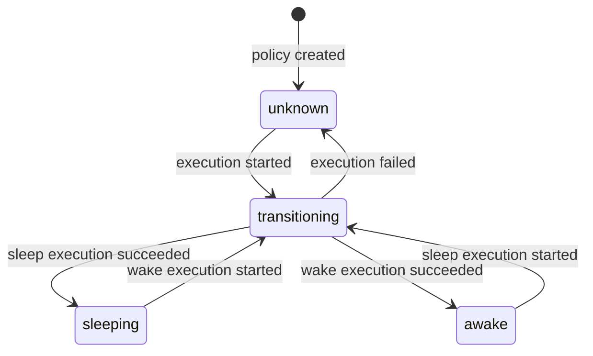
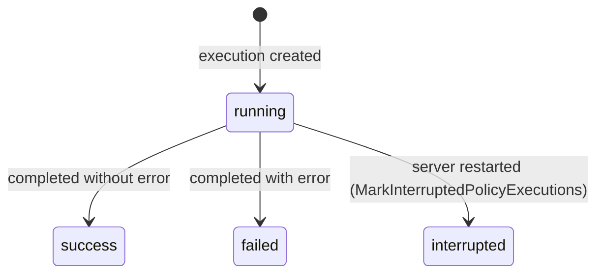
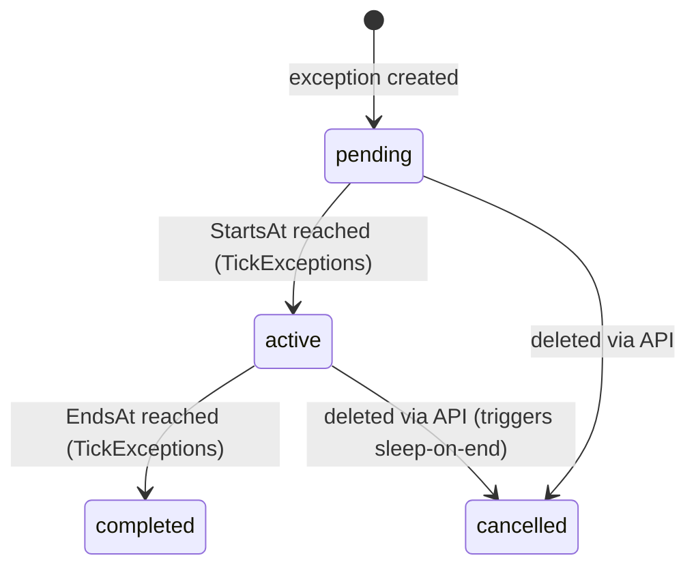

# Backend Developer Guide

> Deep-dive technical reference for contributors working on the kube-phoenix Go backend.
> Written for experienced Go developers who are new to this codebase.

---

## Table of Contents

1. [Overview](#1-overview)
2. [Package Map](#2-package-map)
3. [Data Model Deep Dive](#3-data-model-deep-dive)
4. [Request Lifecycle](#4-request-lifecycle)
5. [Policy Execution Engine](#5-policy-execution-engine)
6. [Cluster Data Pipeline](#6-cluster-data-pipeline)
7. [Real-Time Communication](#7-real-time-communication)
8. [Observability](#8-observability)
9. [Testing Guide](#9-testing-guide)
10. [Common Patterns and Conventions](#10-common-patterns-and-conventions)

---

## 1. Overview

kube-phoenix is a Kubernetes cluster sleep/wake policy engine that reduces cloud spend by scaling workloads to zero and draining nodes during off-hours, then restoring them on schedule. The backend is a single Go binary that serves a REST API, WebSocket and SSE endpoints, Prometheus metrics, and an embedded Next.js SPA -- all from a single HTTP listener on port 8080. A configurable evaluation ticker (default 30 seconds) continuously reconciles intended state (derived from policy sleep windows, overrides, and exceptions) against actual cluster state, triggering sleep or wake executions when they diverge.

**Tech stack:** Go (Chi v5 router, GORM ORM, gorilla/websocket), PostgreSQL 17, client-go for Kubernetes API access, Prometheus client for metrics.

**Run locally:**

```bash
make dev-backend
```

This requires `DATABASE_URL` to be set (PostgreSQL connection string). The Kubernetes client is optional -- if unavailable, cluster endpoints return 503 but everything else works.

---

## 2. Package Map

### `cmd/server` -- Entry Point

**File:** `backend/cmd/server/main.go`

**Purpose:** Bootstrap the application, wire dependencies, start background goroutines, and handle graceful shutdown.

**Key responsibilities:**
- Parse `DATABASE_URL` from env, initialize `store.Store`, run `SeedDefaults()` and `MarkInterruptedPolicyExecutions()`.
- Create the Kubernetes client (`k8s.New()`), tolerating its absence (sets `k8s = nil`).
- Start `ClusterCache`, `PolicyScheduler`, and maintenance tickers (session cleanup every 15m, audit retention daily).
- Build the Chi router via `api.NewRouter()` and start `http.Server` with `ReadTimeout=15s`, `WriteTimeout=0` (disabled for WebSocket/SSE), `IdleTimeout=60s`.
- Listen for `SIGINT`/`SIGTERM`, cancel background context, wait for tickers, then `srv.Shutdown()` with 30s timeout.

**Key functions:**
- `main()` -- orchestrates all of the above.
- `startMaintenanceTickers(ctx, st, retentionDays, wg)` -- spawns session cleanup and audit retention goroutines.
- `runTicker(ctx, interval, name, fn)` -- generic ticker loop used by all background tasks.
- `parseIntEnv(key, fallback)` -- reads an integer from the environment with a default.

---

### `internal/api` -- HTTP Handlers and Router

**Purpose:** Define all HTTP endpoints, the middleware stack, request parsing, validation, and JSON response formatting.

**Key types:**
- `Handler` -- central struct holding `*store.Store`, `*k8s.Client`, `*scheduler.PolicyScheduler`, `*k8s.ClusterCache`, rate limiters, session timeouts, `*AuditWriter`, and OIDC config. Every handler method is a method on `Handler`.
- `AuditWriter` -- async buffered writer that drains a 1024-entry channel and persists `store.AuditLog` records in the background.
- `policyResponse` -- wraps `store.Policy` with computed `NextTransitionAt` and deserialized `SleepWindows`.
- `WorkloadResponse`, `NodeResponse`, `PodDetailResponse`, `NodePodResponse` -- typed JSON response shapes for cluster endpoints.

**Key files and what they contain:**

| File | Handlers |
|:-----|:---------|
| `router.go` | `NewRouter()` -- builds the full Chi router with middleware stack and route registration |
| `auth.go` | `login`, `logout`, `me`, `changePassword`, `createSessionCookies`, `clearSessionCookies` |
| `oidc.go` | `oidcConfig`, `oidcLogin`, `oidcCallback`, `oidcExchangeAndVerify`, `oidcExtractClaims` |
| `policies.go` | `listPolicies`, `getPolicy`, `createPolicy`, `updatePolicy`, `deletePolicy`, `triggerPolicySleep`, `triggerPolicyWake` |
| `exceptions.go` | `listExceptions`, `getException`, `createException`, `updateException`, `deleteException` |
| `overrides.go` | `listPolicyOverrides`, `createPolicyOverride`, `deletePolicyOverride` |
| `policy_executions.go` | `listPolicyExecutions`, `getPolicyExecution`, `getPolicyExecutionLogs`, `getPolicyExecutionSnapshots`, `getPolicySnapshots`, `wsPolicyExecutionLogs` |
| `cluster.go` | `getWorkloads`, `getNodes`, `getNodePods`, `getPodDetail`, `getPodLogs`, `getWorkloadPods` |
| `overview.go` | `getOverview`, `streamCluster` (SSE), `buildOverview` |
| `guardrails.go` | `getGuardrails`, `updateGuardrails` |
| `users.go` | `listUsers`, `createUser`, `updateUser`, `deleteUser` |
| `audit.go` | `AuditWriter.Start()`, `Handler.audit()`, `marshalOrNull()` |
| `admin.go` | `resetDB` -- streams NDJSON progress events while dropping/recreating all tables |
| `ws.go` | `wsReadPump`, `wsSendLines`, `wsDrainChannel`, `wsStreamLoop` -- WebSocket helpers |
| `helpers.go` | `jsonOK`, `jsonCreated`, `jsonError`, `jsonInternalError`, `parseID`, `reloadScheduler` |
| `errmsg.go` | String constants: `ErrInvalidID`, `ErrNotFound`, `ErrInvalidBody` |

**Dependencies:** `store`, `k8s`, `scheduler`, `auth`, `middleware`, `metrics`, `policy`, `stringutil`, `web`.

---

### `internal/scheduler` -- Policy Scheduler and Engine

**Purpose:** Evaluate policies on a configurable tick interval (default 30 seconds) and orchestrate sleep/wake executions when intended state diverges from actual state.

**Key types:**
- `PolicyScheduler` -- owns the tick loop, in-memory policy cache (`map[uint]cachedPolicy`), `PolicyRunner` (from `scaler`), and `Broker`. Protected by `sync.Mutex`.
- `cachedPolicy` -- pairs a `store.Policy` with its parsed `[]policy.SleepWindow`.
- `PolicyState` -- string enum: `"sleeping"`, `"awake"`, `"unknown"`.
- `Broker` -- in-process pub/sub for execution log lines (see `broker.go`).
- `SchedulerConfig` -- groups the three runtime-tunable settings: `TickInterval`, `AutoWake`, `ReconcileWhileAwake`.

**Key functions:**
- `NewPolicyScheduler(st, k8sClient, cfg SchedulerConfig)` -- constructor.
- `Start(ctx)` / `Stop()` -- lifecycle; `Start` calls `reload()` then launches `tickLoop`.
- `Reload()` -- re-reads all enabled policies from DB; called after any policy CRUD.
- `RecoverPolicies(ctx)` -- startup reconciliation: compares `CurrentState` against `IntendedState` and queues recovery executions for mismatches.
- `RunSleepNow(policyID, trigger)` / `RunWakeNow(policyID, trigger)` -- manual triggers; return the new execution ID.
- `TickExceptions(ctx)` -- called every 60s; delegates to `maybeStartException` (pending → active when `StartsAt` passes) and `maybeEndException` (active → completed when `EndsAt` passes, triggers sleep-on-end if configured).
- `run(ctx, policy, direction, trigger)` -- core orchestration: sets `transitioning` state, creates `PolicyExecution`, spawns goroutine that runs `PolicyRunner.RunPolicySleep/Wake`, persists log lines, publishes to broker, records metrics, updates policy state.
- `evaluateAll()` -- snapshots the cached policy map and calls `evaluatePolicy` for each.
- `evaluatePolicy(cp, now)` -- computes `IntendedState`, checks for skip overrides, fires `run()` on mismatch.
- `UpdateSettings(cfg SchedulerConfig) error` -- apply new eval interval, auto-wake, and reconcile-while-awake at runtime; restarts the ticker goroutine only if the interval changed.

**Policy Engine (`policy_engine.go`):**
- `IntendedState(windows, timezone, overrides, now)` -- override precedence: `force_sleep` > `stay_awake` > window evaluation.
- `HasSkipOverride(overrides, direction, now)` -- checks for `skip_sleep`/`skip_wake` overrides; consumed (deleted) on match.
- `ActiveException(exceptions, policyID, now)` -- finds the first active exception covering `now`.

**Broker (`broker.go`):**
- `Subscribe(execID) chan PolicyLogLine` -- creates a buffered channel (capacity 256).
- `Publish(execID, line)` -- non-blocking fan-out; drops lines for slow subscribers.
- `Unsubscribe(execID, ch)` -- removes and closes the channel (double-close safe).
- `Close(execID)` -- closes all subscriber channels for an execution.

**Dependencies:** `store`, `k8s`, `scaler`, `policy`, `metrics`.

---

### `internal/scaler` -- Kubernetes Scaling Operations

**Purpose:** Execute the actual Kubernetes mutations for sleep and wake operations.

**Key types:**
- `Runner` -- holds `*k8s.Client` and `*store.Store`; provides low-level scale/drain operations.
- `PolicyRunner` -- wraps `Runner` and adds DB-backed `WorkloadSnapshot` logic. This is what the scheduler uses.
- `LogLine` -- `{Level, Message, Time}` emitted to a channel during runs.
- `Counts` -- aggregates: `Saved`, `Scaled`, `Drained`, `Deleted`, `Skipped`, `Protected`, `Errors`.
- `workloadEntry` -- uniform representation of a Deployment or StatefulSet with function pointers for `Annotate`, `Scale`, `RemoveAnnotation`.

**Key functions (PolicyRunner):**
- `RunPolicySleep(ctx, policy, execID, logCh)` -- for each matched workload: create `WorkloadSnapshot`, annotate `previous-replicas`, scale to 0. Then drain and delete unprotected nodes.
- `RunPolicyWake(ctx, policy, execID, logCh)` -- load open snapshots, restore each workload to `ReplicasBefore`, close snapshots. Nodes are not managed (Karpenter handles provisioning).
- `sleepWorkload(params, kind, ns, name, replicas, annotate, scale)` -- processes a single workload during sleep; handles already-zero, snapshot creation, rollback on scale failure.
- `lookupWorkload(ctx, kind, ns, name)` -- checks if a workload still exists in the cluster.
- `restoreWorkload(ctx, kind, ns, name, target)` -- scales up and removes the annotation.

**Key functions (Runner):**
- `collectFilteredEntries(deployments, statefulsets, skipNS, nsFilter, counts, countSkipped)` -- filters workloads by namespace and converts to `workloadEntry` slice.
- `scaleDownWorkloads(ctx, mode, entries, logCh, counts)` -- annotate + scale to 0 for each entry.
- `restoreWorkloads(ctx, mode, entries, logCh, counts)` -- restore from `previous-replicas` annotation.
- `drainNodes(ctx, mode, guardrails, logCh, counts)` -- list nodes, identify protected ones, drain and delete the rest.
- `drainAndDeleteNode(ctx, mode, name, podCount, drainTimeout, logCh, counts)` -- cordon, drain (dynamic timeout: `podCount*15 + 60` seconds), delete node object.
- `isLabelProtected(labels, skipNodeLabels)` / `isTaintProtected(taints, skipNodeTaints)` -- node protection checks.

**Dependencies:** `k8s`, `store`, `stringutil`.

---

### `internal/k8s` -- Kubernetes API Client

**Purpose:** Typed wrapper around `client-go` that exposes the specific Kubernetes operations kube-phoenix needs.

**Key types:**
- `Client` -- wraps `*kubernetes.Clientset`. Created via `New()` which tries in-cluster config first, then falls back to `KUBECONFIG` or `~/.kube/config`.
- `ContainerMetrics` -- `{CPUMillis, MemBytes}` from the Metrics Server API.
- `ClusterCache` -- in-memory mirror of cluster state refreshed every 10s (see below).
- `CachedSnapshot` -- point-in-time copy: `Nodes`, `Pods`, `Deployments`, `StatefulSets`, `FetchedAt`.

**Key functions (Client):**
- `ListDeployments(ctx, namespace)` / `ListDeploymentsBySelector(ctx, namespace, labelSelector)` -- list with optional label filter.
- `ScaleDeployment(ctx, ns, name, replicas)` -- get scale subresource, set replicas, update.
- `AnnotateDeployment(ctx, ns, name, key, value)` / `RemoveDeploymentAnnotation(ctx, ns, name, key)` -- read-modify-write on the deployment object.
- Equivalent methods for StatefulSets: `ListStatefulSets`, `ListStatefulSetsBySelector`, `ScaleStatefulSet`, `AnnotateStatefulSet`, `RemoveStatefulSetAnnotation`.
- `ListNodes(ctx)` / `GetNode(ctx, name)` / `CordonNode(ctx, name)` / `DrainNode(ctx, name, timeout)` / `DeleteNode(ctx, name)`.
- `DrainNode` -- cordons, evicts all non-DaemonSet pods (falling back to force-delete), then polls until drained or timeout.
- `ListPods(ctx, ns)` / `ListAllPods(ctx)` / `ListPodsOnNode(ctx, nodeName)` / `GetPod(ctx, ns, name)`.
- `GetPodLogs(ctx, ns, name, container, tailLines, previous, follow)` -- returns `io.ReadCloser` for streaming.
- `GetPodEvents(ctx, ns, podName)` -- events filtered by `involvedObject.name`.
- `GetAllPodMetrics(ctx)` -- hits `/apis/metrics.k8s.io/v1beta1/pods`, returns `map[string]ContainerMetrics` keyed by `"namespace/podName"`. Returns empty map (not error) when metrics server is unavailable.
- `GetPodMetrics(ctx, ns, name)` -- per-container metrics for a single pod.

**Dependencies:** `k8s.io/client-go`, `k8s.io/api`, `k8s.io/apimachinery`.

---

### `internal/k8s` (ClusterCache)

**File:** `backend/internal/k8s/cache.go`

**Purpose:** Background goroutine that refreshes an in-memory snapshot of cluster state every 10 seconds, so HTTP handlers read from memory instead of hitting the K8s API on every request.

**Key types:**
- `ClusterCache` -- holds `*Client`, `CachedSnapshot` behind `sync.RWMutex`, and subscriber channels.
- `CachedSnapshot` -- `{Nodes, Pods, Deployments, StatefulSets, FetchedAt}`.

**Key functions:**
- `NewClusterCache(client)` -- constructor.
- `Start(ctx)` -- begins the background refresh loop; first refresh is immediate.
- `refresh(ctx)` -- fetches all four resource types in parallel (4 goroutines). Partial failures preserve previously-good data for unaffected resource types. `FetchedAt` is only advanced when at least one fetch succeeds.
- `Snapshot()` -- returns a copy of the current state (read lock).
- `Subscribe()` -- returns a `chan struct{}` (buffer 1) that receives a signal on each refresh.
- `Unsubscribe(ch)` -- removes a subscriber.
- `notify()` -- non-blocking send to all subscribers after each refresh.

**Dependencies:** `k8s` (Client), `k8s.io/api`.

---

### `internal/store` -- Database Layer

**Purpose:** GORM-based persistence layer for all application state. Manages schema migration, connection pooling, seeds, and all CRUD queries.

**Key types (models):**
- `Guardrails`, `User`, `Session`, `AuditLog`, `Policy`, `PolicyExecution`, `PolicyLogLine`, `WorkloadSnapshot`, `PolicyOverride`, `ScheduledException`, `WorkloadTarget`.

(Detailed field documentation in [Section 3](#3-data-model-deep-dive).)

**Key files:**

| File | Content |
|:-----|:--------|
| `store.go` | `New(dsn)` -- opens PostgreSQL connection, configures pool (10 open, 5 idle, 5m lifetime), runs `AutoMigrate`, adds CHECK constraints, migrates legacy cron columns. `Ping()`, `DB()`, `Tx()`. |
| `models.go` | All GORM model struct definitions with tags. |
| `status.go` | String constants: `PolicyState*`, `PolicyMode*`, `ExecStatus*`, `ExceptionStatus*`. |
| `policies.go` | `ListPolicies`, `GetPolicy`, `CreatePolicy`, `UpdatePolicy`, `UpdatePolicyState`, `SetPolicyTransitioning`, `DeletePolicy` (transactional cascade), `HasApplyPolicyOverlap`. Execution CRUD: `CreatePolicyExecution`, `GetPolicyExecution`, `ListPolicyExecutions`, `FinishPolicyExecution`, `MarkInterruptedPolicyExecutions`. Log lines: `AppendPolicyLogLine`, `GetPolicyLogLines`. Snapshots: `CreateWorkloadSnapshot`, `GetOpenSnapshots`, `GetSnapshotsForExecution/Policy`, `CloseSnapshot`, `MarkSnapshotDeletedAtWake`, `MarkSnapshotExternallyScaled`, `DeleteWorkloadSnapshot`. Overrides: `Create/Get/List/Delete PolicyOverride`, `ListActiveOverrides`. Exceptions: `Create/Get/List/Update ScheduledException`, `CancelScheduledException` (atomic status + cancelled_at + cancel_reason), `ListOpenExceptions`, `UpdateScheduledExceptionStatus`. |
| `queries.go` | `GetGuardrails`, `UpdateGuardrails`, `SeedDefaults`, `DropAllTables`, `MigrateSchema`. |
| `users.go` | `CreateUser`, `GetUserByID/Username`, `ListUsers`, `UpdateUser`, `DeleteUser` (transactional), `UpdateLastLogin`, `ChangePassword`, `GetOrCreateOIDCUser`, `HashPassword`, `CheckPassword`. |
| `sessions.go` | `GenerateToken`, `CreateSession`, `GetSessionByToken` (with expiry check), `ExtendSession` (sliding window capped at `max_expires_at`), `DeleteSession`, `DeleteUserSessions`, `CleanExpiredSessions`, `CountActiveSessions`. |
| `audit.go` | `CreateAuditLog`, `ListAuditLogs` (filtered, paginated), `CleanOldAuditLogs`. |

**Dependencies:** `gorm.io/gorm`, `gorm.io/driver/postgres`, `golang.org/x/crypto/bcrypt`, `policy` (for migration helper).

---

### `internal/policy` -- Sleep Window Evaluation

**Purpose:** Pure evaluation logic for sleep windows. No database or Kubernetes dependencies.

**Key types:**
- `SleepWindow` -- `{Name string, DaysOfWeek []int, StartTime string, EndTime string, AllDay bool}`. `Name` is an optional display label. Days use 0=Sun...6=Sat. Times are `"HH:MM"` in 24-hour format.
- `IntendedState` -- string enum: `"sleeping"` or `"awake"`.

**Key functions:**
- `Evaluate(windows, timezone, now)` -- returns `StateSleeping` if `now` falls inside any window, `StateAwake` otherwise. Handles same-day windows (e.g. 09:00-17:00) and overnight windows (e.g. 19:00-07:00) by checking both the evening portion (current day) and morning portion (previous day).
- `NextTransition(windows, timezone, now)` -- scans all window boundary times within the next 8 days, finds the earliest one where the evaluated state differs from the current state. Returns `nil` if no transition found.
- `ValidateWindows(windows)` -- structural validation: 1–10 windows, non-empty days, valid HH:MM format, no duplicate days, start != end.
- `CronsToWindows(sleepCron, wakeCron)` -- migration helper that reverse-parses legacy cron expressions into `SleepWindow` format.

**Key internal functions:**
- `windowContains(w, currentDOW, currentMinutes)` -- checks if a day/time falls inside a single window.
- `collectBoundaries(windows, local, numDays)` -- generates all window start/end boundary times for `NextTransition`.
- `dayInSet(day, daysOfWeek)` -- membership check.
- `timeToMinutes(t)` / `parseTime(t)` -- convert "HH:MM" to minutes-of-day.

**Dependencies:** None (standard library only).

---

### `internal/middleware` -- HTTP Middleware

**File:** `backend/internal/middleware/auth.go`

**Purpose:** Session authentication, CSRF protection, and RBAC permission checks.

**Key functions:**
- `SessionAuth(st, idleTimeout) func(http.Handler) http.Handler` -- reads the `__kp_session` cookie, looks up the session via `store.GetSessionByToken`, checks `User.Enabled`, extends the sliding window, and places the `*store.User` into the request context.
- `CSRFProtect` -- double-submit cookie pattern: for POST/PUT/DELETE, validates that the `X-CSRF-Token` header matches the `__kp_csrf` cookie value. GET/HEAD/OPTIONS are exempt.
- `RequirePermission(perm) func(http.Handler) http.Handler` -- extracts the user from context and checks `auth.HasPermission(user.Role, perm)`.
- `UserFromContext(ctx) *store.User` -- retrieves the authenticated user from context (or nil).
- `GenerateCSRFToken()` -- 32-byte hex random token.
- `SetCSRFCookie(w, token, secure)` -- sets the JS-readable CSRF cookie (`HttpOnly: false`).

**Dependencies:** `store`, `auth`.

---

### `internal/auth` -- Authentication Utilities

**Purpose:** OIDC provider setup, RBAC permissions, PKCE helpers, and rate limiting.

**Key files:**

**`permissions.go`:**
- `Permission` type (string enum): `PermViewAll`, `PermScheduleEdit`, `PermScheduleTrigger`, `PermGuardrailEdit`, `PermUserManage`, `PermAdminResetDB`, `PermAuditView`, `PermPasswordChange`.
- `RolePermissions` map: `admin` has all 8, `operator` has 6 (no `user.manage` or `admin.reset_db`), `viewer` has 3 (`view.all`, `audit.view`, `password.change`).
- `HasPermission(role, perm) bool` -- lookup.
- `PermissionsForRole(role) []Permission` -- returns the ordered list for `/api/auth/me`.
- `ValidRole(role) bool` -- checks against `RolePermissions` keys.

**`oidc.go`:**
- `OIDCConfig` -- configuration struct populated from env vars.
- `OIDCProvider` -- wraps `go-oidc` verifier, `oauth2.Config`, and Keycloak discovery metadata.
- `NewOIDCProvider(ctx, cfg)` -- performs OIDC discovery, creates the verifier and OAuth2 config. Supports `SkipTLSVerify` for development.
- `MapGroupsToRole(groups, adminGroups, operatorGroups)` -- case-insensitive group-to-role mapping; priority: admin > operator > viewer.
- `GenerateState()` -- 16-byte hex random string for the OIDC state parameter.
- `GeneratePKCEVerifier()` -- 43-character base64url string for RFC 7636 PKCE.
- `OIDCConfigFromEnv()` -- reads `OIDC_ISSUER_URL`, `OIDC_CLIENT_ID`, `OIDC_CLIENT_SECRET`, `OIDC_REDIRECT_URL`, `OIDC_GROUPS_CLAIM`, `OIDC_ROLE_ADMIN_GROUPS`, `OIDC_ROLE_OPERATOR_GROUPS`, `OIDC_SKIP_TLS_VERIFY`. Returns nil if `OIDC_ISSUER_URL` is unset.

**`ratelimit.go`:**
- `RateLimiter` -- in-memory sliding-window counter per key. `Allow(key)` prunes expired entries, returns false if the limit is reached. `Reset(key)` clears on successful login.

**Dependencies:** `go-oidc/v3`, `golang.org/x/oauth2`, `stringutil`.

---

### `internal/metrics` -- Prometheus Metrics

**File:** `backend/internal/metrics/metrics.go`

**Purpose:** Defines and registers all Prometheus metrics via `promauto`.

(Full metric details in [Section 8](#8-observability).)

**Dependencies:** `prometheus/client_golang`.

---

### `internal/stringutil` -- String Utilities

**File:** `backend/internal/stringutil/stringutil.go`

**Purpose:** Shared CSV-splitting helpers used by both `scaler` and `api` packages.

**Key functions:**
- `SplitCSV(s) []string` -- splits comma-separated string, trims whitespace, discards empties.
- `SplitCSVSet(s) map[string]bool` -- same but returns a set.

**Dependencies:** None (standard library only).

---

### `web` -- Embedded Frontend

**File:** `backend/web/embed.go`

**Purpose:** Embeds the compiled Next.js static export via `//go:embed all:static` and serves it with SPA fallback.

**Key function:**
- `SPAHandler() http.Handler` -- file server that tries the requested path first; on 404, serves `index.html` for client-side routing.

**Dependencies:** `embed`, `io/fs`, `net/http`.

---

## 3. Data Model Deep Dive

### GORM Models

All models are defined in `backend/internal/store/models.go`. GORM's `AutoMigrate` manages the schema. CHECK constraints for enum fields are added via raw SQL in `store.New()`.

#### Guardrails (singleton, ID=1)

```go
type Guardrails struct {
    ID               uint      // always 1
    SystemNamespaces string    // CSV: "kube-system,kube-public,..." -- protected by default
    SkipNamespaces   string    // CSV: user-managed skip list
    SkipNsNode       string    // CSV: namespaces whose pods protect the node from draining
    SkipNodeLabels   string    // CSV key=value pairs: nodes with these labels are protected
    SkipNodeTaints               string    // CSV key=value:effect: nodes with these taints are protected
    SchedulerEvalInterval        string    // parsed by ParseSchedulerEvalInterval(); default "30s"
    SchedulerAutoWake            bool      // default true
    SchedulerReconcileWhileAwake bool      // default true
    UpdatedAt                   time.Time
}
```

Seeded with production defaults in `SeedDefaults()`. The scaler reads these before every execution to determine what to skip.

`ParseSchedulerEvalInterval() time.Duration` is a method on `Guardrails` that parses `SchedulerEvalInterval` as a Go duration string and falls back to 30s on empty, invalid, or non-positive values.

#### User

```go
type User struct {
    ID           uint
    Username     string    // unique composite index with Source
    GivenName    string    // from OIDC claims
    FamilyName   string    // from OIDC claims
    Email        string
    PasswordHash string    // bcrypt, omitted from JSON
    Role         string    // "admin" | "operator" | "viewer"
    Source       string    // "local" | "oidc"
    OIDCSubject  *string   // OIDC sub claim, unique, nullable
    Enabled      bool      // disabled users cannot log in or use existing sessions
    CreatedAt    time.Time
    UpdatedAt    time.Time
    LastLoginAt  *time.Time
}
```

- Unique index on `(username, source)` allows the same username from different sources.
- `OIDCSubject` has a separate unique index for fast OIDC user lookup.
- Password hashing uses `bcrypt.DefaultCost`.
- OIDC users have no password; their role is updated on every login from group claims.

#### Session

```go
type Session struct {
    ID           uint
    Token        string    // 64-char hex, unique index
    UserID       uint      // FK -> users (CASCADE delete)
    User         User      // preloaded on lookup
    IPAddress    string
    UserAgent    string
    ExpiresAt    time.Time // sliding window, extended on each request
    MaxExpiresAt time.Time // hard cap (default 24h from creation)
    CreatedAt    time.Time
}
```

- `Token` is generated by `crypto/rand` (32 bytes, hex-encoded).
- `GetSessionByToken` checks both `expires_at > now()` and `max_expires_at > now()`.
- `ExtendSession` uses `LEAST(new_expiry, max_expires_at)` to respect the hard cap.
- Cleanup runs every 15 minutes via the session-cleanup ticker.

#### AuditLog

```go
type AuditLog struct {
    ID           uint
    UserID       *uint     // FK -> users (SET NULL on delete)
    Username     string    // denormalized for when user is deleted
    Action       string    // e.g. "policy.create", "auth.login", "admin.reset_db"
    ResourceType string    // e.g. "policy", "user", "exception"
    ResourceID   *uint
    Before       string    // JSONB: serialized state before the change
    After        string    // JSONB: serialized state after the change
    IPAddress    string
    Timestamp    time.Time
}
```

- Written asynchronously via `AuditWriter` (buffered channel, capacity 1024).
- If the buffer is full, the entry is dropped and `kube_phoenix_audit_drops_total` is incremented.
- Retention is configurable via `AUDIT_RETENTION_DAYS` (default 90). Daily cleanup deletes entries older than the threshold.

#### Policy

```go
type Policy struct {
    ID              uint
    Name            string
    Description     string
    NamespaceFilter string    // CSV; empty = target all namespaces
    LabelSelector   string    // full k8s label selector syntax (e.g. "app=nginx,tier=frontend")
    SleepWindows    string    // JSON array of policy.SleepWindow, stored as TEXT
    Timezone        string    // IANA timezone (e.g. "Europe/Berlin")
    Mode            string    // "plan" (dry-run) | "apply" (mutating)
    Enabled         bool
    TimeoutMinutes  int       // 0 = server default (120 min)
    CurrentState    string    // "sleeping" | "awake" | "unknown" | "transitioning"
    StateSince      *time.Time
    LastSleepAt     *time.Time
    LastWakeAt      *time.Time
    NextTransitionAt *time.Time
    CreatedAt       time.Time
    UpdatedAt       time.Time
}
```

- `SleepWindows` is the sole source of truth for scheduling. Stored as a JSON string in a TEXT column, parsed by `json.Unmarshal` into `[]policy.SleepWindow`.
- `CurrentState` is updated by the scheduler after each execution completes.
- `Mode` defaults to `"plan"` -- new policies must be explicitly switched to `"apply"`.
- Conflict detection: `HasApplyPolicyOverlap` prevents creating two apply-mode policies targeting overlapping namespaces.

#### PolicyExecution

```go
type PolicyExecution struct {
    ID         uint
    PolicyID   uint       // FK -> policies (CASCADE)
    Direction  string     // "sleep" | "wake"
    Trigger    string     // "scheduled" | "manual_sleep" | "manual_wake" | "recovery" | "exception_start" | "exception_end"
    StartedAt  time.Time
    FinishedAt *time.Time
    Status     string     // "running" | "success" | "failed" | "interrupted" | "skipped"
    Mode       string     // "plan" | "apply"
    CountScaled, CountSkipped, CountErrors, CountProtected, CountDrained, CountDeleted int
}
```

- `MarkInterruptedPolicyExecutions()` runs at startup to mark any `running` executions as `interrupted` (server crashed mid-execution).
- Count fields are populated by `FinishPolicyExecution` from the `Counts` struct returned by the scaler.

#### PolicyLogLine

```go
type PolicyLogLine struct {
    ID          uint
    ExecutionID uint      // FK -> policy_executions (CASCADE)
    Seq         int       // monotonic per execution, composite index with ExecutionID
    Level       string    // "info" | "ok" | "plan" | "error" | "warn"
    Message     string
    Timestamp   time.Time
}
```

- Ordered by `seq asc` for deterministic replay.
- Persisted in real-time during execution; also published to the Broker for WebSocket streaming.

#### WorkloadSnapshot

```go
type WorkloadSnapshot struct {
    ID               uint
    PolicyID         uint
    SleepExecutionID uint      // which execution created this snapshot
    WakeExecutionID  *uint     // null while workload is still sleeping
    Kind             string    // "Deployment" | "StatefulSet"
    Namespace        string
    Name             string
    ReplicasBefore   int32     // saved replica count at sleep time
    ReplicasRestored *int32    // nil until woken
    RestoredAt       *time.Time
    WasAlreadyZero   bool      // workload was at 0 before we touched it
    WasDeletedAtWake bool      // workload gone when we tried to restore
    WasExternallyScaled bool   // workload was scaled by external actor during sleep
    CapturedAt       time.Time
}
```

- "Open" snapshots have `WakeExecutionID IS NULL AND WasDeletedAtWake = false`.
- `CloseSnapshot` links the snapshot to the wake execution and records `ReplicasRestored`.
- The `previous-replicas` annotation on the K8s resource is a belt-and-suspenders fallback.

#### PolicyOverride

```go
type PolicyOverride struct {
    ID             uint
    PolicyID       uint
    OverrideType   string     // "stay_awake" | "force_sleep" | "skip_sleep" | "skip_wake"
    StartsAt       *time.Time // nil for skip_sleep/skip_wake
    EndsAt         *time.Time // nil for skip_sleep/skip_wake
    TargetCronTime *time.Time // reused as "valid until" for skip overrides
    Reason         string
    CreatedBy      string
    CreatedAt      time.Time
}
```

- Windowed overrides (`stay_awake`, `force_sleep`) have `StartsAt` and `EndsAt`.
- Skip overrides (`skip_sleep`, `skip_wake`) have `TargetCronTime` as an expiry. They are consumed (deleted from DB) when matched.
- `ListActiveOverrides` returns windowed overrides currently in effect plus all skip overrides.

#### ScheduledException

```go
type ScheduledException struct {
    ID              uint
    PolicyID        *uint     // optional -- can be freestanding
    ExceptionType   string    // "stay_awake" | "force_sleep"
    StartsAt        time.Time
    EndsAt          time.Time
    TicketRef       string    // e.g. "JIRA-123"
    Reason          string
    SleepOnEnd      bool      // default true: trigger sleep when exception ends
    NamespaceFilter string    // for freestanding exceptions
    LabelSelector   string
    WorkloadTargets string    // JSONB array of WorkloadTarget
    Status          string    // "pending" | "active" | "completed" | "cancelled"
    StartExecutionID *uint
    EndExecutionID   *uint
    CancelledAt     *time.Time
    CancelReason    string
    CreatedBy       string
    CreatedAt       time.Time
    UpdatedAt       time.Time
}
```

- DB CHECK constraint: `status IN ('pending','active','completed','cancelled')`.
- Lifecycle managed by `TickExceptions`: pending -> active when `StartsAt` passes, active -> completed when `EndsAt` passes.
- Deletion of an active exception triggers sleep-on-end (if enabled) and sets status to `cancelled`.

### Model Relationships

```
Policy ---< PolicyExecution ---< PolicyLogLine
  |
  +---< WorkloadSnapshot (sleep_execution_id, wake_execution_id)
  |
  +---< PolicyOverride
  |
  +---< ScheduledException (optional FK)

User ---< Session (CASCADE delete)
User ---< AuditLog (SET NULL on delete)
```

`DeletePolicy` uses a transaction to cascade: delete snapshots, overrides, exceptions, then executions (log lines cascade via FK), then the policy itself.

### Status State Machines

#### Policy.CurrentState



The `transitioning` state is the concurrency guard. While a policy is `transitioning`, the evaluation ticker skips it, and manual triggers return 409 Conflict.

#### PolicyExecution.Status



Note: `skipped` exists as a constant but is not currently used in the normal flow.

#### ScheduledException.Status



### Sleep Window Storage and Evaluation

Sleep windows are stored as a JSON string in `policies.sleep_windows`:

```json
[
  {
    "daysOfWeek": [1, 2, 3, 4, 5],
    "startTime": "19:00",
    "endTime": "07:00",
    "allDay": false
  }
]
```

This example means: sleep from 19:00 to 07:00 (overnight) on weekdays.

**Evaluation flow:**
1. `policy.Evaluate(windows, timezone, now)` converts `now` to the policy's timezone.
2. For each window, `windowContains(w, dayOfWeek, minuteOfDay)` checks:
   - **AllDay:** just checks if the current day is in `DaysOfWeek`.
   - **Same-day** (startTime < endTime): current day must be in set AND time in `[start, end)`.
   - **Overnight** (startTime >= endTime): either current day is in set AND time >= start (evening portion), OR yesterday was in set AND time < end (morning portion).
3. If any window matches, return `StateSleeping`; otherwise `StateAwake`.

**Override precedence** (evaluated before windows in `scheduler.IntendedState`):
1. Active `force_sleep` override -> always sleeping.
2. Active `stay_awake` override -> always awake.
3. No active override -> evaluate windows.

---

## 4. Request Lifecycle

### HTTP Request Flow

Every request follows this path:

```
Client
  -> Chi Router
    -> chiMiddleware.RequestID     (assigns X-Request-Id)
    -> chiMiddleware.Logger        (structured access log)
    -> chiMiddleware.Recoverer     (panic recovery -> 500)
    -> corsHandler()               (CORS headers)
    -> Body size limit (1 MB)      (inline middleware)
    -> [route match]
      -> For /metrics, /healthz:   (no auth)
      -> For /api/auth/login, /api/auth/oidc/*:  (no auth)
      -> For all other routes:
        -> authmw.SessionAuth      (cookie -> session -> user in context)
        -> authmw.CSRFProtect      (double-submit cookie for mutations)
        -> [optional] authmw.RequirePermission(perm)  (RBAC check)
        -> Handler method
          -> Validate input
          -> Call store / k8s / scheduler
          -> h.audit(r, action, ...) (non-blocking async write)
          -> jsonOK(w, result) / jsonCreated(w, result) / jsonError(w, msg, code)
```

**CORS configuration:**
- If `CORS_ALLOWED_ORIGIN` is set, only that origin is allowed.
- If `ADMIN_USER` is set (production mode) without `CORS_ALLOWED_ORIGIN`, CORS blocks all cross-origin requests (same-origin only).
- Otherwise (dev mode), `*` is allowed.

**Body size limit:** All requests have a 1 MB body limit via `http.MaxBytesReader`.

### Authentication Flow (Local Login)

1. Client sends `POST /api/auth/login` with `{username, password}`.
2. Rate limiting: `ipLimiter.Allow(r.RemoteAddr)` (10 attempts per 15 min per IP) and `userLimiter.Allow(username)` (5 per 15 min per user). On rejection, returns 429 with `Retry-After: 900`.
3. Look up user by username via `store.GetUserByUsername`.
4. Verify password with `bcrypt.CompareHashAndPassword`.
5. Check `user.Enabled` -- disabled accounts get 403.
6. On success: reset both rate limiters, create session:
   - Generate 64-char hex token via `crypto/rand`.
   - Create `Session` record with `ExpiresAt = now + idleTimeout` (default 8h) and `MaxExpiresAt = now + maxLifetime` (default 24h).
   - Set `__kp_session` cookie (HttpOnly, Secure, SameSite=Strict).
   - Generate CSRF token, set `__kp_csrf` cookie (not HttpOnly -- JS must read it).
7. Return `{user: {...}}`.

### Authentication Flow (OIDC)

1. Client calls `GET /api/auth/oidc/login`.
2. Server generates random state and PKCE verifier, stores both in short-lived cookies (5 min TTL, path `/api/auth/oidc`, SameSite=Lax for cross-site redirect).
3. Redirects to Keycloak's authorization endpoint with PKCE S256 challenge.
4. User authenticates at Keycloak, which redirects to `GET /api/auth/oidc/callback?code=...&state=...`.
5. Server validates state cookie matches query param, retrieves PKCE verifier cookie.
6. Exchanges authorization code for tokens via `oauth2.Exchange` with PKCE verifier.
7. Verifies ID token signature and claims via `go-oidc`.
8. Extracts claims: `sub`, `preferred_username`, `email`, `given_name`, `family_name`, and groups (from configured claim name).
9. Maps groups to role via `MapGroupsToRole` (case-insensitive comparison).
10. Upserts user via `store.GetOrCreateOIDCUser` -- creates or updates role/email/name.
11. Creates session + cookies (same as local login).
12. Redirects to `/` (the SPA).

**OIDC Logout:** `POST /api/auth/logout` clears the local session. For OIDC users, it also returns the Keycloak `end_session_endpoint` URL so the browser can terminate the SSO session.

---

## 5. Policy Execution Engine

This is the heart of kube-phoenix. Understanding this section is essential for any backend work.

### The Evaluation Tick Loop

```go
// policy_scheduler.go
// interval is snapshotted from ps.cfg.TickInterval in Start() under the mutex.
func (ps *PolicyScheduler) tickLoop(ctx context.Context, interval time.Duration) {
    ticker := time.NewTicker(interval)
    for {
        select {
        case <-ctx.Done(): return
        case <-ticker.C: ps.evaluateAll()
        }
    }
}
```

`evaluateAll()` takes a snapshot of the in-memory policy cache (under mutex), then evaluates each policy without holding the lock. The tick interval is configurable via the Guardrails UI (Scheduler Behaviour card) and defaults to 30 seconds.

### How IntendedState is Determined

For each enabled policy, the scheduler calls `IntendedState(windows, timezone, overrides, now)`:

1. **Check overrides first** (highest priority):
   - If any `force_sleep` override has `StartsAt <= now <= EndsAt` -> return `sleeping`.
   - If any `stay_awake` override has `StartsAt <= now <= EndsAt` -> return `awake`.
2. **Evaluate windows:**
   - If no windows defined -> return `unknown` (skip this tick).
   - Call `policy.Evaluate(windows, timezone, now)` -> returns `sleeping` or `awake`.

### How a Sleep/Wake Execution is Orchestrated

When `evaluatePolicy` detects a mismatch (intended != current, and current != transitioning):

1. **Skip override check:** If there's a matching `skip_sleep`/`skip_wake` override, consume it (delete from DB) and return without executing.

2. **`run(ctx, policy, direction, trigger)`:**
   - Lock mutex, re-read policy from DB (freshness check).
   - If `CurrentState == transitioning` -> return error (concurrent guard).
   - Set `CurrentState = transitioning` in DB.
   - Unlock mutex.
   - Create `PolicyExecution` record with `status=running`.
   - Spawn goroutine:

3. **Inside the goroutine:**
   - Create a `context.WithTimeout` using `policy.TimeoutMinutes` (default 2 hours).
   - Create a buffered `logCh` channel (capacity 512).
   - Start a log-persist goroutine that reads from `logCh`, assigns sequential numbers, persists to `policy_log_lines`, and publishes to `Broker`.
   - Call `PolicyRunner.RunPolicySleep` or `RunPolicyWake`.
   - Close `logCh`, wait for the persist goroutine to drain.
   - Call `Broker.Close(execID)` to signal all WebSocket subscribers.
   - Determine final status (`success` or `failed`).
   - Call `store.FinishPolicyExecution` with final counts.
   - Record Prometheus metrics.
   - Update policy state: `sleeping` (if sleep succeeded), `awake` (if wake succeeded), or `unknown` (if failed).

### The Scaling Pipeline

#### Sleep: `PolicyRunner.RunPolicySleep`

1. Load guardrails -> build `skipNS` set (system + user-managed namespaces).
2. Fetch open snapshots for this policy -> build `snappedSet` to prevent double-sleeping.
3. List Deployments and StatefulSets (filtered by `policy.LabelSelector`).
4. Call `collectFilteredEntries` to filter by `skipNS` and `policy.NamespaceFilter`.
5. For each workload entry, call `sleepWorkload`:
   - If already snapshotted -> skip (prevents double-sleep).
   - Create `WorkloadSnapshot` in DB.
   - If replicas == 0 -> snapshot with `WasAlreadyZero=true`, skip scale.
   - If plan mode -> log "Would sleep..." and continue.
   - If apply mode -> save snapshot, annotate `previous-replicas`, scale to 0.
   - On scale failure -> delete the snapshot (rollback).
6. Call `drainNodes` to handle node draining.

#### Wake: `PolicyRunner.RunPolicyWake`

1. Load open snapshots for this policy.
2. For each snapshot:
   - If `WasAlreadyZero` -> close snapshot (we did not own those replicas), skip.
   - Look up workload in cluster. If gone -> mark `WasDeletedAtWake`, skip.
   - If current replicas != 0 -> log warning (externally scaled), mark `WasExternallyScaled`, but still restore.
   - If plan mode -> log "Would restore..." and continue.
   - If apply mode -> scale to `ReplicasBefore`, remove annotation, close snapshot.

### Node Draining

During sleep, after workloads are scaled to 0:

1. List all nodes.
2. List all pods to identify:
   - Nodes hosting pods in `SkipNsNode` namespaces (critical nodes).
   - Non-DaemonSet pod count per node.
3. For each node:
   - If protected by label match (`SkipNodeLabels`) -> skip.
   - If protected by taint match (`SkipNodeTaints`) -> skip.
   - If hosting critical-namespace pods -> skip.
   - Otherwise:
     - Compute drain timeout: `podCount * 15 + 60` seconds.
     - **Cordon:** Set `node.Spec.Unschedulable = true`.
     - **Evict:** Send PodDisruptionBudget-aware evictions for all non-DaemonSet pods. Fall back to force-delete (grace period 0) on eviction failure.
     - **Wait:** Poll every 2s until no non-DaemonSet pods remain (or timeout).
     - **Delete:** Remove the node object from the API server.

### Plan Mode vs Apply Mode

Every scaler operation checks `isApply(mode)`:
- **Apply:** actually mutates Kubernetes resources, creates DB snapshots, writes annotations.
- **Plan:** logs "Would ..." messages at the `plan` level without any mutations. Snapshot rows are not created. This is the default for new policies.

### Log Streaming Pipeline

```
Scaler goroutine
  -> emit(logCh, level, msg)          [non-blocking send to buffered channel]
    -> log-persist goroutine
      -> store.AppendPolicyLogLine()   [write to DB]
      -> broker.Publish(execID, line)  [fan-out to WebSocket subscribers]
        -> subscriber channels (cap 256)
          -> WebSocket handler writes JSON to client
```

### Concurrency Guard

The `transitioning` state prevents double execution:

1. Before starting a run, the scheduler locks the mutex and checks `CurrentState`.
2. If already `transitioning`, the run is rejected.
3. The state is set to `transitioning` in the DB before unlocking.
4. The evaluation ticker also skips policies in `transitioning` state.
5. After the execution completes, the state is set to the final value (`sleeping`, `awake`, or `unknown`).

---

## 6. Cluster Data Pipeline

### ClusterCache

**What it caches:** Nodes, Pods, Deployments, StatefulSets.

**Refresh interval:** Every 10 seconds (`cacheRefreshInterval`).

**Refresh logic:** 4 goroutines fetch in parallel. Each resource type is updated independently -- if nodes fail but pods succeed, the cached nodes are preserved from the last successful fetch. `FetchedAt` is advanced only when at least one fetch succeeds.

**SSE streaming:** Each refresh calls `notify()`, which sends a non-blocking signal to all subscriber channels. The SSE handler (`streamCluster`) subscribes on connect and writes `data: {...}\n\n` on each signal.

### `/api/cluster/workloads`

1. Try `cache.Snapshot()` -- if `Ready()`, use cached Deployments and StatefulSets.
2. Fallback: fetch Deployments and StatefulSets in parallel from the K8s API.
3. Build `WorkloadResponse` for each:
   - Current replicas from `spec.replicas`.
   - Saved replicas from `previous-replicas` annotation (indicates sleeping).
   - Status: `"sleeping"` (saved!=nil, current==0), `"partial"` (saved!=nil, 0 < current < saved), `"running"` (otherwise).

### `/api/cluster/nodes`

1. Load guardrails (for node protection rules).
2. Try cache, or fetch nodes + pods in parallel.
3. For each node:
   - Instance type and zone from standard K8s labels (with beta fallbacks).
   - Pod count: non-DaemonSet pods only.
   - CPU/memory: allocatable from node status, requested summed from pod specs.
   - Protection status: checked against `SkipNodeLabels`, `SkipNodeTaints`, and `SkipNsNode` (critical namespace pods).
   - Cordon status from `node.Spec.Unschedulable`.

### `/api/cluster/nodes/{name}/pods` and `/api/cluster/workloads/{ns}/{kind}/{name}/pods`

Both use `filterAndBuildPodResponses`:
1. List pods (on node or in namespace).
2. Fetch all ReplicaSets -> build `rsOwnerMap` (resolves RS -> Deployment ownership).
3. For each non-DaemonSet pod: resolve owner chain, optionally filter by owner kind/name.
4. Fetch pod metrics from Metrics Server (`GetAllPodMetrics`).
5. Build `NodePodResponse` with resource requests, usage, owner info, status, age.

### `/api/cluster/pods/{ns}/{name}`

Detailed pod view: container specs with resource requests/limits/usage, conditions, events, node instance type.

### `/api/cluster/pods/{ns}/{name}/logs`

Streams pod logs directly from the K8s API. Supports:
- `container` query param (required for multi-container pods).
- `tailLines` (default 500, max 10000).
- `previous=true` for terminated container logs.
- `follow=true` for streaming mode (uses `ResponseController.Flush` for chunked transfer).

---

## 7. Real-Time Communication

### SSE: `/api/cluster/stream`

**Protocol:** Server-Sent Events (text/event-stream).

**Flow:**
1. Client connects. Headers set: `Content-Type: text/event-stream`, `Cache-Control: no-cache`, `X-Accel-Buffering: no`.
2. Current overview is sent immediately (so client gets data before first tick).
3. Handler subscribes to `ClusterCache.Subscribe()`.
4. On each cache refresh signal, `buildOverview()` is called and sent as `data: {...}\n\n`.
5. Connection lives until client disconnects or request context is cancelled.

**Overview payload (`OverviewResponse`):**
- `clusterStatus`: `"awake"` | `"sleeping"` | `"partial"`.
- `runningCount`, `sleepingCount`, `nodeCount`.
- `sleepingByNs`: top 4 namespaces with sleeping workloads.
- `nextRun`: name and time of the next scheduled transition.
- `cacheAgeMs`: staleness indicator.

### WebSocket: `/ws/policy-executions/{id}/logs`

**Protocol:** WebSocket with JSON frames.

**Flow:**
1. Handler validates execution ID, fetches execution record.
2. Upgrades to WebSocket (gorilla/websocket). Origin check: `Origin` header host must match `Host` header.
3. Starts `wsReadPump` goroutine (reads pong frames, manages read deadline of 60s).
4. **Replay:** Fetches all existing log lines from DB and sends them as JSON frames.
5. If execution is no longer `running` -> close connection (all logs already sent).
6. **Subscribe:** Subscribes to `Broker` for the execution ID.
7. **Race check:** Re-reads execution status. If finished between step 4 and 6, drains any remaining broker messages and closes.
8. **Stream loop (`wsStreamLoop`):** Selects on:
   - Broker channel -> write JSON frame.
   - Ping ticker (30s) -> send WebSocket ping.
   - Client disconnect (`done` channel from read pump).
   - Request context cancellation.
9. On broker channel close (execution finished) -> handler returns.
10. Cleanup: unsubscribe from broker, close WebSocket connection.

**Timeouts:**
- `wsWriteTimeout = 10s` -- per-frame write deadline.
- `wsPingInterval = 30s` -- keepalive pings.
- `wsPongTimeout = 60s` -- client must respond to pings within this window.

### REST Polling Fallback

`GET /api/policy-executions/{id}/logs` returns all log lines for an execution from the database. This is the fallback for clients that do not support WebSocket.

---

## 8. Observability

### Prometheus Metrics

All metrics are registered via `promauto` in `backend/internal/metrics/metrics.go` and exposed at `GET /metrics` (no auth required).

| Metric | Type | Labels | What it measures |
|:-------|:-----|:-------|:-----------------|
| `kube_phoenix_executions_total` | Counter | `status`, `mode`, `direction` | Completed policy executions. `status` is success/failed. `mode` is plan/apply. `direction` is sleep/wake. |
| `kube_phoenix_execution_duration_seconds` | Histogram | `mode`, `direction`, `status` | Wall-clock duration of each execution. Buckets: 5, 15, 30, 60, 120, 300, 600, 1800. |
| `kube_phoenix_workloads_scaled_total` | Counter | `direction` | Workloads (Deployments + StatefulSets) affected by scaling operations. |
| `kube_phoenix_nodes_drained_total` | Counter | -- | Nodes drained during sleep operations. |
| `kube_phoenix_nodes_deleted_total` | Counter | -- | Nodes deleted during sleep operations. |
| `kube_phoenix_active_policies` | Gauge | `mode` | Number of enabled policies, partitioned by plan/apply. Updated on scheduler reload. |
| `kube_phoenix_auth_attempts_total` | Counter | `status`, `method` | Login attempts. `status` is success/failure. `method` is local/oidc. |
| `kube_phoenix_user_actions_total` | Counter | `action`, `resource_type` | User-initiated mutations. `action` is e.g. `policy.create`, `user.delete`. |
| `kube_phoenix_active_sessions` | Gauge | -- | Currently valid sessions. Incremented on login, decremented on logout/cleanup. |
| `kube_phoenix_rate_limit_hits_total` | Counter | `type` | Rate limit rejections. `type` is `per_ip` or `per_username`. |
| `kube_phoenix_audit_drops_total` | Counter | -- | Audit log entries dropped because the async write buffer was full. |

### Structured Logging

The application uses `log/slog` with JSON output (configured in `main.go`):

```go
slog.SetDefault(slog.New(slog.NewJSONHandler(os.Stdout, nil)))
```

All log calls use structured key-value pairs:
```go
slog.Info("policy scheduler: starting execution",
    "policyID", p.ID, "execID", execID, "direction", direction, "trigger", trigger)
```

Chi middleware adds request-level logging (via `chiMiddleware.Logger`).

### Audit Log System

**Architecture:** Asynchronous, buffered channel (capacity 1024).

**Flow:**
1. Handler calls `h.audit(r, action, resourceType, resourceID, before, after)`.
2. `audit()` extracts user from context, calls `marshalOrNull()` on `before` and `after` to produce valid JSON strings (`"null"` when the argument is nil), then builds an `AuditLog` entry.
3. Non-blocking send to `auditWriter.ch`:
   - If buffer has room: entry is queued.
   - If buffer is full: entry is dropped, `kube_phoenix_audit_drops_total` is incremented, warning logged.
4. `AuditWriter.Start()` goroutine drains the channel and persists entries to PostgreSQL.
5. On context cancellation (shutdown), remaining entries are flushed.

**`marshalOrNull(v interface{}) string`:** Serialises `v` to a JSON string. Returns the literal string `"null"` when `v` is nil or marshalling fails. This is important because the `before`/`after` columns are `jsonb` in PostgreSQL, which rejects empty strings — `"null"` is the correct JSON representation of an absent value.

**What gets logged:**
- `auth.login`, `auth.logout`, `auth.password_change`
- `policy.create`, `policy.update`, `policy.delete`, `policy.sleep`, `policy.wake`
- `policy.override.create`, `policy.override.delete`
- `exception.create`, `exception.update`, `exception.delete`
- `user.create`, `user.update`, `user.delete`
- `guardrail.update`
- `admin.reset_db`

Each entry records `before` and `after` state as JSONB. Creates store `before = "null"`, deletes store `after = "null"`. The frontend diff view uses these to classify each field as added, removed, changed, or unchanged.

---

## 9. Testing Guide

### Running Tests

```bash
# All backend tests
cd backend && go test ./...

# Specific package
go test ./internal/policy/...
go test ./internal/auth/...
go test ./internal/middleware/...

# With verbose output
go test -v ./internal/policy/...

# With race detection
go test -race ./...
```

### Existing Test Coverage

Test files exist for:

| Package | Test File | What it tests |
|:--------|:----------|:-------------|
| `internal/policy` | `evaluator_test.go` | `Evaluate()` and `NextTransition()` -- same-day windows, overnight windows, all-day windows, timezone handling |
| `internal/policy` | `windows_test.go` | `ValidateWindows()` -- structural validation, `CronsToWindows()` -- legacy migration |
| `internal/auth` | `permissions_test.go` | `HasPermission()`, `PermissionsForRole()`, `ValidRole()` |
| `internal/auth` | `ratelimit_test.go` | `RateLimiter.Allow()`, `Reset()`, sliding window behavior |
| `internal/auth` | `oidc_test.go` | `MapGroupsToRole()`, `OIDCConfigFromEnv()` |
| `internal/middleware` | `auth_test.go` | `SessionAuth`, `CSRFProtect`, `RequirePermission` middleware behavior |

### Test Patterns Used

**Table-driven tests** -- the dominant pattern, especially in `policy/evaluator_test.go`:

```go
tests := []struct {
    name     string
    windows  []SleepWindow
    timezone string
    now      time.Time
    want     IntendedState
}{
    { "weekday evening in window", ... },
    { "weekend morning outside window", ... },
}
for _, tt := range tests {
    t.Run(tt.name, func(t *testing.T) {
        got := Evaluate(tt.windows, tt.timezone, tt.now)
        if got != tt.want { ... }
    })
}
```

**httptest** -- used in middleware tests to simulate HTTP request/response cycles:

```go
req := httptest.NewRequest("POST", "/api/...", body)
w := httptest.NewRecorder()
handler.ServeHTTP(w, req)
assert(w.Code == http.StatusOK)
```

### What is Not Covered

- **Integration tests with a real database:** Store operations are not tested in isolation. Adding these would require a test PostgreSQL instance or an in-memory alternative.
- **K8s client tests:** The `k8s.Client` methods are thin wrappers around `client-go` and are not unit-tested. Integration tests would require a fake or envtest cluster.
- **API handler tests:** No httptest-based handler tests exist. These would be valuable for validating request parsing, validation, and response shapes.
- **Scaler tests:** No tests for the scaling pipeline. These would be high-value since the scaler is the most critical path.

### How to Add Tests for New Handlers

1. Create a test file in `internal/api/` (e.g., `policies_test.go`).
2. Use `httptest.NewRecorder()` and `httptest.NewRequest()`.
3. Set up a `Handler` with mock dependencies (store, k8s client).
4. For routes with URL parameters, use `chi.NewRouteContext()`:

```go
rctx := chi.NewRouteContext()
rctx.URLParams.Add("id", "1")
req = req.WithContext(context.WithValue(req.Context(), chi.RouteCtxKey, rctx))
```

5. For authenticated routes, inject the user into context:

```go
ctx := context.WithValue(req.Context(), middleware.ctxUserKey{}, &store.User{...})
// Note: ctxUserKey is unexported, so you would need to use
// middleware.UserFromContext or expose a test helper.
```

---

## 10. Common Patterns and Conventions

### Error Handling: JSON Response Helpers

All HTTP handlers use three response helpers defined in `backend/internal/api/helpers.go`:

```go
jsonOK(w, v)              // 200 + JSON body
jsonCreated(w, v)         // 201 + JSON body
jsonError(w, msg, code)   // code + {"error": msg}
jsonInternalError(w, err, msg)  // logs err, returns 500 + {"error": "internal server error"}
```

`jsonInternalError` intentionally hides the real error from the client (logged server-side only).

Standard error messages are defined in `backend/internal/api/errmsg.go`:
```go
const (
    ErrInvalidID   = "invalid id"
    ErrNotFound    = "not found"
    ErrInvalidBody = "invalid body"
)
```

### ID Parsing

URL parameters are parsed with `parseID`:

```go
func parseID(r *http.Request, param string) (uint, error) {
    id, err := strconv.ParseUint(chi.URLParam(r, param), 10, 64)
    return uint(id), err
}
```

Used consistently at the top of every handler that takes an ID:

```go
id, err := parseID(r, "id")
if err != nil {
    jsonError(w, ErrInvalidID, http.StatusBadRequest)
    return
}
```

### Pagination

List endpoints that support pagination use `page` and `pageSize` (or `page_size`) query parameters:

- `page` is 0-indexed. Default: 0.
- `pageSize` has endpoint-specific defaults (20 for executions, 50 for audit logs) and a max of 100.
- Response includes `items` (array) and `total` (count before pagination).

Example: `GET /api/policy-executions?policy_id=1&status=success&direction=sleep&page=0&page_size=20`

Supported filters: `policy_id` (uint), `status` (running/success/failed/interrupted/skipped), `direction` (sleep/wake).

### Audit Logging

Every mutating handler calls `h.audit()` at the end:

```go
h.audit(r, "policy.create", "policy", &p.ID, nil, p)
h.audit(r, "policy.update", "policy", &id, oldPolicy, newPolicy)
h.audit(r, "policy.delete", "policy", &id, oldPolicy, nil)
```

Parameters: `(request, action, resourceType, resourceID, before, after)`. Both `before` and `after` are serialized to JSON via `marshalOrNull()`. `before=nil` for creates (stored as `"null"`), `after=nil` for deletes (stored as `"null"`). Storing `"null"` rather than an empty string is required because the DB columns are `jsonb` — PostgreSQL rejects empty strings in jsonb columns.

### Scheduler Reload

After any policy, override, or exception mutation, handlers call:

```go
h.reloadScheduler(policyID)
```

This calls `h.policyScheduler.Reload()` which re-reads all policies from the DB and rebuilds the in-memory cache. The reload is synchronous but fast (single DB query).

### Status Constants

All status strings are centralized in `backend/internal/store/status.go`:

```go
// Policy states
PolicyStateSleeping, PolicyStateAwake, PolicyStateUnknown, PolicyStateTransitioning

// Policy modes
PolicyModeApply, PolicyModePlan

// Execution statuses
ExecStatusRunning, ExecStatusSuccess, ExecStatusFailed, ExecStatusInterrupted, ExecStatusSkipped

// Exception statuses
ExceptionStatusPending, ExceptionStatusActive, ExceptionStatusCompleted, ExceptionStatusCancelled
```

Always use these constants instead of raw strings to avoid typos.

### Kubernetes Resource Validation

URL parameters that represent Kubernetes resource names are validated with:

```go
var validK8sName = regexp.MustCompile(`^[a-z0-9][a-z0-9\-\.]{0,252}[a-z0-9]$|^[a-z0-9]$`)
```

Namespace filters in policies are validated against RFC 1123 DNS label format:

```go
var reNamespace = regexp.MustCompile(`^[a-z0-9]([a-z0-9-]*[a-z0-9])?$`)
```

### Update Pattern (Partial Updates)

Policy and user updates use a partial-update pattern:

1. Decode request body into `map[string]interface{}`.
2. Map camelCase JSON keys to snake_case DB column names via a `fieldMap`.
3. Filter against an `allowed` whitelist in the store method.
4. Use GORM's `.Select(keys).Updates(updates)` to update only the specified columns.

This allows clients to send only the fields they want to change, and prevents accidental overwrites of unrelated fields.

### WebSocket Conventions

All WebSocket handlers follow the same structure:
1. Parse and validate ID from URL params.
2. Fetch the resource from DB.
3. Upgrade the connection with the shared `upgrader`.
4. Start `wsReadPump` (consumes client frames to keep TCP buffer clear).
5. Send existing data from DB.
6. If the resource is still active, subscribe to broker and enter `wsStreamLoop`.
7. Defer cleanup: unsubscribe, close connection, wait for read pump.
