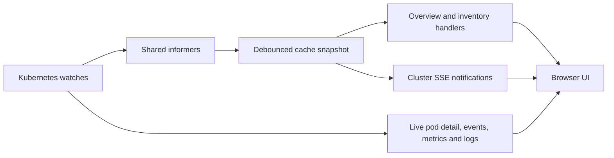

# Backend data and transport flow

Use this reference when changing handlers, authentication, cluster views, streaming, persistence, or process lifecycle. Setup and routine checks are in the [backend guide](../backend-dev-guide.md); scaling internals are in the [policy engine reference](backend-policy-engine.md).

## HTTP request boundary

The [router](../../backend/internal/api/router.go) separates public login/OIDC, health, metrics, and version routes from session-protected API routes. Protected routes apply session authentication, CSRF checks for mutations, and permission checks where required. Swagger UI and the served OpenAPI specification require a session too.

Session middleware loads the account, rejects disabled users, and extends idle expiry when needed. The absolute session lifetime still caps the session. Permissions come from [the role map](../../backend/internal/auth/permissions.go); both router gates and role assignments matter. A viewer can export configuration and view audit logs, but cannot preview an import.

Handlers validate input, call store/client/scheduler operations, and serialize responses. Keep internal errors in structured server logs and return useful client errors. Reuse shared ID and pagination helpers. Partial updates must preserve explicit false and zero values instead of relying on GORM's zero-value omission behavior.

When changing a route, update the canonical [OpenAPI specification](../../openapi.yaml), the [frontend API client](../../frontend/src/lib/api.ts), and affected mock handlers. `make copy-spec` refreshes the embedded build copy; edit the root specification rather than maintaining two independent contracts.

## Configuration and persistence

Process-wide environment settings are parsed in [config.go](../../backend/internal/config/config.go) and passed through typed configuration. OIDC and database-backed scheduler settings have their own loaders. [Configuration](../configuration.md) owns documented defaults.

The store wraps GORM and its underlying PostgreSQL connection pool. Model definitions and query methods are the field-level reference. Key relationships are policy → executions, logs, snapshots, and exceptions; users → sessions and audit identity. Guardrails are a singleton configuration record. Observability snapshots and thresholds are separate from policy recovery state.

Startup migration code includes legacy repairs as well as optional AutoMigrate. `AUTO_MIGRATE=false` skips AutoMigrate; it is not a general promise that no startup migration SQL runs. Review [store.go](../../backend/internal/store/store.go) before shipping a schema change, and verify upgrades against existing data. `Store.Close()` closes the underlying SQL pool.

## Cluster cache and live reads

[ClusterCache](../../backend/internal/k8s/cache.go) uses shared informers for nodes, pods, Deployments, and StatefulSets. Resource events trigger debounced snapshot rebuilds. Handlers must check readiness and handle unavailable or unsynchronized cache state.

Overview and inventories use cached resource state where possible. Pod details, events, metrics, and container logs have live API paths with different cost and failure behavior. Metrics-server is needed for resource usage values; its absence should not be interpreted as missing workloads.

Avoid converting ordinary inventory requests into cluster-wide live reads. Check cache age, client errors, and cache readiness separately. Informer subscriptions are notifications to reread a snapshot, not a complete resource event log.

## Cluster SSE

The [overview handler](../../backend/internal/api/overview.go) sends an initial overview immediately, then sends updates when the cache notifies subscribers. It sends keepalive comments every 30 seconds, without a fixed data-event cadence. Requests without a usable Kubernetes/cache connection fail rather than providing a working cluster stream.

The browser merges pushed overview data into its query cache and uses its configured HTTP polling fallback. Reverse proxies must allow long-lived responses and avoid buffering. An open stream alone does not prove fresh Kubernetes data.

## Execution logs

The scheduler drains runner log messages, assigns per-execution sequence numbers, batches persistence, and publishes through the in-process [broker](../../backend/internal/scheduler/broker.go). The broker has a bounded replay ring and bounded subscriber channels. It is a live delivery aid, not a durable queue; the database is the persisted history source.

The [WebSocket handler](../../backend/internal/api/policy_executions.go) closes the replay/subscription race in this order:

1. Authenticate and validate the execution, enforce connection limits, and upgrade after the origin check.
2. Subscribe to the broker and obtain its replay tail before querying persisted logs.
3. Send database history, then replay lines whose sequence exceeds the database maximum.
4. Recheck completion and deliver the live channel until completion, disconnect, or cancellation.

The client deduplicates by sequence. Reconnect and HTTP reconciliation remain necessary because buffers and persistence can fail. Completed executions close normally after remaining delivery. WebSocket writes have deadlines and periodic ping/pong handling; unauthenticated requests receive HTTP 401 before upgrading.

Browser origin host and request host must match. A separate dev frontend origin cannot be enabled for WebSockets merely by setting CORS or `NEXT_PUBLIC_API_URL`. Use a same-origin proxy or the embedded production frontend.

## Audit and monitoring

Authentication, user-management, and admin audit actions are written synchronously. Other actions use a bounded background writer and can be dropped under prolonged backpressure; the drop metric and logs expose that failure. The audit table is useful evidence, not a guarantee that every attempted operation was durably recorded.

Prometheus definitions live in [metrics.go](../../backend/internal/metrics/metrics.go). The `/metrics` endpoint is public for scraping. The observability collector combines measurements with estimates; its dashboard is alpha and API Rivers is cosmetic/mock. See [observability](../observability.md) for interpretation and retention.

## Startup and shutdown

[main.go](../../backend/cmd/server/main.go) loads configuration, opens and seeds the store, repairs interrupted state, initializes clients and background workers, and starts the HTTP server. Collector/client recorder wiring happens before scheduler workers use it. Kubernetes initialization can fail while the application still starts; database initialization is required.

Shutdown order matters: stop accepting HTTP requests and allow handlers to finish, cancel background workers, cancel the audit writer so it can drain, join tracked workers, then close the database pool. Preserve the separate audit lifetime when changing worker ownership. WebSocket connections are not ordinary short HTTP requests, so their request context and connection cleanup also matter.

## Debugging a data path

Trace one layer at a time: browser transport → authentication/permission → handler → store/cache/client → scheduler or runner. Check execution IDs and sequence numbers rather than relying on animation or state badges. Use [troubleshooting](../troubleshooting.md) for symptoms, then inspect the linked source and targeted tests.
