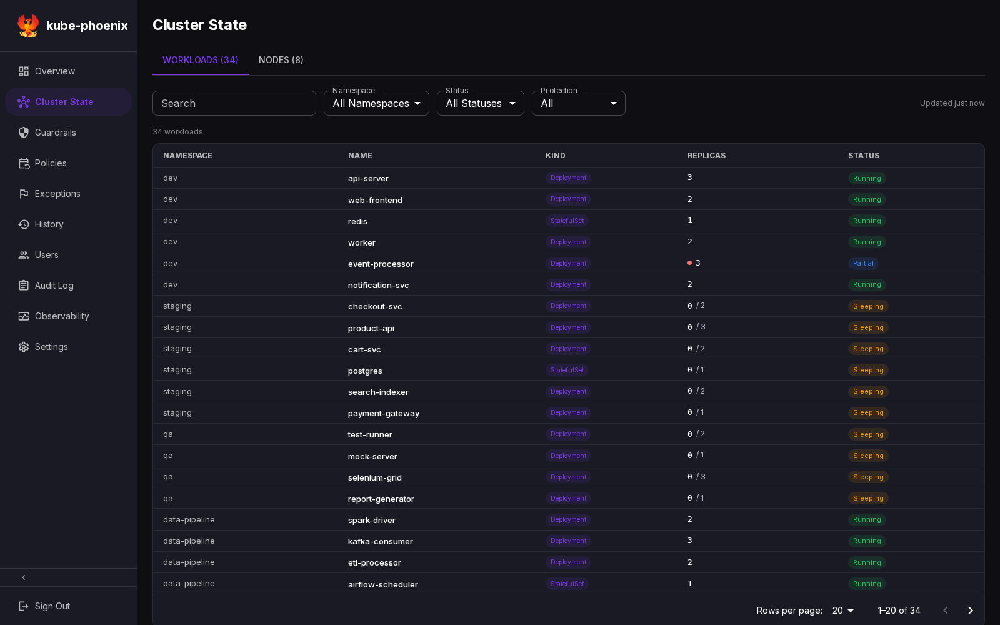
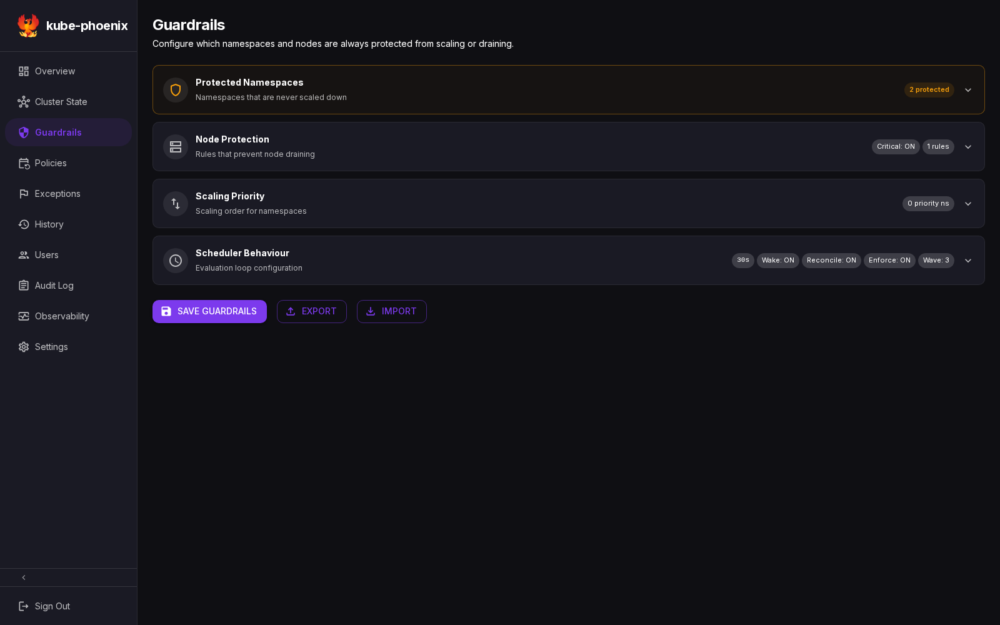
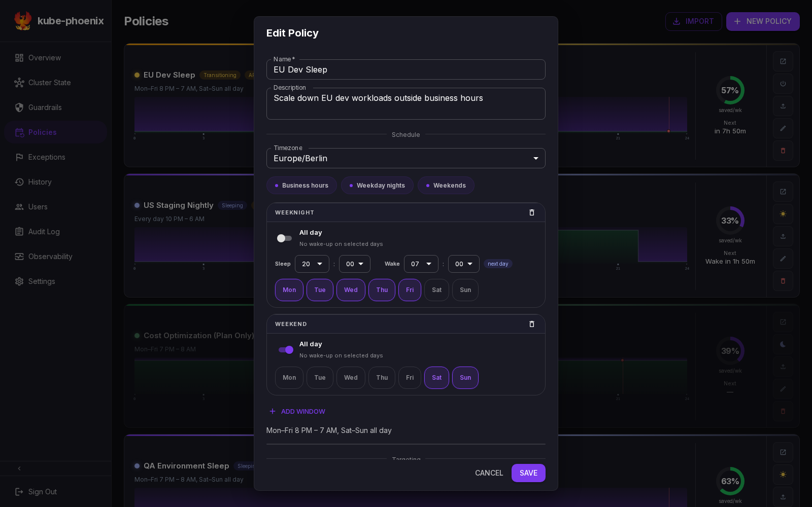
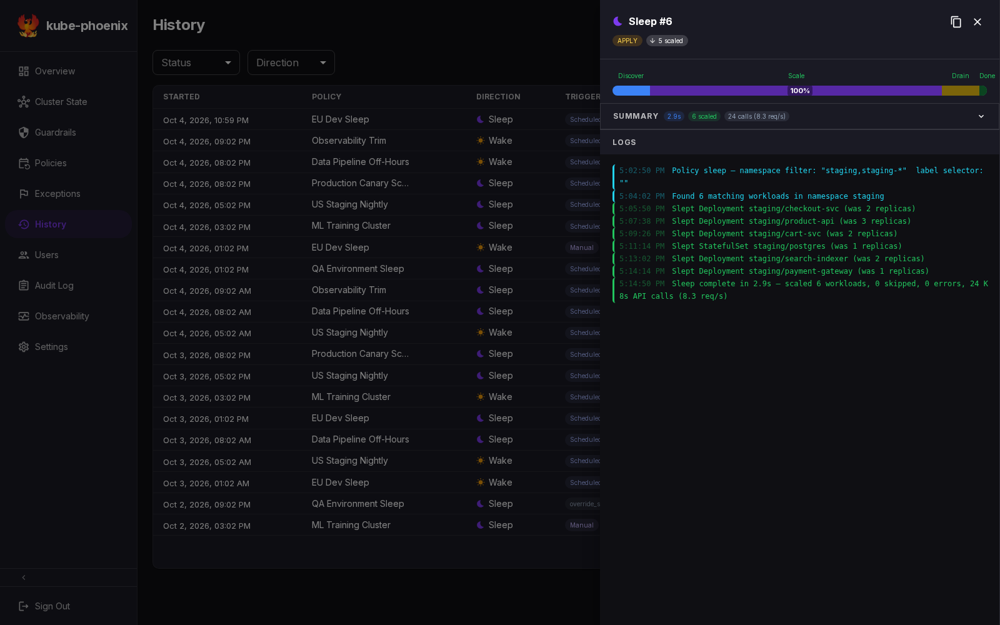

# Your first policy

Preview a policy, put the disposable `team-backend` workloads to sleep, and restore their original replica counts. This walkthrough uses a running kube-phoenix instance connected to a test cluster with the [local sample workloads](local-development.md#what-the-script-creates). Sign in as an admin or operator with permission to edit guardrails and trigger policies.

Use a dedicated test cluster with no other policies or controllers changing these replicas during the exercise. The commands assume the `local-cluster` context and default fixture counts. If your fixtures differ, restore that baseline before continuing. Mock mode can illustrate the screens, but cannot verify real scaling or restoration.

**Sleep also considers cluster-wide node drain and deletion. A `team-backend` namespace filter does not protect nodes.** Before creating the policy, this tutorial labels every node and adds the matching node-protection guardrail. Keep that protection in place throughout the exercise, including on a single-node cluster.

The screenshots below use mock data to illustrate the interface. Their names, counts, and execution results are examples, not evidence that this walkthrough has been executed.

## 1. Check the cluster and capture the baseline

```bash
kubectl config current-context
kubectl get nodes
kubectl -n team-backend get deployments
```

Confirm that the context is your test cluster, all nodes are ready, and the seven Deployments have these desired replicas:

| Deployment | Replicas |
| :--------- | -------: |
| `api` | 2 |
| `worker` | 1 |
| `cron` | 1 |
| `gateway` | 2 |
| `auth` | 1 |
| `notifications` | 1 |
| `cache` | 1 |

Capture desired replicas, node names, and schedulability in a temporary directory. Keep this terminal open so the variable remains available for later comparisons.

```bash
POLICY_TUTORIAL_DIR="$(mktemp -d)"
kubectl -n team-backend get deployments \
  -o custom-columns=NAME:.metadata.name,REPLICAS:.spec.replicas --no-headers \
  | sort > "$POLICY_TUTORIAL_DIR/replicas-before.txt"
kubectl get nodes -o custom-columns=NAME:.metadata.name,UNSCHEDULABLE:.spec.unschedulable --no-headers | sort > "$POLICY_TUTORIAL_DIR/nodes-before.txt"
```

Open **Cluster State** and find the `team-backend` workloads. Leave `team-backend` out of **Protected Namespaces** for this exercise; preserve the existing protection for system/application namespaces.

If prior filters hide the fixtures, use **Clear filters**. This resets search, namespace, status, and protection filters, including a status filter from the URL.



*Illustrative mock screenshot: use your actual `team-backend` inventory and captured replica counts.*

## 2. Protect every node

In **Guardrails → Node Protection**, note the existing **Skip Node Labels** entries so you can preserve them. Use the dedicated label below only if it is not already in use for another purpose:

```bash
kubectl get nodes -L tutorial.kube-phoenix.io/protected
kubectl label nodes --all tutorial.kube-phoenix.io/protected=true
kubectl get nodes -L tutorial.kube-phoenix.io/protected
```

Every node must show `true` in the new column. Add `tutorial.kube-phoenix.io/protected=true` to **Skip Node Labels**, press **Enter** to create the chip, then click **Save Guardrails**. Keep all existing entries. Reload the page and confirm the saved entry is present.

The field matches exact `key=value` pairs. It is separate from a policy's workload **Label Selector**. A matching node is skipped before drain or deletion.

```bash
kubectl get nodes -l 'tutorial.kube-phoenix.io/protected!=true'
```

This must report no resources. If it lists a node, label and protect that node before continuing. Recheck immediately before live execution in case a node joined the cluster.



*Illustrative mock screenshot: add the dedicated label entry described above to your real cluster's guardrails.*

## 3. Create a policy with scheduling disabled

Open **Policies**, create a policy, and enter:

| Field | Value |
| :---- | :---- |
| Name | `first-policy-team-backend` |
| Namespace Filter | `team-backend` |
| Label Selector | Empty, to include all seven fixture Deployments |
| Sleep window | Monday–Friday, 19:00–07:00 |
| Timezone | `UTC` |
| Mode | **Plan (dry-run)** |
| Enabled | **Off** |

Select days and times in the window editor; policies use windows rather than cron expressions. Keeping **Enabled** off prevents scheduled transitions while you work through the manual steps. Manual sleep/wake triggers are still available. Do not create exceptions for this tutorial.

The disabled card explains that scheduling is off and mutes its timeline and statistics; permitted manual actions remain available. The savings ring describes the percentage of a recurring week covered by configured sleep windows, not measured savings. Hover, focus, or click it for an explanation; exceptions and actual executions are excluded.



*Illustrative mock screenshot: use the field values in the table, including Enabled off.*

## 4. Preview the sleep

Open the policy's detail page, select **Sleep Now**, and choose **Plan (dry-run)** in the trigger dialog. Wait for the execution to finish and inspect its logs on that page.

Confirm that the preview:

- Targets only the seven `team-backend` Deployments for workload scaling.
- Reports every current node as protected by a label/taint match.
- Contains no proposed node drain or deletion. If it does, stop and correct node protection before applying anything.

Compare the actual cluster with your baseline:

```bash
kubectl -n team-backend get deployments \
  -o custom-columns=NAME:.metadata.name,REPLICAS:.spec.replicas --no-headers \
  | sort > "$POLICY_TUTORIAL_DIR/replicas-after-plan.txt"
diff -u "$POLICY_TUTORIAL_DIR/replicas-before.txt" "$POLICY_TUTORIAL_DIR/replicas-after-plan.txt"
kubectl get nodes -o custom-columns=NAME:.metadata.name,UNSCHEDULABLE:.spec.unschedulable --no-headers | sort > "$POLICY_TUTORIAL_DIR/nodes-after-plan.txt"
diff -u "$POLICY_TUTORIAL_DIR/nodes-before.txt" "$POLICY_TUTORIAL_DIR/nodes-after-plan.txt"
```

Both comparisons should produce no differences. Use the execution mode, logs, and Kubernetes state together: a successful plan execution can update the policy's displayed state without changing replicas.



*Illustrative mock screenshot: inspect your own plan execution and node-protection messages.*

## 5. Apply the sleep

Edit the policy, select **Apply (live)** as its mode, leave **Enabled off**, and save. Confirm the namespace filter remains exactly `team-backend`. If an overlap error appears, resolve the conflicting test policy before continuing.

Recheck node protection:

```bash
kubectl get nodes -l 'tutorial.kube-phoenix.io/protected!=true'
```

With no unprotected nodes, use **Sleep Now** on the detail page and choose **Apply (live)**. The detail page exposes both sleep and wake actions even if the previous plan changed the displayed policy state.

Wait for the execution to finish. Check that it has no errors, all seven desired replica counts are zero, and node drain/delete counts are zero:

```bash
kubectl -n team-backend get deployments \
  -o custom-columns=NAME:.metadata.name,DESIRED:.spec.replicas,READY:.status.readyReplicas
kubectl get nodes
```

Pods may take a little longer to terminate. In the execution logs, confirm that each node was protected. The cluster should retain the same nodes and their prior schedulability.

## 6. Wake and verify restoration

On the detail page, select **Wake Now**, choose **Apply (live)**, and wait for completion. The wake uses saved replica snapshots. Do not manually change replica counts between sleep and wake.

```bash
kubectl -n team-backend get deployments \
  -o custom-columns=NAME:.metadata.name,REPLICAS:.spec.replicas --no-headers \
  | sort > "$POLICY_TUTORIAL_DIR/replicas-after-wake.txt"
diff -u "$POLICY_TUTORIAL_DIR/replicas-before.txt" "$POLICY_TUTORIAL_DIR/replicas-after-wake.txt"
kubectl -n team-backend get deployments
kubectl get nodes -o custom-columns=NAME:.metadata.name,UNSCHEDULABLE:.spec.unschedulable --no-headers | sort > "$POLICY_TUTORIAL_DIR/nodes-after-wake.txt"
diff -u "$POLICY_TUTORIAL_DIR/nodes-before.txt" "$POLICY_TUTORIAL_DIR/nodes-after-wake.txt"
```

Both comparisons should produce no differences. Wait until the Deployments also show their expected ready replicas: nine ready replicas across seven Deployments. Inspect the wake execution for errors before calling the exercise complete.

If restoration fails, keep the policy and its saved snapshots, inspect the execution logs, and follow [workloads left at zero](troubleshooting.md#workload-stuck-at-zero-replicas-after-a-failed-wake). Do not delete the policy as a recovery step: deleting it also deletes its snapshots and execution history. Wake restores workloads; it does not recreate or uncordon nodes.

## 7. Clean up and record the result

Once all replicas are restored, keep the policy disabled or delete this tutorial policy from the Policies page. Save any execution evidence you need before deletion. Leave the sample Deployments running for future exercises.

Leaving the dedicated node label and guardrail in place keeps the test cluster protected for later workload-only tests. If you deliberately want to return to the previous node-protection configuration, first confirm there are no enabled policies, active executions, or scheduled exceptions that could initiate a sleep. Remove only the guardrail chip added for this tutorial, save, then remove its node label:

```bash
kubectl label nodes --all tutorial.kube-phoenix.io/protected-
```

Do not remove an entry or label that predated this exercise. Complete the [policy smoke checklist](testing/policy-smoke-test.md), recording your actual results and execution IDs. For scheduling, exceptions, and destructive node-operation tests, use the separate [scenario catalogue](test-plan-policy.md).
