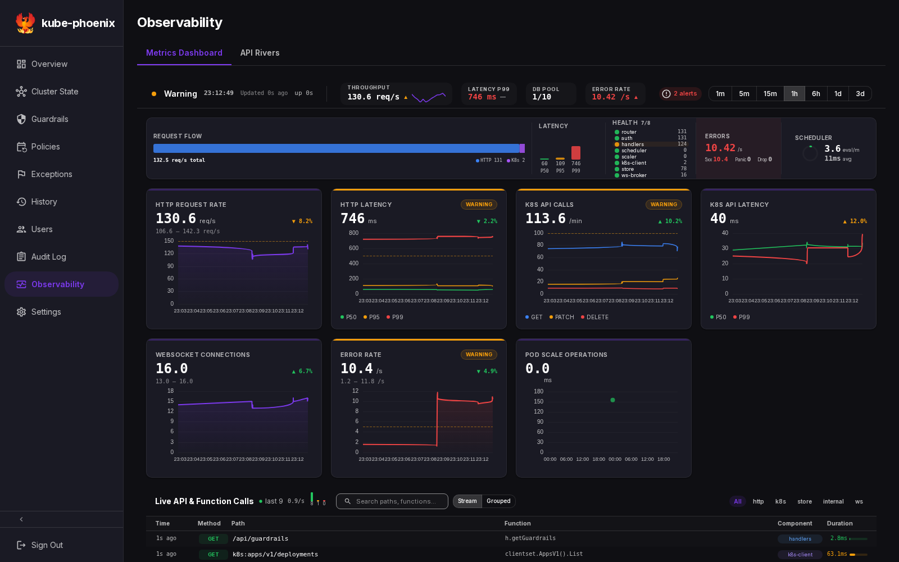
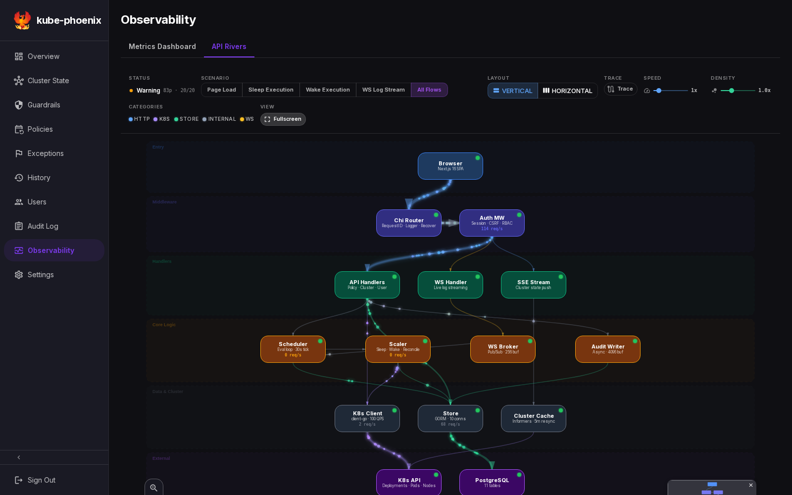

# Observability

## Overview

The **Metrics Dashboard is an alpha feature**. It presents application metrics and recent activity at `/observability/`; use the underlying metrics, execution history, and logs to confirm operational conclusions. **API Rivers is a cosmetic/mock visualization** of application relationships and example flows. Its particles, link values, and path highlighting are illustrative, not distributed traces or measured traffic between every component.

The dashboard can display real backend measurements, derived values, and estimates in the same view. The distinction matters even when connected to a real cluster. In `make dev-mock`, all of the displayed activity is sample data.

[Metrics Dashboard](#metrics-dashboard) · [Interpret the data](#interpret-the-data) · [API Rivers](#api-rivers) · [Prometheus](#prometheus-metrics) · [Troubleshooting](#troubleshooting) · [Contributor reference](#backend-architecture)

## Metrics Dashboard

*Actual application screenshot using seeded mock data. Values illustrate the alpha interface and do not describe a live deployment.*

### Status header and panels

The header shows freshness, a health summary, and throughput, latency, database-pool, and error indicators. Choose a time range from `1m`, `5m`, `15m`, `1h`, `6h`, `1d`, or `3d`. Selecting a panel opens a larger view.

| Panel | What to read |
| :---- | :----------- |
| HTTP Request Rate | Instrumented inbound request rate, in requests per second |
| HTTP Latency | Histogram-derived P50, P95, and P99 response times, in milliseconds |
| K8s API Calls | Instrumented Kubernetes operation rates, grouped into displayed GET/PATCH/DELETE categories, per minute |
| K8s API Latency | Histogram-derived Kubernetes operation latency, in milliseconds |
| WebSocket Connections | Active execution-log WebSocket connection count |
| Pod Scale Operations | Headline: workloads scaled during the collection interval. Scatter plot: histogram-derived median execution duration, in milliseconds. The count refers to workloads, not individual pod lifecycle events. |
| Error Rate | HTTP 5xx and recovered scheduler-panic rates combined by the collector |

Stored history is loaded for the selected range and merged with incoming samples. The chart uses each sample's timestamp, so gaps and downsampling are not equivalent to evenly spaced measurements. History loading or failure is reported separately while live samples can continue arriving.

The system overview summarizes the same data by component and health category. The error timeline shows transient threshold-crossing events generated by the browser. These indicators help explore the alpha view; they are not a persistent incident record or an external alert-delivery service.

### Live API call feed

The feed shows a bounded selection of recent recorded calls, including instrumented HTTP requests and Kubernetes client operations. Search by path, function, or component, filter categories, or switch between individual and grouped entries. Expanded entries show the available metadata.

HTTP paths are route templates rather than raw resource URLs. The displayed function/component mapping comes from a lookup table; it is not a captured call stack. The copy-as-cURL action gives a starting command for an HTTP route, not a complete authenticated replay with request body and concrete route parameters.

Long-lived streams, health checks, metrics scrapes, and static routes are excluded from some instrumentation. The call feed and HTTP histograms have separate exclusion lists: execution-log WebSocket connections can appear in the feed while their connection lifetimes are excluded from HTTP latency histograms. Consult the [recorder source](../backend/internal/observability/call_recorder.go) when diagnosing whether an operation is represented.

### Configurable thresholds

The backend stores warning and critical values by panel key. The thresholds endpoints expose the current values and accept updates; see the [API reference](api.md) and [OpenAPI contract](../openapi.yaml). Treat seeded values as starting values for the alpha interface, not deployment-specific alert recommendations.

Most indicators become worse as values rise; cache-hit percentage uses the opposite direction. Panel labels, derived units, and shared threshold mappings still have alpha limitations. Check the underlying metric and units before using a displayed warning to make an operational decision. Changes to these stored thresholds do not create Prometheus alert rules or notification routing.

## Interpret the data

| Data | Origin | Interpretation |
| :--- | :----- | :------------- |
| HTTP/Kubernetes counters and active connection/pool gauges | Backend instrumentation and `sql.DBStats` | Measurements of instrumented operations, not all possible internal work |
| Rates and per-tick counts | Differences between cumulative counters | Derived over collection intervals; startup, resets, and gaps affect the available samples |
| Latency percentiles | Interpolation over Prometheus histogram buckets | Estimates from accumulated histograms, not exact percentiles recomputed from raw requests in the selected dashboard range |
| Component/link traffic and latency | A mixture of measurements, scaling factors, and fixed values | Illustrative estimates; unsuitable for identifying a measured bottleneck or tracing one request |
| Health summaries and incident indicators | Threshold comparisons applied to displayed values | Alpha presentation state, not an independent health probe |
| Mock-mode metrics and calls | Synthetic generators in `frontend/mock-api/` | Demonstration and development data only |

For example, the backend payload uses fixed latency values for some components and factors applied to aggregate request rates for some links. API Rivers can consume this payload without making those links independently measured. Its scenario controls alter the illustration, not workload execution.

## API Rivers

*Actual application screenshot using mock data. The topology and animated paths are a cosmetic demonstration.*

The diagram arranges application components and external dependencies into a predefined topology. Particles and labels illustrate connections and scenarios; their speed, density, and apparent traffic do not establish actual per-link throughput.

### Interactions

- Hover a component to inspect its description, displayed values, and available runtime limits.
- Select a link or use trace mode to highlight a path through the predefined diagram.
- Choose a page-load, sleep, wake, or log-stream scenario to explore an example flow.
- Drag components to adjust the layout; offsets are stored in the browser.

### Controls

Switch between vertical and horizontal layouts, adjust animation speed and particle density, zoom, use the minimap, or enter fullscreen. Path highlighting follows the diagram and its supplied values. It does not capture a distributed trace or prove which backend call delayed an execution.

## Prometheus metrics

The Go backend exposes `/metrics` on its main service port without session authentication. Application metrics are registered on the default Prometheus registry alongside Go runtime and process metrics. The Helm chart includes a [ServiceMonitor template](../helm/kube-phoenix/templates/servicemonitor.yaml) for deployments using Prometheus Operator.

| Area | Representative metric families |
| :--- | :----------------------------- |
| Policy execution | `kube_phoenix_executions_total`, `kube_phoenix_execution_duration_seconds`, `kube_phoenix_workloads_scaled_total` |
| Node operations | `kube_phoenix_nodes_drained_total`, `kube_phoenix_nodes_deleted_total` |
| HTTP | `kube_phoenix_http_requests_total`, `kube_phoenix_http_request_duration_seconds` |
| Kubernetes client | `kube_phoenix_k8s_requests_total`, `kube_phoenix_k8s_request_duration_seconds` |
| Scheduler | `kube_phoenix_scheduler_evaluations_total`, `kube_phoenix_scheduler_evaluation_duration_seconds`, `kube_phoenix_scheduler_panics_total` |
| Cluster cache | `kube_phoenix_cache_hits_total`, `kube_phoenix_cache_misses_total`, `kube_phoenix_cache_rebuild_duration_seconds` |
| Connections | `kube_phoenix_ws_active_connections`, `kube_phoenix_db_pool_open_connections`, `kube_phoenix_db_pool_in_use`, `kube_phoenix_db_pool_idle` |
| Authentication and audit | `kube_phoenix_auth_attempts_total`, `kube_phoenix_rate_limit_hits_total`, `kube_phoenix_audit_drops_total` |

Use the exposed metric help/type metadata and [`metrics.go`](../backend/internal/metrics/metrics.go) for the complete names, labels, and histogram buckets. Prometheus scraping is separate from opening the dashboard. Define deployment monitoring and alerting in the monitoring system using the metrics appropriate to the environment.

## Troubleshooting

| Symptom | Check |
| :------ | :---- |
| No samples after opening the page | The authenticated `/api/observability/stream` request, backend collector logs, and database connectivity; the collector needs an initial counter baseline before its first snapshot |
| Freshness stops advancing | Whether the SSE connection closed, a proxy buffered the stream, or collection/persistence failed; the browser attempts reconnection |
| Long-range chart has little data | Deployment age, selected range, retention, and history-request errors; choosing three days cannot create missing history |
| A call is absent from the feed | Recorder exclusions, the operation's instrumentation, and the bounded recent-call sample; the feed is not a complete request archive |
| A topology value looks implausible | Whether it is a fixed/scaled estimate or mock value; compare the underlying Prometheus series or execution logs |
| A scaling operation needs investigation | Open its record in History or its policy's execution list and inspect the execution logs, rather than interpreting animation state |

The call recorder keeps recent calls in memory and sends only a recent subset in each stream payload. Calls can be omitted from the visible feed under load, and a restart clears the recorder. Cache-hit percentage reports 100 when no reads have been counted; that value alone does not establish that useful data has been served. Failed snapshot writes are logged and are not retried for that tick.

## Keyboard shortcuts

Shortcuts apply when focus is outside an input, textarea, or editable element.

| Key | Action |
| :-- | :----- |
| `1`–`7` | Select the corresponding time range, from 1m through 3d |
| `t` | Switch Metrics Dashboard / API Rivers |
| `/` | Focus the view's text search input when present |
| `Escape` | Dismiss an open panel/dialog |

## URL parameters

Use `?tab=metrics` or `?tab=rivers` to select the view and `?range=1h` to choose the dashboard's history range. For example: `/observability/?tab=metrics&range=1h`. The range controls metric history; it does not turn a Rivers scenario into historical tracing.

## Mock server

Run `make dev-mock` from the repository root for the frontend and sample API. The [observability mock](../frontend/mock-api/routes/observability.mjs) generates metric samples and calls, provides a short pre-seeded history, and implements threshold/configuration endpoints for development. Follow the [Frontend Developer Guide](frontend-dev-guide.md#run-locally) for setup and the distinction between mock and real-backend checks.

## Backend architecture

The collector reads the local Prometheus registry on a two-second cadence, derives a snapshot, persists it, and publishes an in-memory payload for SSE clients. The history endpoint reads stored snapshots with SQL downsampling. Runtime configuration combines configured values with descriptive constants; it is not an additional measurement stream. Implementation details belong in [Backend Data Flow](development/backend-data-flow.md) and the [collector source](../backend/internal/observability/collector.go).

The persistence types are `MetricSnapshot` and `ObservabilityThreshold`; recent `ApiCall` records remain in memory. Use the [store definitions](../backend/internal/store/observability.go) and [OpenAPI schema](../openapi.yaml) for field names and types rather than maintaining another schema copy here.

At the nominal cadence, one snapshot every two seconds produces about 43,200 rows per day. Snapshots older than three days are pruned hourly; write failures, downtime, and prune timing affect the actual row count. SSE clients share the collector's latest payload rather than each querying the database, while history requests use the database connection pool.

Execution logs have a separate WebSocket/replay/persistence pipeline. See [Backend Policy Engine](development/backend-policy-engine.md) for execution and log ownership, and [Frontend Data Flow](development/frontend-data-flow.md#execution-logs) for sequence deduplication, reconnects, and completed-log fetching.
